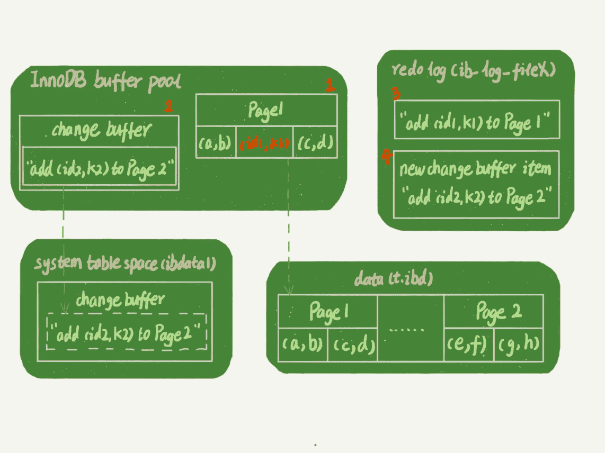
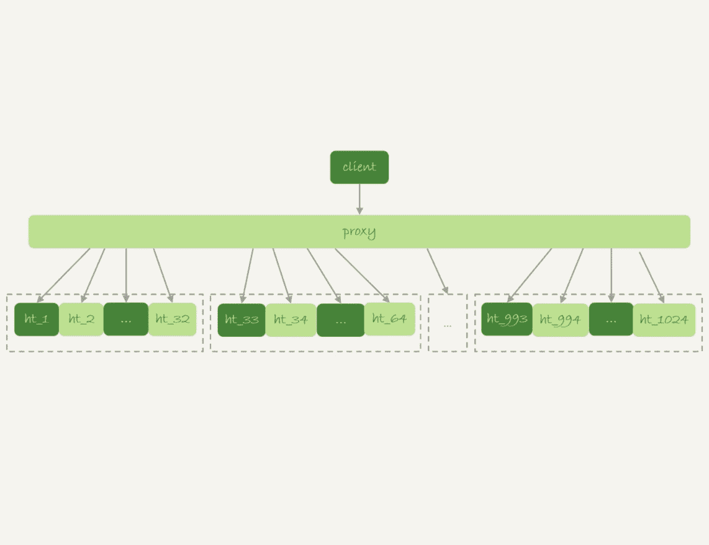
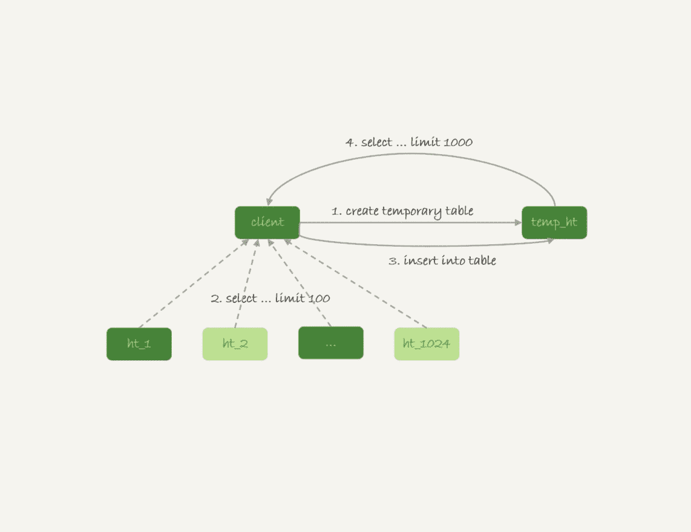

# 引擎

## Myisam
> 只支持表锁。

## Memory

> 堆组织表：
>
> 内存表的数据部分以数组的方式单独存放

- **索引**

  > 默认：hash索引

- **特点**

  > 1. 内存表的数据就是按照写入顺序存放的。
  > 2. 当数据文件有空洞的时候，内存表找到空位就可以插入新值。
  > 3. 数据位置发生变化的时候，内存表需要修改所有索引。
  > 4. 内存表所有索引的“地位”都是相同的。
  > 5. 内存表不支持 Blob 和 Text 字段，并且即使定义了 varchar(N)，实际也当作 char(N)，也就是固定长度字符串来存储，因此内存表的每行数据长度相同。

## Innodb

## 索引

> B+树：

- **特性**

  > 1. InnoDB 表的数据总是有序存放的。
  > 2. 当数据文件有空洞的时候，InnoDB 表在插入新数据的时候，为了保证数据有序性，只能在固定的位置写入新值。
  > 3. 数据位置发生变化的时候，InnoDB 表只需要修改主键索引。
  > 4. InnoDB 表用主键索引查询时需要走一次索引查找，用普通索引查询的时候，需要走两次索引查找。
  > 5. InnoDB 支持变长数据类型，不同记录的长度可能不同。

# 数据操作

## DQL

### 查询缓存

> 1. 大多数情况下不建议使用查询缓存，因为更新操作会使查询缓存失效。
> 2. 8.0之前。
>     1. 参数*query_cache_type*设置成 DEMAND，默认查询都不使用查询缓存。
>     2. SQL_CACHE 显式指定查询缓存。
> 3. 查询缓存在8.0之后没有了。

### count

> 效率排名：count(字段)<count(id)<count(1)≈count(*)

- **count(*)**

  - *语义*

    > 表示满足条件的结果集的总行数。

  - *实现*

    > - myisam：在磁盘上存储了总行数，查询时，直接从磁盘获取。
    > - innodb：
    >   - innode层不取值。
    >   - server层直接累加。
    >   - 用最小索引树统计。

- **count(主键 id)**
    
    - *语义*
    
      > 表示满足条件的结果集的总行数。
    
    - *实现*
    
      > - innode层取id值。
      > - server层直接累加。
      > - 用最小索引树统计。
    
- **count(1)**
    
    - *语义*
    
      > 表示满足条件的结果集的总行数。
    
    - *实现*
    
      > - innode层不取值，放入数组1。
      > - server层直接累加。
      > - 用最小索引树统计。
    
- **count(字段)**
    
    - *语义*
    
      > 表示满足条件的数据行里面，参数「字段」不为null的总个数。
    
    - *实现*
    
      > - innode层取字段值。
      > - server层需要判断累加。
      > - 用字段索引树统计。

#### 计数优化

- 用缓存系统保存计数

  > 缺点：更新丢失，逻辑不一致

- 在数据库保存计数

### order by

#### 字段排序

> ```sql
> select city,name,age from t where city='杭州' order by name limit 1000
> ```
>
> 按索引分析

- **city**

  > 单行长度 VS max_length_for_sort_data
  > - 小于：全字段排序
  > - 大于：rowid排序

  - *全字段排序*

    - **排序的数据量 < sort_buffer_size**

      > **内部排序**
      >
      > 1. 初始化sort_buffer,放入city,name,age三个字段
      >
      > 2. 在city索引树上查到第一个满足'city=杭州'的记录，取出id
      > 3. 在主键索引树上获取到id所在的行，取出age,name,city的值，存到sort_buffer中
      > 4. 继续2，3步骤，直到不满足条件'city=杭州'
      > 5. 在sort_buffer中按照name做快速排序，返回结果集

    - **排序的数据量 > sort_buffer_size**

      > **外部排序**
      >
      > 1. 初始化sort_buffer,放入city,name,age三个字段；
      > 2. 在city索引树上查到第一个满足'city=杭州'的记录，取出id；
      > 3. 在主键索引树上获取到id所在的行，取出age,name,city的值，存到sort_buffer中。
      > 4. 继续2，3步骤，直到sort_buffer容量满了。
      > 5. 在sort_buffer中按照name做快速排序，将结果放入临时文件，清空sort_buffer。
      > 6. 继续2，3，4，5步骤，直到不满足条件'city=杭州'。
      > 7. 使用归并排序算法，将临时文件合并成一个有序的大文件。
      > 8. 从文件中读取数据，并返回结果集。

  - *rowid排序*

    > 1. 初始化sort_buffer,放入name,id两个字段
    > 2. 在city索引树上查找到第一个满足'city=杭州'的记录，取出id
    > 3. 在主键索引树上获取到id所在的行，取出id，name值，存到sort_buffer中
    > 4. 继续2，3步骤，直到不满足条件'city=杭州'
    > 5. 在sort_buffer中按照name快速排序
    > 6. 再根据id到主键索引取出数据返回

- **city, name**

  > 1. 在city索引树上查找到第一个满足条件'city=˙杭州'的记录，取出id
  > 2. 在主键索引树上获取id所在行，取出name,age,city，作为结果集返回
  > 3. 从索引树上取下一个主键id
  > 4. 重复步骤2，3步骤直到不满足条件'city=杭州'

- **city, name, age**

  > 1. 在city索引树上查找到第一个满足条件'city=˙杭州'的记录，取出name,age,city,作为结果集返回
  > 2. 从索引树上取下一个满足条件的记录，取name,age,city作为结果集返回
  > 3. 重复执行步骤2，直到不满足条件'city=杭州'

#### 随机排序

> ```sql
> select word from words order by rand() limit 3;
> ```
>
> - 语法：order by rand();
> - 使用rowid排序
> - 要排序的数据量 VS tmp_table_size
>     - 小于：内存临时表
>     - 大于：磁盘临时表

- **内存临时表排序**

  > 1. 创建一个临时表，使用的是memory引擎，表里有两个字段，第一个字段是 double 类型，为了后面描述方便，记为字段 R，第二个字段是 varchar(64) 类型，记为字段 W。并且，这个表没有建索引
  > 2. 从 words 表中，按主键顺序取出所有的 word 值。对于每一个 word 值，调用 rand() 函数生成一个大于 0 小于 1 的随机小数，并把这个随机小数和 word 分别存入临时表的 R 和 W 字段中。
  > 3. 在这个没有索引的临时表中，按照字段R排序。
  > 4. 初始化 sort_buffer。sort_buffer 中有两个字段，一个是 double 类型，另一个是整型。
  > 5. 从内存临时表中一行一行地取出 R 值和位置信息，分别存入 sort_buffer 中的两个字段里。
  > 6. 在 sort_buffer 中根据 R 的值进行排序。
  > 7. 排序完成后，取出前三个结果的位置信息，依次到内存临时表中取出 word 值，返回给客户端。

- **磁盘临时表排序**

  > 没有显式索引的 InnoDB 表的排序过程。

#### 算法

- **随机算法**

  - *随机算法1*

    > - 取这个表的主键「id」的最大值「M」和最小值「N」;
    >
    > - 生成一个最大值到最小值之间的数 `X = (M-N)*rand() + N` ;
    > - 取不小于「X」的第一个「ID」的行。

    - **优点**

      > 计算速度快

    - **缺点**

      > 概率不均匀

  - *随机算法2*

    > 1. 取得整个表的行数，并记为 C。
    > 2. 取得 Y = floor(C * rand())。 floor 函数在这里的作用，就是取整数部分。
    > 3. 再用 limit Y,1 取得一行。

    - **优点**

      > 概率均匀

    - **缺点**

      > 执行代价较高

- **归并算法**

  > 1. MySQL 将需要排序的数据分成「X」份，每一份单独排序后存在这些临时文件中。
  > 2. 然后把这「X」个有序文件再合并成一个有序的大文件。

- **优先队列算法**

  > 1. 对于准备排序的 (R,rowid)，先取前三行，构造成一个堆；
  > 2. 取下一个行 (R’,rowid’)，跟当前堆里面最大的 R 比较，如果 R’小于 R，把这个 (R,rowid) 从堆中去掉，换成 (R’,rowid’)；
  > 3. 重复第 2 步，直到所有 (R’,rowid’) 完成比较。

### union

- **union**

  ```sql
  (select 1000 as f) union (select id from t1 order by id desc limit 2);
  ```

  > 1. 创建一个内存临时表，表中有一个字段f,并且f是主键字段。
  > 2. 将第一个子查询的结果放入内存表中。
  > 3. 执行第二个子查询，将结果逐行插入内存表，若id重复，则插入失败。
  > 4. 从临时表中取出数据，返回结果，并且删除临时表。

- **union all**

  ```sql
  (select 1000 as f) union all (select id from t1 order by id desc limit 2);
  ```

  > 1. 将第一个子查询的结果放入结果集
  > 2. 将第二个子查询的结果放入结果集
  > 3. 返回结果

### join

#### 选择驱动表
- Index Nested-Loop Join 算法，应该选择小表做驱动表。
- Block Nested-Loop Join 算法：
    - 在 join_buffer_size 足够大的时候，是一样的；
    - 在 join_buffer_size 不够大的时候（这种情况更常见），应该选择小表做驱动表。

#### 算法

- **NLJ**

  > Index Nested-Loop Join；可以使用被驱动表的索引，建议用小表做驱动表
  >
  > ```sql
  > select * from t1 straight_join t2 on (t1.a=t2.a);
  > ```
  >
  > >  a在t1和t2表中是索引
  >
  > 
  >
  > 1. 从表t1中取读一行数据R
  > 2. 从数据行R中取出字段a到表t2中查找
  > 3. 取出表t2中满足条件的行，与R组成一行，作为结果集的一部分
  > 4. 重复步骤1，2，3，直到表t1的末尾循环结束

- **SNL**

  > Simple Nested-Loop Join；被驱动表使用不是索引，这个算法会导致驱动表每去被驱动表查一次，都要做全表扫描，mysql没有使用这个算法。
  >
  > ```sql
  > select * from t1 straight_join t2 on (t1.a=t2.b);
  > ```

- **BNL**

  > Block Nested-Loop Join；被驱动表上没有可用的索引，但是在内存中操作，速度快。

  - *驱动表占用内存 < join_buffer_size*

    >  大表和小表做驱动表，无差别
    >
    > ```sql
    > select * from t1 straight_join t2 on (t1.a=t2.b);
    > ```
    >
    > 
    >
    > 1. 把表t1的数据读入线程内存join_buffer中，由于上面的语句写的是select *，所以要把整个表t放入内存中。
    > 2. 扫描表t2，把t2中的每一行都取出来，和join_buffer中的数据做对比，满足join条件的作为结果集的一部分返回。

  - *驱动表占用内存 > join_buffer_size*，建议用小表做驱动表

    > 建议用小表做驱动表
    >
    > ```sql
    > select * from t1 straight_join t2 on (t1.a=t2.b);
    > ```
    >
    > 
    >
    > 1. 扫描表t1，顺序读取数据放入join_buffer中，假设（t1一共100行）放到第88行满了，继续第2步
    > 2. 扫描表t2，把t2中的每一行都取出来，跟join_buffer中的数据做对比，满足join条件的，作为结果集的一部分返回
    > 3. 清空join_buffer
    > 4. 扫描表t1，把剩下的12行放入join_buffer中，继续执行第2步

  - *缺点*

    > BNL 算法对系统的影响主要包括三个方面：
    >
    > 1. 可能会多次扫描被驱动表，占用磁盘 IO 资源；
    > 2. 判断 join 条件需要执行 M*N 次对比（M、N 分别是两张表的行数），如果是大表就会占用非常多的 CPU 资源；
    > 3. 可能会导致 Buffer Pool 的热数据被淘汰，影响内存命中率。使用BNL算法，会导致多次扫描被驱动表，如果被驱动表是一个冷表：
    >    - 冷表的数据量小于整个 Buffer Pool 的 3/8，如果语句执行时间超过 1 秒，就会在再次扫描冷表的时候，把冷表的数据页移到 LRU 链表头部。
    >    - 如果这个冷表很大，业务正常访问的数据页，没有机会进入 young 区域。

- **BKA**

  > Batched Key Access；BKA算法是对NLJ算法的优化。
  >
  > 
  >
  > ```shell
  > set optimizer_switch='mrr=on,mrr_cost_based=off,batched_key_access=on';
  > ```
  >
  > > 开启BKA算法

#### join优化

- **BNL转BKA**

  > 1. 把表t2中满足条件的数据放在临时表tmp_t中。
  > 2. 为了让join使用BKA算法，给临时表tmp_t的字段b加上索引。
  > 3. 让表t1和tmp_t做join操作

- **hash_join**

  > join_buffer是无序的，如果支持hash，可以加快查询，mysql不支持，可以在业务端自己实现

### group by

> 当内存表的容量不足以排序时，会转为磁盘临时表。

- **需要排序**

  ```sql
  select id%10 as m, count(*) as c from t1 group by m;
  ```

  > 1. 创建内存表，表里有两个字段m、c，m是主键。
  > 2. 遍历索引树，获取id%10 的结果，记为 x
  >    - 如果临时表中不存在m为x的行，则插入（x,1）
  >    - 如果临时表中存在m为x的行，则c的值加1
  > 3. 遍历完成，借助sort_buffer根据m排序，返回结果。

- **不需要排序**

  ```sql
  select id%10 as m, count(*) as c from t1 group by m order by null;
  ```

  > 跳过了排序步骤。

#### group优化

- **增加索引**

  ```sql
  alter table t1 add column z int generated always as(id % 100), add index(z);
  select z, count(*) as c from t1 group by z;
  ```

  > 1. 索引可以确保数据是有序的，只需要从左到右，顺序扫描，依次累加。
  > 2. 当碰到第一个 1 的时候，已经知道累积了 X 个 0，结果集里的第一行就是 (0,X);
  > 3. 当碰到第一个 2 的时候，已经知道累积了 Y 个 1，结果集里的第二行就是 (1,Y);
  > 4. 不需要临时表，也不需要再额外排序。

- **直接排序**

  ```sql
  select SQL_BIG_RESULT id%100 as m, count(*) as c from t1 group by m;
  ```

  > 1. SQL_BIG_RESULT提示优化器：这个语句涉及的数据量很大，请直接用磁盘临时表。
  > 2. 既然数据量很大，那从磁盘空间考虑，直接用数组来存。
  > 3. 初始化 sort_buffer，确定放入一个整型字段，记为 m；
  > 4. 扫描索引树，依次取出里面的 id 值, 将 id%100 的值存入 sort_buffer 中；
  > 5. 扫描完成后，对 sort_buffer 的字段 m 做排序。
  > 6. 排序完成后，就得到了一个有序数组。返回结果集。

## DML

### insert

```sql
insert into tablename (cloumn1,cloumn2) value (a,b);
insert into tablename (cloumn1,cloumn2) values (a,b),(a1,b1);
insert into tablename (cloumn1,cloumn2) select (cloumn1,cloumn2) from table2 where XXX;
```

- **insert 唯一键冲突**

  > 执行insert 语句，发生唯一键冲突的时候，并不只是简单地报错返回，还在冲突的索引上加了锁。

- **自增主键**

  > 不能保证连续递增

  - *保存位置*

    > - myisam的自增值保存在数据文件中。
    > - innodb:
    >   - mysql5.7之前，存在内存中，并没有持久化，异常重启后从表中查出最大值后加1作为表的自增值。
    >   - mysql8.0,将自增值存在了redo log中，重启的时候依靠redo log恢复重启前的值。

  - *修改机制*

    ```shell
    auto_increment_offset：自增初始值，默认1；
    auto_increment_increment：步长，默认1。
    ```

    > id被定义为AUTO_INCREMENT，插入语句时：
    > - id为0或null：新增语句使用当前的自增值，自增值按步长增加。
    > - 指定id时。新增语句使用指定的id。
    >     - 指定id < 自增值：自增值不变。
    >     - 指定id > 自增值： 从 auto_increment_offset 开始，以 auto_increment_increment 为步长，持续叠加，直到找到第一个大于指定id的值，作为新的自增值。

  - *不连续的原因*

    1. **唯一键冲突**

    2. **事务回滚**

    3. **insert ... select语句申请id的策略导致不连续。**

       > 1. 语句执行过程中，第一次申请自增 id，会分配 1 个；
       > 2. 1 个用完以后，这个语句第二次申请自增 id，会分配 2 个；
       > 3. 2 个用完以后，还是这个语句，第三次申请自增 id，会分配 4 个；
       > 4. 依此类推，同一个语句去申请自增 id，每次申请到的自增 id 个数都是上一次的两倍。

  - *自增锁*

    > 非事务锁，一般为申请完成立马释放。

    - **加锁规则**

      > 由参数innodb_autoinc_lock_mode控制
      >
      > - 0：语句执行结束后才释放锁。【类5.0版本】
      > - 1：分两种情况
      >   - 普通insert语句：在申请之后就马上释放。
      >   - insert ... select语句：等语句结束后才被释放。
      > - 2：在申请之后就马上释放。

- **insert... select**

    > 在可重复读隔离级别下，binlog_format=statement下,需要对select的表访问的行加next_key lock。
    >
    > 给索引 c 上的所有间隙都加上共享的 next-key lock，主键索引全部加锁。
    >
    > ```sql
    > insert into t(c,d)  (select c+1, d from t force index(c) order by c desc limit 1);
    > ```
    >
    > 1. 创建临时表，表里有两个字段c和d。
    > 2. 按照索引C扫描表t，依次取出c=4,3,2,1，然后回表，读到 c 和 d 的值写入临时表。这时，Rows_examined=4。
    > 3. 由于语义里面有 limit 1，所以只取了临时表的第一行，再插入到表 t 中。这时，Rows_examined 的值加 1，变成了 5。

- **insert into … on duplicate key update**

    > 1. 插入一行数据，如果碰到唯一键约束，就执行后面的更新语句。
    > 2. 如果有多个列违反了唯一性约束，就会按照索引的顺序，修改跟第一个索引冲突的行。

### delete

> 删除数据，磁盘文件大小不会缩小。

- **复用**

  > - 删除数据行，该行所在的位置可以被复用。只有当插入的数据大于该位置前驱，并小于该位置后驱时，该位置可以被复用。
  > - 删除数据导致一个数据页的数据全部清空。整个数据页可以被复用。当需要开辟新的数据页时，该数据页就会被复用，不受原范围限制。如页分裂。

- **空洞**

  > - 删除数据空出来的位置称为空洞。
  >
  > - 不止删除，页分裂也会造成空洞。

- **重建表**

  > 1. 非online【重建时不能更新数据】：`alter table tablename engine=innodb,ALGORITHM=copy;`
  > 2. online：`alter table tablename engine=innodb,ALGORITHM=inplace;`
  > 3. `optimize table t`
  > 4. alter table会默认提交前面的事务。
  > 5. 重新收缩的过程中，页会按15/16满的比例来重新整理页数据。

  - *inplace*

    > inplace是指，表的操作是放在引擎层，而不是server层。

  - *online*

    > online 指表重建时，可以支持增删改操作。

### update

> 

# 表

## 分区表

> 1. 对于server层来说是一个表，所有分区表共用一个MDL锁；
> 2. 对于innodb来说，是多个表；行锁和表锁只对当前分区有效。
> 3. MySQL 在第一次打开分区表的时候，需要访问所有的分区。

- **操作**

  - *创建*

    ```sql
    CREATE TABLE `t` (
      `ftime` datetime NOT NULL,
      `c` int(11) DEFAULT NULL,
      KEY (`ftime`)
    ) ENGINE=InnoDB DEFAULT CHARSET=latin1
    PARTITION BY RANGE (YEAR(ftime))
    (PARTITION p_2017 VALUES LESS THAN (2017) ENGINE = InnoDB,
     PARTITION p_2018 VALUES LESS THAN (2018) ENGINE = InnoDB,
     PARTITION p_2019 VALUES LESS THAN (2019) ENGINE = InnoDB,
     PARTITION p_others VALUES LESS THAN MAXVALUE ENGINE = InnoDB);
    ```

  - *删除分区*

    ```sql
    alter table t drop partition …
    ```

- **分区策略**

  > 1. innodb引擎使用本地分区策略。
  > 2. myisam引擎使用通用分区策略。

- **应用场景**

  > 分区表的一个显而易见的优势是对业务透明，相对于用户分表来说，使用分区表的业务代码更简洁。还有，分区表可以很方便的清理历史数据。

## 临时表

> - 一个临时表只能被创建它的 session 访问，对其他线程不可见。
>
> - 临时表可以与普通表同名。
>
> - 临时表和普通表重名时，show create 语句，以及增删改查语句访问的是临时表。
>
>     > 每个线程都维护了自己的临时表链表。这样每次 session 内操作表的时候，先遍历链表，检查是否有这个名字的临时表，如果有就优先操作临时表，如果没有再操作普通表
>     
> - show tables 命令不显示临时表。
>
> - 客户端异常断开，或数据库异常重启，临时表会自动回收。
>
>     > session 结束的时候，对链表里的每个临时表，执行 `DROP TEMPORARY TABLE + 表名` 操作。

- **引擎**

  > 可用使用各种引擎。
  >
  > - InnoDB引擎|MyISAM引擎：数据写到磁盘上。【磁盘临时表】
  > - Memory引擎：数据写到内存中。【内部临时表】

- **创建**

  ```sql
  create temporary table temp_t ... 
  ```

- **应用**

  > 1. 大表分库分区时，中间查询结果使用临时表，再进行排序、分组等操作。
  > 2. union, group by(分组字段没有索引)。

- **文件系统**

  - 表结构：
    - 放在临时文件目录下，select @@tmpdir 命令，来显示实例的临时文件目录。
    - 后缀是.frm。
    - 前缀是「#sql{进程 id}_{线程 id}_ 序列号」。
  - 数据：
      - <=5.6：与表结构相同前缀、以.ibd 为后缀的文件。
      - \>=5.7：MySQL 引入了一个临时文件表空间，专门用来存放临时文件的数据。

## 内存表
> - 使用Memory引擎的表。
> - 数据都保存在内存里，系统重启的时候会被清空，但是表结构还在。

- **创建**

  ```sql
  create table … engine=memory。
  ```

## 分表

- **分库分表**

  > 
  >
  > - 一般情况下，分库分表系统都有一个中间层 proxy。
  > - 分区 key 的选择是以“减少跨库和跨表查询”为依据的。

- **用不到分区依据时**

  - *方案一*

    > 在 proxy 层的进程代码中实现排序等。

  - *方案二*

    > 
    >
    > - 各个分库拿到的数据，汇总到一个 MySQL 实例的一个表中。
    > - 直接把临时表放到分库中的某一个上。

## 数据拷贝

### 逻辑拷贝

- **mysqldump**

  - *导出*

    ```shell
    mysqldump -h$host -P$port -u$user --add-locks=0 --no-create-info --single-transaction  --set-gtid-purged=OFF db1 t --where="a>900" --result-file=/client_tmp/t.sql
    ```

    > 1. --single-transaction：在导出数据的时候不需要对db1.t加表锁，而是使用 start transaction with consistent snapshot的方法。
    > 2. --add_locks：设置为0，表示在输出的文件里，不增加"lock tables t write"。
    > 3. --no-create-info：不需要导出表结构。
    > 4. –set-gtid-purged=off：不输出跟 GTID 相关的信息；
    > 5. --result-file：指定了输出文件的路径，其中 client 表示生成的文件是在客户端机器上的。
    > 6. –-skip-extended-insert：一条 INSERT 语句只插入一行数据。
    > 7. –-tab:同时导出表结构定义文件和 csv 数据文件

  - *导入*

    ```shell
    mysql -h127.0.0.1 -P13000 -uroot dbname source -e 'path'
    ```

- **csv**

  - *导出*

    ```sql
    select * from t into outfile 'path'
    ```

    > secure_file_priv设置为：
    >
    > - empty：表示不限制文件生成的位置，这是不安全的设置；
    > - 一个表示路径的字符串：要求生成的文件只能放在这个指定的目录，或者它的子目录；
    > - NULL：表示禁止在这个 MySQL 实例上执行 select … into outfile 操作。

  - *导入*

    ```sql
    load data infile 'path' into table database.tablename
    ```

### 物理拷贝


> 1. 执行 create table r like t，创建一个相同表结构的空表；
> 2. 执行 alter table r discard tablespace，这时候 r.ibd 文件会被删除；
> 3. 执行 flush table t for export，这时候 db1 目录下会生成一个 t.cfg 文件；
> 4. 在 db1 目录下执行 cp t.cfg r.cfg; cp t.ibd r.ibd；这两个命令（这里需要注意的是，拷贝得到的两个文件，MySQL 进程要有读写权限）；
> 5. 执行 unlock tables，这时候 t.cfg 文件会被删除；
> 6. 执行 alter table r import tablespace，将这个 r.ibd 文件作为表 r 的新的表空间，由于这个文件的数据内容和 t.ibd 是相同的，所以表 r 中就有了和表 t 相同的数据。

- **注意点**

  > 1. 在第 3 步执行完 flsuh table 命令之后，db1.t 整个表处于只读状态，直到执行 unlock tables 命令后才释放读锁；
  > 2. 在执行 import tablespace 的时候，为了让文件里的表空间 id 和数据字典中的一致，会修改 r.ibd 的表空间 id。而这个表空间 id 存在于每一个数据页中。因此，如果是一个很大的文件（比如 TB 级别），每个数据页都需要修改，所以你会看到这个 import 语句的执行是需要一些时间的。当然，如果是相比于逻辑导入的方法，import 语句的耗时是非常短的。

# 权限

> - 内存的权限数据和磁盘数据表相同，不需要执行 flush privileges。
> - 只用 grant/revoke 语句来执行的话，内存和数据表本来就是保持同步更新的。

- **创建用户**

  ```sql
  create user 'username'@'ip' identified by 'password'
  ```

  > 这条命令做了两个动作：
  >
  > 1. 往mysql.user中插入一条数据，所有表示权限的字段都是N。
  > 2. 内存里，往acl_users里插入一个acl_user对象，这个对象的access字段值为0。

- **全局权限**

  ```sql
  grant all privileges on *.* to 'username'@'ip' with grant option
  ```

  > 这个 grant 命令做了两个动作：
  >
  > 1. 把mysql.user里，'username'@'ip'这一行所有表示权限的字段改成Y。
  > 2. 内存里，从数组acl_users里找到这个用户对应的对象，将access值修改为二进制全1。

  - *影响范围*

    > 1. 对于一个已经存在的连接，它的全局权限不受grant命令的影响。
    > 2. grant命令对于全局权限，同时更新磁盘和内存，命令完成后即时生效，接下来新的连接会使用新的权限。

  - *回收权限*

    ```sql
    revoke all privileges on *.* from 'username'@'ip' 
    ```

    > 1. 磁盘上，将mysql.user表里，用户'username'@'ip'这一行的所有表示权限的字段改成N。
    > 2. 内存里，从数组acl_users里找到这个用户对应的对象，将accsess的值改成0。

- **db权限**

  ```sql
  grant all privileges on dbname.* to 'sunchen'@'%' with grant option;
  ```

  > 这个命令做了两个动作：
  >
  > 1. 磁盘上，在mysql.db里插入一条数据，所有权限字段设置成Y。
  > 2. 内存里，增加一个对象到acl_dbs，这个对象的权限位为全1。

- **表权限**

  ```sql
  grant all privileges on dbname.tablename to 'sunchen'@'%' with grant option;
  ```

  > 1. 磁盘上，往mysql.tables_priv里插入一行，所有权限字段设置成Y。
  > 2. 和列权限足组合起来存放在内存的 hash 结构 column_priv_hash 中。

- **列权限**

  ```sql
  grant select(id) on dbname.tablename to 'sunchen'@'%' with grant option;
  ```

  > 1. 磁盘上，往mysql.columns_priv里插入一行，所有权限字段设置成Y。
  > 2. 和列权限足组合起来存放在内存的 hash 结构 column_priv_hash 中。

- **刷新权限**

  ```sql
  flush privileges;
  ```

  > 1. 清空acl_users,从mysql.user里读取数据重新构造一个acl_users。
  > 2. 对于 db 权限、表权限和列权限，MySQL 也做了上述处理。

  - *使用场景*

    > 用DML语句操作系统权限表，导致内存数据和磁盘不一致。