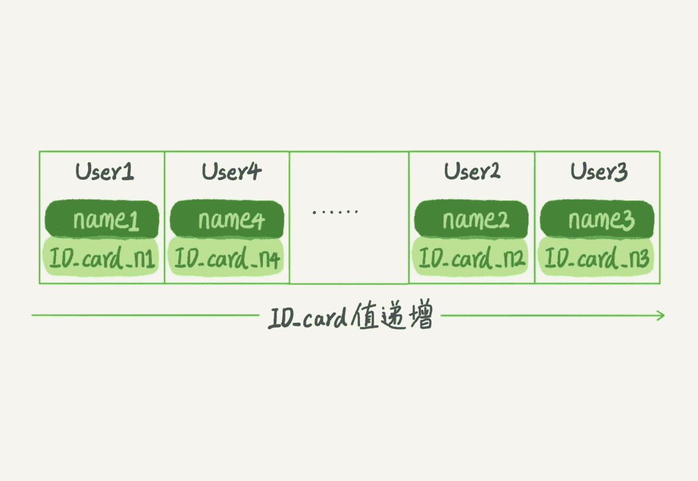
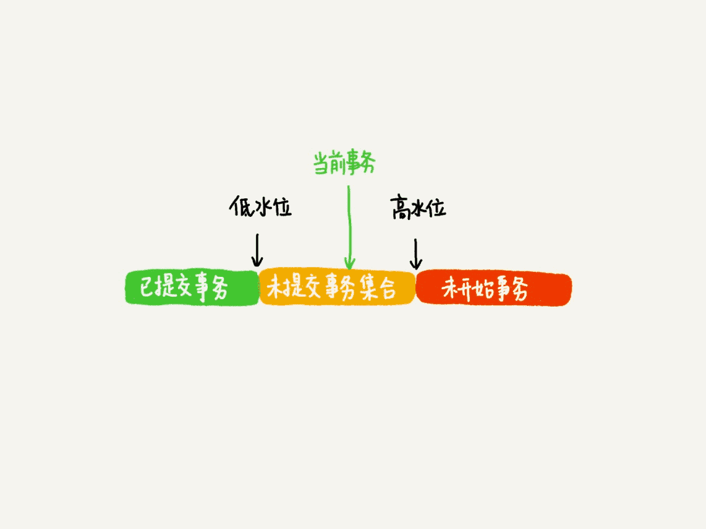
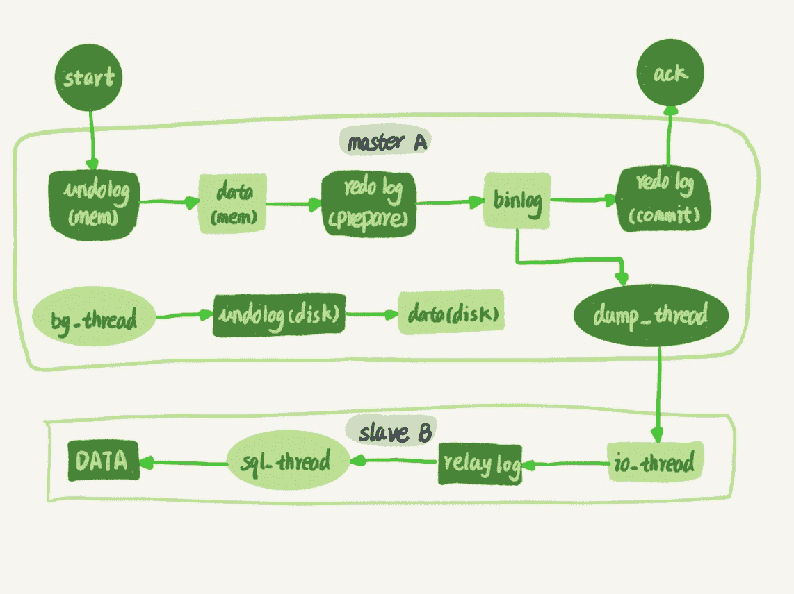
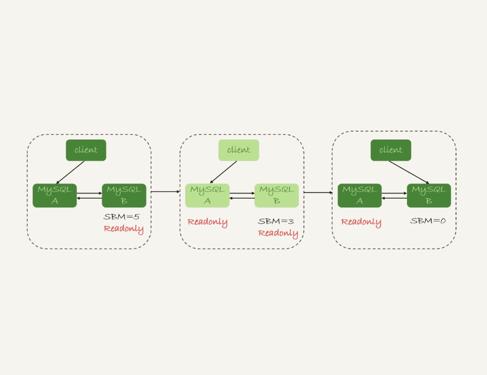
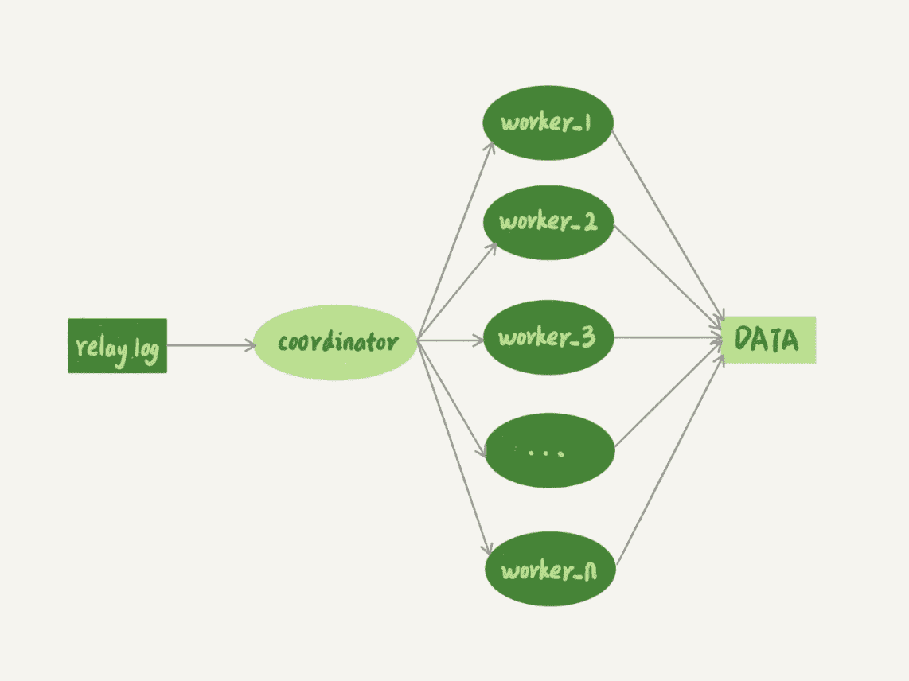
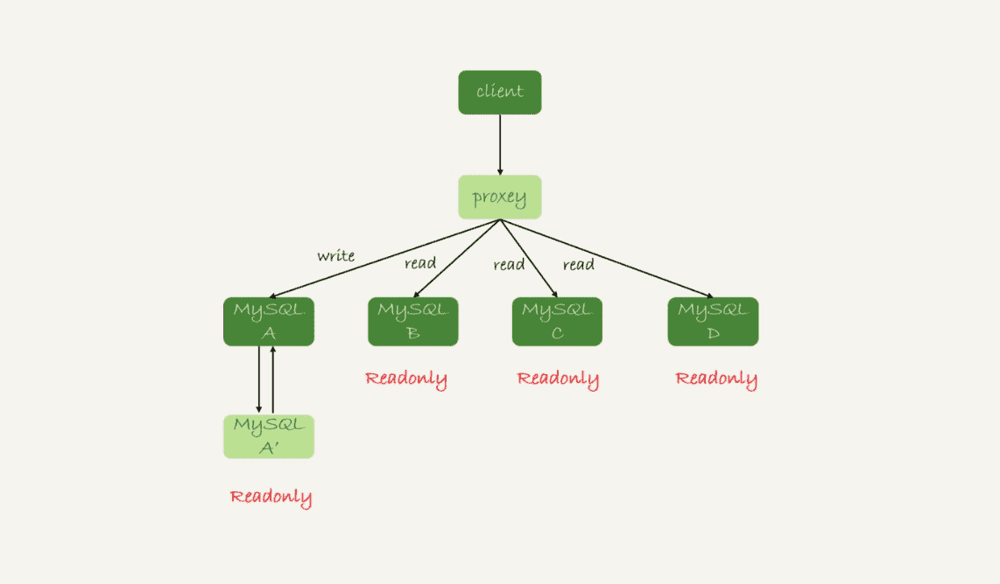
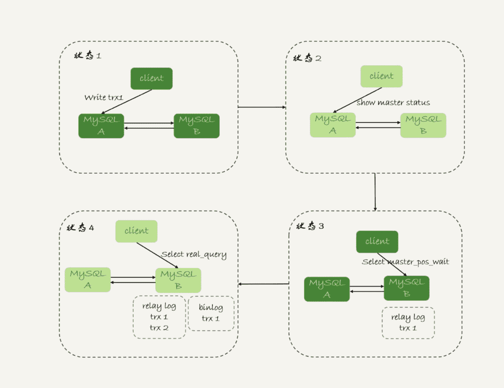

# 引擎

## Myisam
> 只支持表锁。

## Memory

> 堆组织表：
>
> 内存表的数据部分以数组的方式单独存放

- **索引**

  > 默认：hash索引

- **特点**

  > 1. 内存表的数据就是按照写入顺序存放的。
  > 2. 当数据文件有空洞的时候，内存表找到空位就可以插入新值。
  > 3. 数据位置发生变化的时候，内存表需要修改所有索引。
  > 4. 内存表所有索引的“地位”都是相同的。
  > 5. 内存表不支持 Blob 和 Text 字段，并且即使定义了 varchar(N)，实际也当作 char(N)，也就是固定长度字符串来存储，因此内存表的每行数据长度相同。

## Innodb

## 索引

> B+树：

- **特性**

  > 1. InnoDB 表的数据总是有序存放的。
  > 2. 当数据文件有空洞的时候，InnoDB 表在插入新数据的时候，为了保证数据有序性，只能在固定的位置写入新值。
  > 3. 数据位置发生变化的时候，InnoDB 表只需要修改主键索引。
  > 4. InnoDB 表用主键索引查询时需要走一次索引查找，用普通索引查询的时候，需要走两次索引查找。
  > 5. InnoDB 支持变长数据类型，不同记录的长度可能不同。

# 数据操作

## DQL

### 查询缓存

> 1. 大多数情况下不建议使用查询缓存，因为更新操作会使查询缓存失效。
> 2. 8.0之前。
>     1. 参数*query_cache_type*设置成 DEMAND，默认查询都不使用查询缓存。
>     2. SQL_CACHE 显式指定查询缓存。
> 3. 查询缓存在8.0之后没有了。

### count

> 效率排名：count(字段)<count(id)<count(1)≈count(*)

- **count(*)**

  - *语义*

    > 表示满足条件的结果集的总行数。

  - *实现*

    > - myisam：在磁盘上存储了总行数，查询时，直接从磁盘获取。
    > - innodb：
    >   - innode层不取值。
    >   - server层直接累加。
    >   - 用最小索引树统计。

- **count(主键 id)**
    
    - *语义*
    
      > 表示满足条件的结果集的总行数。
    
    - *实现*
    
      > - innode层取id值。
      > - server层直接累加。
      > - 用最小索引树统计。
    
- **count(1)**
    
    - *语义*
    
      > 表示满足条件的结果集的总行数。
    
    - *实现*
    
      > - innode层不取值，放入数组1。
      > - server层直接累加。
      > - 用最小索引树统计。
    
- **count(字段)**
    
    - *语义*
    
      > 表示满足条件的数据行里面，参数「字段」不为null的总个数。
    
    - *实现*
    
      > - innode层取字段值。
      > - server层需要判断累加。
      > - 用字段索引树统计。

#### 计数优化

- 用缓存系统保存计数

  > 缺点：更新丢失，逻辑不一致

- 在数据库保存计数

### order by

#### 字段排序

> ```sql
> select city,name,age from t where city='杭州' order by name limit 1000
> ```
>
> 按索引分析

- **city**

  > 单行长度 VS max_length_for_sort_data
  > - 小于：全字段排序
  > - 大于：rowid排序

  - *全字段排序*

    - **排序的数据量 < sort_buffer_size**

      > **内部排序**
      >
      > 1. 初始化sort_buffer,放入city,name,age三个字段
      >
      > 2. 在city索引树上查到第一个满足'city=杭州'的记录，取出id
      > 3. 在主键索引树上获取到id所在的行，取出age,name,city的值，存到sort_buffer中
      > 4. 继续2，3步骤，直到不满足条件'city=杭州'
      > 5. 在sort_buffer中按照name做快速排序，返回结果集

    - **排序的数据量 > sort_buffer_size**

      > **外部排序**
      >
      > 1. 初始化sort_buffer,放入city,name,age三个字段；
      > 2. 在city索引树上查到第一个满足'city=杭州'的记录，取出id；
      > 3. 在主键索引树上获取到id所在的行，取出age,name,city的值，存到sort_buffer中。
      > 4. 继续2，3步骤，直到sort_buffer容量满了。
      > 5. 在sort_buffer中按照name做快速排序，将结果放入临时文件，清空sort_buffer。
      > 6. 继续2，3，4，5步骤，直到不满足条件'city=杭州'。
      > 7. 使用归并排序算法，将临时文件合并成一个有序的大文件。
      > 8. 从文件中读取数据，并返回结果集。

  - *rowid排序*

    > 1. 初始化sort_buffer,放入name,id两个字段
    > 2. 在city索引树上查找到第一个满足'city=杭州'的记录，取出id
    > 3. 在主键索引树上获取到id所在的行，取出id，name值，存到sort_buffer中
    > 4. 继续2，3步骤，直到不满足条件'city=杭州'
    > 5. 在sort_buffer中按照name快速排序
    > 6. 再根据id到主键索引取出数据返回

- **city, name**

  > 1. 在city索引树上查找到第一个满足条件'city=˙杭州'的记录，取出id
  > 2. 在主键索引树上获取id所在行，取出name,age,city，作为结果集返回
  > 3. 从索引树上取下一个主键id
  > 4. 重复步骤2，3步骤直到不满足条件'city=杭州'

- **city, name, age**

  > 1. 在city索引树上查找到第一个满足条件'city=˙杭州'的记录，取出name,age,city,作为结果集返回
  > 2. 从索引树上取下一个满足条件的记录，取name,age,city作为结果集返回
  > 3. 重复执行步骤2，直到不满足条件'city=杭州'

#### 随机排序

> ```sql
> select word from words order by rand() limit 3;
> ```
>
> - 语法：order by rand();
> - 使用rowid排序
> - 要排序的数据量 VS tmp_table_size
>     - 小于：内存临时表
>     - 大于：磁盘临时表

- **内存临时表排序**

  > 1. 创建一个临时表，使用的是memory引擎，表里有两个字段，第一个字段是 double 类型，为了后面描述方便，记为字段 R，第二个字段是 varchar(64) 类型，记为字段 W。并且，这个表没有建索引
  > 2. 从 words 表中，按主键顺序取出所有的 word 值。对于每一个 word 值，调用 rand() 函数生成一个大于 0 小于 1 的随机小数，并把这个随机小数和 word 分别存入临时表的 R 和 W 字段中。
  > 3. 在这个没有索引的临时表中，按照字段R排序。
  > 4. 初始化 sort_buffer。sort_buffer 中有两个字段，一个是 double 类型，另一个是整型。
  > 5. 从内存临时表中一行一行地取出 R 值和位置信息，分别存入 sort_buffer 中的两个字段里。
  > 6. 在 sort_buffer 中根据 R 的值进行排序。
  > 7. 排序完成后，取出前三个结果的位置信息，依次到内存临时表中取出 word 值，返回给客户端。

- **磁盘临时表排序**

  > 没有显式索引的 InnoDB 表的排序过程。

#### 算法

- **随机算法**

  - *随机算法1*

    > - 取这个表的主键「id」的最大值「M」和最小值「N」;
    >
    > - 生成一个最大值到最小值之间的数 `X = (M-N)*rand() + N` ;
    > - 取不小于「X」的第一个「ID」的行。

    - **优点**

      > 计算速度快

    - **缺点**

      > 概率不均匀

  - *随机算法2*

    > 1. 取得整个表的行数，并记为 C。
    > 2. 取得 Y = floor(C * rand())。 floor 函数在这里的作用，就是取整数部分。
    > 3. 再用 limit Y,1 取得一行。

    - **优点**

      > 概率均匀

    - **缺点**

      > 执行代价较高

- **归并算法**

  > 1. MySQL 将需要排序的数据分成「X」份，每一份单独排序后存在这些临时文件中。
  > 2. 然后把这「X」个有序文件再合并成一个有序的大文件。

- **优先队列算法**

  > 1. 对于准备排序的 (R,rowid)，先取前三行，构造成一个堆；
  > 2. 取下一个行 (R’,rowid’)，跟当前堆里面最大的 R 比较，如果 R’小于 R，把这个 (R,rowid) 从堆中去掉，换成 (R’,rowid’)；
  > 3. 重复第 2 步，直到所有 (R’,rowid’) 完成比较。

### union

- **union**

  ```sql
  (select 1000 as f) union (select id from t1 order by id desc limit 2);
  ```

  > 1. 创建一个内存临时表，表中有一个字段f,并且f是主键字段。
  > 2. 将第一个子查询的结果放入内存表中。
  > 3. 执行第二个子查询，将结果逐行插入内存表，若id重复，则插入失败。
  > 4. 从临时表中取出数据，返回结果，并且删除临时表。

- **union all**

  ```sql
  (select 1000 as f) union all (select id from t1 order by id desc limit 2);
  ```

  > 1. 将第一个子查询的结果放入结果集
  > 2. 将第二个子查询的结果放入结果集
  > 3. 返回结果

### join

> 驱动表：join时优先查询的表
>
> 被驱动表：join时不优先查询的表

#### 选择驱动表
- Index Nested-Loop Join 算法，应该选择小表做驱动表。
- Block Nested-Loop Join 算法：
    - 在 join_buffer_size 足够大的时候，是一样的；
    - 在 join_buffer_size 不够大的时候（这种情况更常见），应该选择小表做驱动表。

#### 算法

- **NLJ**

  > Index Nested-Loop Join；可以使用被驱动表的索引，建议用小表做驱动表
  >
  > ```sql
  > select * from t1 straight_join t2 on (t1.a=t2.a);
  > ```
  >
  > >  a在t1和t2表中是索引
  >
  > 
  >
  > 1. 从表t1中取读一行数据R
  > 2. 从数据行R中取出字段a到表t2中查找
  > 3. 取出表t2中满足条件的行，与R组成一行，作为结果集的一部分
  > 4. 重复步骤1，2，3，直到表t1的末尾循环结束

- **SNL**

  > Simple Nested-Loop Join；被驱动表使用不是索引，这个算法会导致驱动表每去被驱动表查一次，都要做全表扫描，mysql没有使用这个算法。
  >
  > ```sql
  > select * from t1 straight_join t2 on (t1.a=t2.b);
  > ```

- **BNL**

  > Block Nested-Loop Join；被驱动表上没有可用的索引，但是在内存中操作，速度快。

  - *驱动表占用内存 < join_buffer_size*

    >  大表和小表做驱动表，无差别
    >
    > ```sql
    > select * from t1 straight_join t2 on (t1.a=t2.b);
    > ```
    >
    > 
    >
    > 1. 把表t1的数据读入线程内存join_buffer中，由于上面的语句写的是select *，所以要把整个表t放入内存中。
    > 2. 扫描表t2，把t2中的每一行都取出来，和join_buffer中的数据做对比，满足join条件的作为结果集的一部分返回。

  - *驱动表占用内存 > join_buffer_size*，建议用小表做驱动表

    > 建议用小表做驱动表
    >
    > ```sql
    > select * from t1 straight_join t2 on (t1.a=t2.b);
    > ```
    >
    > 
    >
    > 1. 扫描表t1，顺序读取数据放入join_buffer中，假设（t1一共100行）放到第88行满了，继续第2步
    > 2. 扫描表t2，把t2中的每一行都取出来，跟join_buffer中的数据做对比，满足join条件的，作为结果集的一部分返回
    > 3. 清空join_buffer
    > 4. 扫描表t1，把剩下的12行放入join_buffer中，继续执行第2步

  - *缺点*

    > BNL 算法对系统的影响主要包括三个方面：
    >
    > 1. 可能会多次扫描被驱动表，占用磁盘 IO 资源；
    > 2. 判断 join 条件需要执行 M*N 次对比（M、N 分别是两张表的行数），如果是大表就会占用非常多的 CPU 资源；
    > 3. 可能会导致 Buffer Pool 的热数据被淘汰，影响内存命中率。使用BNL算法，会导致多次扫描被驱动表，如果被驱动表是一个冷表：
    >    - 冷表的数据量小于整个 Buffer Pool 的 3/8，如果语句执行时间超过 1 秒，就会在再次扫描冷表的时候，把冷表的数据页移到 LRU 链表头部。
    >    - 如果这个冷表很大，业务正常访问的数据页，没有机会进入 young 区域。

- **BKA**

  > Batched Key Access；BKA算法是对NLJ算法的优化。
  >
  > 
  >
  > ```shell
  > set optimizer_switch='mrr=on,mrr_cost_based=off,batched_key_access=on';
  > ```
  >
  > > 开启BKA算法

#### join优化

- **BNL转BKA**

  > 1. 把表t2中满足条件的数据放在临时表tmp_t中。
  > 2. 为了让join使用BKA算法，给临时表tmp_t的字段b加上索引。
  > 3. 让表t1和tmp_t做join操作

- **hash_join**

  > join_buffer是无序的，如果支持hash，可以加快查询，mysql不支持，可以在业务端自己实现

### group by

> 当内存表的容量不足以排序时，会转为磁盘临时表。

- **需要排序**

  ```sql
  select id%10 as m, count(*) as c from t1 group by m;
  ```

  > 1. 创建内存表，表里有两个字段m、c，m是主键。
  > 2. 遍历索引树，获取id%10 的结果，记为 x
  >    - 如果临时表中不存在m为x的行，则插入（x,1）
  >    - 如果临时表中存在m为x的行，则c的值加1
  > 3. 遍历完成，借助sort_buffer根据m排序，返回结果。

- **不需要排序**

  ```sql
  select id%10 as m, count(*) as c from t1 group by m order by null;
  ```

  > 跳过了排序步骤。

#### group优化

- **增加索引**

  ```sql
  alter table t1 add column z int generated always as(id % 100), add index(z);
  select z, count(*) as c from t1 group by z;
  ```

  > 1. 索引可以确保数据是有序的，只需要从左到右，顺序扫描，依次累加。
  > 2. 当碰到第一个 1 的时候，已经知道累积了 X 个 0，结果集里的第一行就是 (0,X);
  > 3. 当碰到第一个 2 的时候，已经知道累积了 Y 个 1，结果集里的第二行就是 (1,Y);
  > 4. 不需要临时表，也不需要再额外排序。

- **直接排序**

  ```sql
  select SQL_BIG_RESULT id%100 as m, count(*) as c from t1 group by m;
  ```

  > 1. SQL_BIG_RESULT提示优化器：这个语句涉及的数据量很大，请直接用磁盘临时表。
  > 2. 既然数据量很大，那从磁盘空间考虑，直接用数组来存。
  > 3. 初始化 sort_buffer，确定放入一个整型字段，记为 m；
  > 4. 扫描索引树，依次取出里面的 id 值, 将 id%100 的值存入 sort_buffer 中；
  > 5. 扫描完成后，对 sort_buffer 的字段 m 做排序。
  > 6. 排序完成后，就得到了一个有序数组。返回结果集。

## DML

### insert

```sql
insert into tablename (cloumn1,cloumn2) value (a,b);
insert into tablename (cloumn1,cloumn2) values (a,b),(a1,b1);
insert into tablename (cloumn1,cloumn2) select (cloumn1,cloumn2) from table2 where XXX;
```

- **insert 唯一键冲突**

  > 执行insert 语句，发生唯一键冲突的时候，并不只是简单地报错返回，还在冲突的索引上加了锁。

- **自增主键**

  > 不能保证连续递增

  - *保存位置*

    > - myisam的自增值保存在数据文件中。
    > - innodb:
    >   - mysql5.7之前，存在内存中，并没有持久化，异常重启后从表中查出最大值后加1作为表的自增值。
    >   - mysql8.0,将自增值存在了redo log中，重启的时候依靠redo log恢复重启前的值。

  - *修改机制*

    ```shell
    auto_increment_offset：自增初始值，默认1；
    auto_increment_increment：步长，默认1。
    ```

    > id被定义为AUTO_INCREMENT，插入语句时：
    > - id为0或null：新增语句使用当前的自增值，自增值按步长增加。
    > - 指定id时。新增语句使用指定的id。
    >     - 指定id < 自增值：自增值不变。
    >     - 指定id > 自增值： 从 auto_increment_offset 开始，以 auto_increment_increment 为步长，持续叠加，直到找到第一个大于指定id的值，作为新的自增值。

  - *不连续的原因*

    1. **唯一键冲突**

    2. **事务回滚**

    3. **insert ... select语句申请id的策略导致不连续。**

       > 1. 语句执行过程中，第一次申请自增 id，会分配 1 个；
       > 2. 1 个用完以后，这个语句第二次申请自增 id，会分配 2 个；
       > 3. 2 个用完以后，还是这个语句，第三次申请自增 id，会分配 4 个；
       > 4. 依此类推，同一个语句去申请自增 id，每次申请到的自增 id 个数都是上一次的两倍。

  - *自增锁*

    > 非事务锁，一般为申请完成立马释放。

    - **加锁规则**

      > 由参数innodb_autoinc_lock_mode控制
      >
      > - 0：语句执行结束后才释放锁。【类5.0版本】
      > - 1：分两种情况
      >   - 普通insert语句：在申请之后就马上释放。
      >   - insert ... select语句：等语句结束后才被释放。
      > - 2：在申请之后就马上释放。

- **insert... select**

    > 在可重复读隔离级别下，binlog_format=statement下,需要对select的表访问的行加next_key lock。
    >
    > 给索引 c 上的所有间隙都加上共享的 next-key lock，主键索引全部加锁。
    >
    > ```sql
    > insert into t(c,d)  (select c+1, d from t force index(c) order by c desc limit 1);
    > ```
    >
    > 1. 创建临时表，表里有两个字段c和d。
    > 2. 按照索引C扫描表t，依次取出c=4,3,2,1，然后回表，读到 c 和 d 的值写入临时表。这时，Rows_examined=4。
    > 3. 由于语义里面有 limit 1，所以只取了临时表的第一行，再插入到表 t 中。这时，Rows_examined 的值加 1，变成了 5。

- **insert into … on duplicate key update**

    > 1. 插入一行数据，如果碰到唯一键约束，就执行后面的更新语句。
    > 2. 如果有多个列违反了唯一性约束，就会按照索引的顺序，修改跟第一个索引冲突的行。

### delete

> 删除数据，磁盘文件大小不会缩小。

- **复用**

  > - 删除数据行，该行所在的位置可以被复用。只有当插入的数据大于该位置前驱，并小于该位置后驱时，该位置可以被复用。
  > - 删除数据导致一个数据页的数据全部清空。整个数据页可以被复用。当需要开辟新的数据页时，该数据页就会被复用，不受原范围限制。如页分裂。

- **空洞**

  > - 删除数据空出来的位置称为空洞。
  >
  > - 不止删除，页分裂也会造成空洞。

- **重建表**

  > 1. 非online【重建时不能更新数据】：`alter table tablename engine=innodb,ALGORITHM=copy;`
  > 2. online：`alter table tablename engine=innodb,ALGORITHM=inplace;`
  > 3. `optimize table t`
  > 4. alter table会默认提交前面的事务。
  > 5. 重新收缩的过程中，页会按15/16满的比例来重新整理页数据。

  - *inplace*

    > inplace是指，表的操作是放在引擎层，而不是server层。

  - *online*

    > online 指表重建时，可以支持增删改操作。

### update

> 

# 表

## 分区表

> 1. 对于server层来说是一个表，所有分区表共用一个MDL锁；
> 2. 对于innodb来说，是多个表；行锁和表锁只对当前分区有效。
> 3. MySQL 在第一次打开分区表的时候，需要访问所有的分区。

- **操作**

  - *创建*

    ```sql
    CREATE TABLE `t` (
      `ftime` datetime NOT NULL,
      `c` int(11) DEFAULT NULL,
      KEY (`ftime`)
    ) ENGINE=InnoDB DEFAULT CHARSET=latin1
    PARTITION BY RANGE (YEAR(ftime))
    (PARTITION p_2017 VALUES LESS THAN (2017) ENGINE = InnoDB,
     PARTITION p_2018 VALUES LESS THAN (2018) ENGINE = InnoDB,
     PARTITION p_2019 VALUES LESS THAN (2019) ENGINE = InnoDB,
     PARTITION p_others VALUES LESS THAN MAXVALUE ENGINE = InnoDB);
    ```

  - *删除分区*

    ```sql
    alter table t drop partition …
    ```

- **分区策略**

  > 1. innodb引擎使用本地分区策略。
  > 2. myisam引擎使用通用分区策略。

- **应用场景**

  > 分区表的一个显而易见的优势是对业务透明，相对于用户分表来说，使用分区表的业务代码更简洁。还有，分区表可以很方便的清理历史数据。

## 临时表

> - 一个临时表只能被创建它的 session 访问，对其他线程不可见。
>
> - 临时表可以与普通表同名。
>
> - 临时表和普通表重名时，show create 语句，以及增删改查语句访问的是临时表。
>
>     > 每个线程都维护了自己的临时表链表。这样每次 session 内操作表的时候，先遍历链表，检查是否有这个名字的临时表，如果有就优先操作临时表，如果没有再操作普通表
>     
> - show tables 命令不显示临时表。
>
> - 客户端异常断开，或数据库异常重启，临时表会自动回收。
>
>     > session 结束的时候，对链表里的每个临时表，执行 `DROP TEMPORARY TABLE + 表名` 操作。

- **引擎**

  > 可用使用各种引擎。
  >
  > - InnoDB引擎|MyISAM引擎：数据写到磁盘上。【磁盘临时表】
  > - Memory引擎：数据写到内存中。【内部临时表】

- **创建**

  ```sql
  create temporary table temp_t ... 
  ```

- **应用**

  > 1. 大表分库分区时，中间查询结果使用临时表，再进行排序、分组等操作。
  > 2. union, group by(分组字段没有索引)。

- **文件系统**

  - 表结构：
    - 放在临时文件目录下，select @@tmpdir 命令，来显示实例的临时文件目录。
    - 后缀是.frm。
    - 前缀是「#sql{进程 id}_{线程 id}_ 序列号」。
  - 数据：
      - <=5.6：与表结构相同前缀、以.ibd 为后缀的文件。
      - \>=5.7：MySQL 引入了一个临时文件表空间，专门用来存放临时文件的数据。

## 内存表
> - 使用Memory引擎的表。
> - 数据都保存在内存里，系统重启的时候会被清空，但是表结构还在。

- **创建**

  ```sql
  create table … engine=memory。
  ```

## 分表

- **分库分表**

  > 
  >
  > - 一般情况下，分库分表系统都有一个中间层 proxy。
  > - 分区 key 的选择是以“减少跨库和跨表查询”为依据的。

- **用不到分区依据时**

  - *方案一*

    > 在 proxy 层的进程代码中实现排序等。

  - *方案二*

    > 
    >
    > - 各个分库拿到的数据，汇总到一个 MySQL 实例的一个表中。
    > - 直接把临时表放到分库中的某一个上。

## 数据拷贝

### 逻辑拷贝

- **mysqldump**

  - *导出*

    ```shell
    mysqldump -h$host -P$port -u$user --add-locks=0 --no-create-info --single-transaction  --set-gtid-purged=OFF db1 t --where="a>900" --result-file=/client_tmp/t.sql
    ```

    > 1. --single-transaction：在导出数据的时候不需要对db1.t加表锁，而是使用 start transaction with consistent snapshot的方法。
    > 2. --add_locks：设置为0，表示在输出的文件里，不增加"lock tables t write"。
    > 3. --no-create-info：不需要导出表结构。
    > 4. –set-gtid-purged=off：不输出跟 GTID 相关的信息；
    > 5. --result-file：指定了输出文件的路径，其中 client 表示生成的文件是在客户端机器上的。
    > 6. –-skip-extended-insert：一条 INSERT 语句只插入一行数据。
    > 7. –-tab:同时导出表结构定义文件和 csv 数据文件

  - *导入*

    ```shell
    mysql -h127.0.0.1 -P13000 -uroot dbname source -e 'path'
    ```

- **csv**

  - *导出*

    ```sql
    select * from t into outfile 'path'
    ```

    > secure_file_priv设置为：
    >
    > - empty：表示不限制文件生成的位置，这是不安全的设置；
    > - 一个表示路径的字符串：要求生成的文件只能放在这个指定的目录，或者它的子目录；
    > - NULL：表示禁止在这个 MySQL 实例上执行 select … into outfile 操作。

  - *导入*

    ```sql
    load data infile 'path' into table database.tablename
    ```

### 物理拷贝


> 1. 执行 create table r like t，创建一个相同表结构的空表；
> 2. 执行 alter table r discard tablespace，这时候 r.ibd 文件会被删除；
> 3. 执行 flush table t for export，这时候 db1 目录下会生成一个 t.cfg 文件；
> 4. 在 db1 目录下执行 cp t.cfg r.cfg; cp t.ibd r.ibd；这两个命令（这里需要注意的是，拷贝得到的两个文件，MySQL 进程要有读写权限）；
> 5. 执行 unlock tables，这时候 t.cfg 文件会被删除；
> 6. 执行 alter table r import tablespace，将这个 r.ibd 文件作为表 r 的新的表空间，由于这个文件的数据内容和 t.ibd 是相同的，所以表 r 中就有了和表 t 相同的数据。

- **注意点**

  > 1. 在第 3 步执行完 flsuh table 命令之后，db1.t 整个表处于只读状态，直到执行 unlock tables 命令后才释放读锁；
  > 2. 在执行 import tablespace 的时候，为了让文件里的表空间 id 和数据字典中的一致，会修改 r.ibd 的表空间 id。而这个表空间 id 存在于每一个数据页中。因此，如果是一个很大的文件（比如 TB 级别），每个数据页都需要修改，所以你会看到这个 import 语句的执行是需要一些时间的。当然，如果是相比于逻辑导入的方法，import 语句的耗时是非常短的。

# 权限

> - 内存的权限数据和磁盘数据表相同，不需要执行 flush privileges。
> - 只用 grant/revoke 语句来执行的话，内存和数据表本来就是保持同步更新的。

- **创建用户**

  ```sql
  create user 'username'@'ip' identified by 'password'
  ```

  > 这条命令做了两个动作：
  >
  > 1. 往mysql.user中插入一条数据，所有表示权限的字段都是N。
  > 2. 内存里，往acl_users里插入一个acl_user对象，这个对象的access字段值为0。

- **全局权限**

  ```sql
  grant all privileges on *.* to 'username'@'ip' with grant option
  ```

  > 这个 grant 命令做了两个动作：
  >
  > 1. 把mysql.user里，'username'@'ip'这一行所有表示权限的字段改成Y。
  > 2. 内存里，从数组acl_users里找到这个用户对应的对象，将access值修改为二进制全1。

  - *影响范围*

    > 1. 对于一个已经存在的连接，它的全局权限不受grant命令的影响。
    > 2. grant命令对于全局权限，同时更新磁盘和内存，命令完成后即时生效，接下来新的连接会使用新的权限。

  - *回收权限*

    ```sql
    revoke all privileges on *.* from 'username'@'ip' 
    ```

    > 1. 磁盘上，将mysql.user表里，用户'username'@'ip'这一行的所有表示权限的字段改成N。
    > 2. 内存里，从数组acl_users里找到这个用户对应的对象，将accsess的值改成0。

- **db权限**

  ```sql
  grant all privileges on dbname.* to 'sunchen'@'%' with grant option;
  ```

  > 这个命令做了两个动作：
  >
  > 1. 磁盘上，在mysql.db里插入一条数据，所有权限字段设置成Y。
  > 2. 内存里，增加一个对象到acl_dbs，这个对象的权限位为全1。

- **表权限**

  ```sql
  grant all privileges on dbname.tablename to 'sunchen'@'%' with grant option;
  ```

  > 1. 磁盘上，往mysql.tables_priv里插入一行，所有权限字段设置成Y。
  > 2. 和列权限足组合起来存放在内存的 hash 结构 column_priv_hash 中。

- **列权限**

  ```sql
  grant select(id) on dbname.tablename to 'sunchen'@'%' with grant option;
  ```

  > 1. 磁盘上，往mysql.columns_priv里插入一行，所有权限字段设置成Y。
  > 2. 和列权限足组合起来存放在内存的 hash 结构 column_priv_hash 中。

- **刷新权限**

  ```sql
  flush privileges;
  ```

  > 1. 清空acl_users,从mysql.user里读取数据重新构造一个acl_users。
  > 2. 对于 db 权限、表权限和列权限，MySQL 也做了上述处理。

  - *使用场景*

    > 用DML语句操作系统权限表，导致内存数据和磁盘不一致。

# 索引

## 索引模型
- **哈希表**

  > 
  >
  > 等值查询，如Memcached

- **有序数组**

  > 
  >
  > 等值查询和范围查询，静态数据存储引擎

- **搜索树**

  > 
  >
  > - 适用场景
  >   访问磁盘少，性能高，广泛应用于大多数数据库路
  > - 大部分索引不使用二叉树的原因：磁盘数据页。n叉树适配磁盘访问模式。

- **B+树**

  > 
  >
  > innodb存储引擎

## 索引类型
### 主键索引

> 也叫聚簇索引【clustered index】，叶子节点存储的是整行数据

### 非主键索引

- **普通索引**

  - *使用场景*

    > 提高归档效率。业务已限制唯一性。

  - *查询过程*

    > 1. 查找到第一个满足条件的记录后停止。
    > 2. 将查询结果载入内存。
    > 3. 如果有数据页相关的change buffer，与change buffer 进行merge后更新内存。

  - *更新过程*

    > - 记录要更新的目标页在内存中：直接更新内存
    > - 记录要更新的目标页不在内存中：将更新操作记录在change buffer中，更新结束

- **唯一索引**

  - *使用场景*

    > 需要通过数据库来保证唯一性

  - *查询过程*

    > 查找到第一个满足条件的记录后停止

  - *更新过程*

    > - 记录要更新的目标页在内存中：先判断是否冲突，没有冲突，直接更新内存
    > - 记录要更新的目标页不在内存中：从磁盘中读入数据页，判断冲突，不冲突更新内存

- **字符串索引**

  | 索引类型 | 使用注意事项                                                 | 优点              | 缺点                                                         |
  | :------- | :----------------------------------------------------------- | :---------------- | :----------------------------------------------------------- |
  | 完整索引 |                                                              | 扫描行数少        | 占用空间大                                                   |
  | 前缀索引 | 创建方法：`index(field(len))`；通过`count(distinct left(field, len))`计算区分度来判断合适的前缀长度，区分度损失5%合理。 | 节省空间          | 增加扫描次数；影响覆盖索引                                   |
  | 倒序索引 | 字符串倒存；适用于前缀区分度不高，后缀区分度高的情况。       | 增加索引区分度    | 不支持范围查询；reverse()消耗CPU，比crc32()消耗少；增加扫描次数；影响覆盖索引 |
  | hash索引 | 新增整数字段，用函数计算出校验码，对整数字段建索引；适用于前后区分度都不高的情况。 | 平均扫描行数接近1 | 不支持范围查询；crc32()多消耗CPU；额外占用空间；影响覆盖索引 |

## 索引优化

### 覆盖索引
> 在命中索引的搜索树上查询得到的值，可以满足查询结果，不需要回表。

- **优点**

  > 可以减少树的搜索次数，提升查询性能。

- **缺点**

  > 造成索引字段冗余，浪费存储空间，增加维护成本。

### 最左前缀
- **优化原则**
  
    > 联合索引：根据复用性安排索引顺序；若有多个字段需要单独使用，选择空间小的单独建立索引。
    
- **优点**

    > 减少索引的个数。

- **排序原则**

    > 基数排序。

### 索引下推
> 在索引遍历中，如果仅能利用前缀索引，可以想办法利用联合索引的其他字段。
>
> 索引下推能有效减少回表次数。

- **使用办法**

  > 在进行遍历查找时，参数除了能用来遍历索引的字段外，还加入了其他字段，用这个字段进行过滤。

- **重点**

  > 接口能力，传递时除关键字外，还会传其他字段。

### 解决mysql用错索引
- **方法一**

  > 采用 force index 强行选择一个索引。

- **方法二**

  > 可以考虑修改语句，引导 MySQL 使用期望的索引。

- **方法三**

  > 可以新建一个更合适的索引，来提供给优化器做选择，或删掉误用的索引。

- **方法四**

  > 使用analyze table table_name，更正统计信息。

### 不会使用索引的情况
- 使用条件字段函数
    
    ```sql
    where month(t) = 7; 
    where id + 1 = 10000
    ```
    
- 隐式类型转化
    
    > 字符串转数字，不会使用索引的快速搜索功能，进行全索引扫描
    
    ```sql
    where user_name = 2; 
    ```
    
- 隐式字符编码转化
    
    > 如果两个表字符集不同，join时，可能会进行全表扫描
    
    - 「按数据长度增加的方向」
    - 连接过程中要求在被驱动表的索引字段上加函数操作

### 其他优化

> 1. 设计表结构时，以减少资源消耗为目标。
> 2. 主键长度越小，普通索引的叶子节点也越小，普通索引占用的空间也约小。
> 3. 基于非主键索引查询可能会造成回表，因此我们在应用中应该尽量使用主键查询。
> 4. 在不影响业务时，尽量使用普通索引。
> 5. 使用哪个索引，是由mysql来决定的。
> 6. 使用force语句强制使用索引。
> 7. 对索引字段做函数操作，优化器会放弃走树搜索功能。
> 8. 当需要使用join时，如果被驱动表可以使用索引，可以使用；当被驱动表不能使用索引，会导致扫描驱动表多次，占用大量的资源，不建议使用。
> 9. 使用join，需要确认好哪个表作为驱动表，
>     1. Index Nested-Loop Join算法，应该选择小表做驱动表。
>     2. 如果是 Block Nested-Loop Join 算法：在 join_buffer_size 足够大的时候，是一样的；在 join_buffer_size 不够大的时候（这种情况更常见），应该选择小表做驱动表。

### 适合不用自增主键的场景
- 数据库只有1个索引。

- 索引必须是唯一索引。

> 唯一就可以等值查询，查找的过程中不用向后遍历，因为遍历的话，每页存的主键又少了，可能需要查多个页。

### 索引重建
- 普通索引

    > 先删后加，影响不大。

- 主键索引
    
    > 删除后，mysql会自动生成一个rowid为主键的索引，新增的时候再替换，相当于涉及到两次索引重建，效率不高。
    
    - 替代方案：`alter table T engine=InnoDB`。

### 索引「数据」操作

#### 索引操作
- **新增**

    ```sql
    alter table table_name add primary key|unique|index|FULLTEXT index_name(column_list)
    create index index_name on table_name(column_list)
    ```

- **删除**

    ```sql
    alter table table_name drop index index_name
    drop index index_name on table_name
    ```

- **查询**

    ```sql
    show index from table_name
    show keys from table_name
    ```

- **使用**

    - *默认使用*：由优化器选择。
    
    - *强制使用*
    
      ```sql
      select column_list from table force index(index_name);
      ```
    
      ​    

#### 数据操作
1. **新增数据**
    
    - 当前数据页没满：在数据页中插入新纪录。    
    - 当前数据页已满
        - 顺序新增：申请新数据页放入数据
        - 中间插入：进行页分裂
    
2. **删除数据**
    
    > 相邻两页利用率很低之后，会发生页合并。
    
3. **查询数据**
    
    - 使用主键索引：先从根结点查找，按层搜索到叶子节点，如果叶子节点所在的数据页不在内存中，将数据页写入内存。
    - 使用二级索引
        - 索引覆盖：要查询的字段在二级索引中均有存储，搜索方式同上。
        - 索引未覆盖：
            1. 先从根结点查找，按层搜索到叶子节点；
            2. 拿出叶子节点的主键id；
            3. 从主键索引的根结点查找，按层搜索到叶子节点，然后将叶子节点所在的数据页写入内存中。
            4. 重复步骤1，2，3，直到下一个不满足条件的值为止。
    
4. **数据修改**
   
   - 修改主键：主键索引和其他所有索引均需改动
   - 修改二级索引字段：修改主键索引和涉及到的二级索引。
   - 修改普通字段：修改主键索引。
   
#### 页分裂
> 当一个数据页已满，插入新的数据时，需要申请新的数据页，这时需要挪动数据到新的数据页，此过程称为页分裂。

- **影响**

  > 页的利用率降低，性能降低。

#### 页合并
> 当相邻两个页由于删除，利用率很低，会将数据页做合并。此过程称为页分裂。
>
> 也称为页分裂的逆过程。

#### 回表
> 回到主键索引树搜索的过程，称为回表。

## 索引基数
> `show index`的`cardinality`字段

- **索引基数统计信息参数**
  
  > `innodb_stats_persistent`
  
  | 值   | 定义         | 采样统计页数N | 变更数据比例 1/M |
  | :--- | :----------- | :------------ | :--------------- |
  | on   | 持久化存储   | 20            | 10               |
  | off  | 存储在内存中 | 8             | 16               |
- **重新统计索引基数**

  > `analyze table table_name`

# 事务

```sql
select * from information_schema.innodb_trx;  
```

> 查询当前正在执行的事务

## 隔离级别
> - 由参数transaction_isolation控制。
> - 只有读提交和可重复读级别才使用MVCC。
> - 读提交和读未提交隔离级别下，binlog不能为statment格式。因为幻读会导致数据实际变化和binlog记录的不一致。

- **读未提交**

  > read-uncommitted
  >
  > 一个事务还未提交时，它的更改能被其他事务看到

- **读提交**

  > read-committed
  >
  > 一个事务提交后，它的更改才能被其他事务看到

  - 可解决脏读问题。

  - 一致性视图生成时间

    > 每一个语句执行前都会重新算出一个新的视图

  - 数据版本可见情况

    > 1. 版本未提交，不可见
    > 2. 版本已经提交，但是是在视图创建后提交的，不可见
    > 3. 版本已经提交，但是是在视图创建之前提交的，可见

- **可重复读**

  > repeatable-read
  >
  > 一个事务执行过程中看到的数据，总是跟这个事务在启动时看到的数据是一致的。

  - 可解决脏读，不可重复读和幻读的问题。

  - 一致性视图生成时间

    > 只在事务开启时创建，之后事务里的其他查询共享这一个视图。

  - 一致性读【consistent read】

  - 数据版本可见情况

    > 一个事务的启动瞬间，一个数据版本的 row trx_id，有以下几种可能：
    >
    > 1. 如果落在低水位之下，表示这个版本是已提交的事务或者是当前事务自己生成的，这个数据是可见的；
    > 2. 如果落在高水位之上，表示这个版本是由将来启动的事务生成的，是肯定不可见的；
    > 3. 如果落在低水位和高水位之间，
    >     - 情况a. 若 row trx_id 在数组中，表示这个版本是由还没提交的事务生成的，不可见；
    >     - 情况b. 若 row trx_id 不在数组中，表示这个版本是已经提交了的事务生成的，可见。

- **串行化**

  > serializable
  >
  > “写”会加“写锁”，“读”会加“读锁”。当出现读写锁冲突的时候，后访问的事务必须等前一个事务执行完成，才能继续执行。

## ACID

- **原子性**

  > Atomic
  >
  > 事务的一系列操作，要不全部成功，要不全部失败

- **一致性**

  > Consistency
  >
  > 事务操作成功后，数据库所处的状态和他的业务规则是一样的，【即数据不会被破坏】

- **隔离性**

  > Isolation
  >
  > 在并发数据操作时，根据隔离级别控制干扰程度

- **持久性**

  > Durabiliy
  >
  > 提交后，数据一定会持久化

## 数据并发问题
> 1. 数据实际修改和binlog记录不一致。
> 2. 数据实际修改和语义不符。

- **脏读**

  > A事务读取了B事务尚未提交的更改，B事务回滚了。

- **不可重复读**

  > A事务第二次读取了B事务已经提交的更改，与第一次读取的内容不一致。

- **幻读**

  > A事务第二次查询，查到了B事务新增的行 

## 事务ID

> transaction id

- **生成时机**

    > 事务开启时，向innodb申请

- **生成规则**
    
    > innodb内部维护了一个max_trx_id全局变量，每次需要申请一个新的trx_id,就会获得max_trx_id的值，然后加1
    >
    > 最大值是2⁴⁸-1，达到最大值，从0开始
    
- **使用场景**
    
    > 用于数据更新时生成新的数据版本，判断数据的可见性。
## 事务操作

- **开启**

  - *没有显式地使用begin*

    > 在执行第一条语句时开启事务。

  - *显式使用*

    ```sql
    begin/start transaction;
    ```

    > 在执行第一条语句时开启事务。

    ```sql
    start transaction with consistent snapshot;
    ```

    > 立即开启事务。

- **提交**

  - *没有显式地使用begin*：由参数autocommit控制
      
      - autocommit = 1 时
        
          > **默认**，当没有显式使用begin/commit时，表示这个语句本身就是一个事务，语句完成的时候会自动提交。
      
      - autocommit = 0 时
      
          > 将线程的自动提交关掉，执行任何一条语句时，事务就启动了。必需主动执行 commit 或 rollback。
      
  - *显式使用*
      
      > commit时提交，rollback时回滚。

## MVCC 
> 用于支持提交读【RC】和可重复读【RR】隔离级别的实现。每行数据都有多个版本，历史版本的恢复有当前版本和undolog获取

## 一致性视图「read-view」
> 
>
> InnoDB 为每个事务构造了一个数组，用来保存这个事务启动瞬间，当前正在“活跃”的所有事务 ID。“活跃”指的就是，启动了但还没提交。
>
> 数组里面事务 ID 的最小值记为低水位，当前系统里面已经创建过的事务 ID 的最大值加 1 记为高水位。
>
> 开启了一致性读之后,在这个事务执行期间,不能释放空间,导致统计信息变大。

## 当前读
> 更新数据都是先读后写的，这个读只读当前的值【即数据最新版本】，称为当前读【current read】
>
> 除更新外，查询加锁也是当前读。

## purge线程

> 数据删除是标记删除，由purge线程来决定什么时候真正删除。主键相同例外。

> purge线程会清理undo log page，默认300.

# 锁

## 全局锁
- **使用场景**

  > 全库逻辑备份

- **加锁【FTWRL】**

  ```sql
  flush tables with read lock 
  ```

- **释放锁**

  - ```sql
    unlock tables
    ```

  - 客户端断开连接

- **设置库只读的命令**

  ```sql
  set global readonly=true
  ```

- **FTWRL与readonly的区别**

  - *FTWRL*

    > 当客户端异常断开时，数据库会立即解除全局锁。

  - *readonly*

    > 客户端异常断开，服务器仍然处于只读状态，需要再次登录服务器进行操作。

## 表级锁
### 表锁
> 一般是在数据库引擎不支持行锁的时候才会被用到。

- **加锁**

  ```sql
  lock tables ... read/write
  ```

- **释放锁**

  - ```sql
    unlock tables
    ```

  - 客户端断开连接

- **加锁规则**

  - *读锁*

    > 所有线程的写会被阻塞。

  - *写锁*

    > 其他线程的读写会被阻塞；本线程可读写。

### 元数据锁

> **metadata lock**，保证读写的正确性。

- **加锁**

  > 不需要显式使用，在访问一个表的时候会被自动加上。

  - 增删改查时会加读锁。
  - 对表做结构变更操作加写锁。

- **释放锁**

  > 事务提交的时候

- **加锁规则**

  > - 读锁之间不互斥
  > - 读写，写锁之间互斥
  > - 特殊注意事项：对于mdl来说，一旦出现写锁等待，不止限制当前的线程，之后对该表的所有读操作也会被阻塞。

- **给小表加字段**

  > 1. 事务要尽可能小。
  > 2. 如果是热点表：在执行时，设置锁等待时间：`alter table tb_name wait n ...`，避免写锁长时间阻塞进程。

- **问题：从库做全量备份时，主库DDL会发生什么？**

  > 1. 数据库没有生成建表语句前到达，没有影响。同步的数据是表结构修改后的。
  > 2. 生成建表语句，还没开始查询，进行查询时，会发生备份报错终止。
  > 3. 进行查询时到达，同步阻塞。同步的数据是表结构修改前的。
  > 4. 核心，在全量备份时，元数据锁是在一张表备份完成后主动释放的。

## 行级锁
> - 同一事务中的锁不会出现锁等待
> - 锁是加在索引上的
> - 读锁只会给访问到的索引加锁
> - 写锁会给访问到的索引和主键索引加锁
> - 范围查询的第一次是等值查询

### 行锁

> 为innodb引擎增强并发能力。

- **加锁**

  - *读锁【共享锁】*

    - **自动加**

      > 隔离级别为串行化的时候，查询。

    - **主动加**

      ```sql
      lock in share mode
      ```

  - *写锁【排它锁】*

    - **自动加**

      > 数据更新时

    - **主动加**

      ```sql
      for update
      ```

- **解锁**

  > 事务提交后释放锁。

- **加锁规则**

  > 读锁之间不冲突
  >
  > 读写，写锁之间冲突。

- **两阶段锁协议**

  > 在需要的时候加锁，在事务提交时释放。

- **死锁**

  > 并发的事务都在等待对方释放资源

  - *解决策略*
    - 锁等待超时，超时时间由innodb_lock_wait_timeout控制，默认50s
    - 发起死锁检测，发现死锁后，会主动回滚某一个事务，让其他事务继续执行，参数innodb_deadlock_detect设置为on,表示开启死锁检测

### 间隙锁
> 解决可重复读级别下的幻读问题
>
> - 所谓“间隙”，其实根本就是由“这个间隙右边的那个记录”定义的。
> - 只在可重复读隔离级别下出现。

- **加锁**

  > 加在两个记录之间。

- **冲突关系**

  > 跟间隙锁存在冲突关系的，往往是"往这个间隙中插入一个记录"这个操作，间隙锁之间不存在冲突关系。

- **缺点**

  > 加锁范围变大，牺牲了一定的并发能力。

### next-key lock

> 间隙锁+行锁 前开后闭区间
>
> 先加间隙锁，再加行锁

- **加锁规则**
  - 原则一：加锁的基本单位是next-key lock
  - 原则二：查找过程中访问到的对象才加锁
  - 优化一：索引上的等值查询，给唯一索引加锁的时候，会退化成行锁
  - 优化二：索引上的等值查询，向右遍历时且最后一个值不满足等值条件的时候，退化成间隙锁
  - 一个bug：唯一索引上的范围查询会访问到不满足条件的第一个值为止。

## 悲观锁与乐观锁

> 是一种思想。

- **悲观锁**

  > **Pessimistic Lock**
  >
  > 认为读多写少，遇到并发写的可能性比较低，所以采取在写时先读出当前版本号，然后加锁操作。

- **乐观锁**

  > **Optimistic Lock**
  >
  > 每次获取数据的时候，都不会担心数据被修改，所以每次获取数据的时候都不会进行加锁，但是在更新数据的时候需要判断该数据是否被别人修改过。

# 日志

## binlog

> 记录数据库的修改记录。
>
> 可用于数据备份、数据恢复、主从同步。

```shell
mysqlbinglog  
```

> --start-position: 指定从哪个位置开始
> -vv: 把内容都解析出来

```shell
mysqlbinlog master.000001  --start-position=2738 --stop-position=2973 | mysql -h127.0.0.1 -P13000 -u$user -p$pwd;
```

> 数据恢复命令

- **容量**

  > 每个binlog文件默认500M。

  - 由于命令的执行、系统重启等原因，binlog日志不满500MB就不再写入。
  - 执行大事务，不断写入binlog导致当前binlog文件尺寸超过500MB。

- **存储位置**

  > 由参数log-bin控制

- **记录时机**

  > - 由参数sql_log_bin控制，默认on。
  > - 作为主库时，在执行DDL或DML语句时记录。
  > - 作为备库时，读到主库传来的binlog后，写到本地文件，称为中转日志「relay log」。解析出日志里的命令，并执行时记录。

  - *记录过程*

    > 1. 事务过程中，日志写入binlog cache中。
    > 2. 事务提交时，将日志writ到文件系统的 page cache
    > 3. 根据参数sync_binlog配置，决定持久化到磁盘的频率。

- **日志录入格式**

  > 由参数binlog_format控制。
  >
  > 日志中的公共字段含义
  >
  > > SET @@SESSION.GTID_NEXT：指定事务特有的id，用于主备同步时跳过冲突。
  > > server_id：服务器id，由参数server-id控制。
  > > end_log_pos：事务结束位置。
  > > thread_id：线程id
  > > Xid：两阶段提交，恢复数据时，验证redo log有效性

  - *statement*

    - **含义**

      > 记录sql语句的原文

    - **优点**

      > 不需要记录每一行的变化，减少了binlog的日志量，占用空间小，节约IO

    - **缺点**

      > - 主从情况下可能会造成数据不一致。
      >   - limit操作时可能主从使用不用的索引
      > - 不能用于数据恢复。

    - **特有字段**

      > SET INSERT_ID=XX：线程需要用到自增值的时候，固定用XX。

  - *row*

    - **含义**

      > 记录每行数据的变化过程，参数binlog_row_image控制要记录的字段：
      >
      > - FULL(默认)：所有字段
      > - MINIMAL：必要字段

      

    - **优点**

      > - 可以用于数据恢复、备份。
      > - 避免主从（备）数据不一致
      >   - mysql复制。
      >   - 自增锁申请完立马释放时。 

    - **缺点**

      > 记录的日志量大，耗费IO资源，影响执行速度，当update修改多条记录。

  - *mixed*

    - **含义**

      > mysql自己判断sql否可能引起主备不一致，如果有可能，就用 row 格式，否则就用 statement 格式。

    - **优点**

      > 避免语句歧义，节省IO。

    - **缺点**

      > 无法恢复数据。

- **生成规则**

  - 判断是否超过6小时
      - 超过：切换到下一号文件，老文件异步上传。
      - 不超过：判断是否超过500MB。
          - 超过：切换到下一号文件，老文件异步上传。
          - 不超过：继续写入。

  - 重启切换到下一号文件。


- **保存及清理规则**
  - 实例使用空间 VS 购买空间
      - 小于80%：看binlog产生时间
          - 小于18小时：实例中保存。
          - 大于18小时：只保存购买空间的30%的binlog「即使该binlog文件已经上传到OSS内」
      - 大于80%：binlog会上传到OSS，发起删除本地数据的请求，本地删除会有任务调度，有一定延迟。


## redo log

> 1. 一种记录普通数据页的改动。
> 2. 一种记录changebuffer的改动。

- **作用**

  > - 提高更新效率。
  > - crash-safe能力：即使数据库发生异常重启，之前提交的记录都不会丢失。

- **容量**

  > 总文件数由参数innodb_log_files_in_group控制。一般为4个文件。
  >
  > 单文件大小由参数innodb_log_file_size控制。一般一个文件大小为1G。

- **特点**

  > 1. redo log 是 InnoDB 引擎特有的。
  > 2. redo log 是物理日志，记录的是“在某个数据页上做了什么修改”。
  > 3. redo log 是循环写的，空间固定会用完。

- **工作原理**

  > 
  >
  > - write pos 是当前记录的位置
  > - checkpoint 是当前要擦除的位置
  > - 从头开始写，写到末尾就又回到开头循环写

### 数据恢复
1. 为了提速，对于更新操作不会直接落盘，而是在内存中先改掉，当内存中的数据消失时，才会落盘。
2. 那么，就需要有文件来记录内存中和磁盘中不一样的地方，这个文件就是redo log。
3. redo log 这时候相当于一个buffer，灾后重启时，这个buffer的文件就是还没有落盘的文件。
4. redo log里面的记录要不要全部落盘呢？根据redo log的提交情况和binlog的提交情况判断，他们通过XID关联，保持数据、redolog、binlog的一致性就好了。

### 两阶段提交

> 

- **两阶段提交细化**

  > 

- **示例**

  ```sql
  update T set c=c+1 where ID=2;
  ```

  - 执行器先找引擎取 ID=2 这一行。引擎直接用树搜索找到这一行。如果ID=2 这一行所在的数据页本来就在内存中，就直接返回给执行器；否则，需要先从磁盘读入内存，然后再返回。
  2. 执行器拿到引擎给的行数据，把这个值加上 1，比如原来是 N，现在就是 N+1，得到新的一行数据，再调用引擎接口写入这行新数据。
  3. 引擎将这行新数据更新到内存中，同时将这个更新操作记录到 redo log里面，此时 redo log 处于 prepare状态。
  4. 然后告知执行器执行完成了，随时可以提交事务。执行器生成这个操作的 binlog，并把 binlog 写入磁盘。
  5. 执行器调用引擎的提交事务接口，引擎把刚刚写入的 redo log 改成提交（commit）状态，更新完成。

### WAL
> 全称 **write-ahead log**
>
> 先写日志，再写磁盘。

## undo log

> 回滚日志

- **作用**

  > - 当数据在操作过程中，内存中的数据会发生变更，而undo log的内容就依附于当前事务的操作。
  > - 记录了这个事务所有操作过的数据，在操作前的样子。
  > - 事务回滚的时候只需要按照undo log里的内容把数据改回来就行了。
  > - 一致性读往前追溯的时候，也可以通过数据的版本链roll_pointer沿着undo log去查找可以查看的值。

- **清理时机**

  > 当正在执行的事务中已经没有undo log的版本号时，在空闲时会清理undo log。

## row log

> 重建表过程中，记录对数据的更新。
>
> 临时文件生成后，将日志文件中的操作应用到临时文件。

## relay log

> 将从主库同步过来的binlog写在relaylog中，用于备库同步数据


1. **参数：log_slave_updates**

   > on：备库执行 relay log 后生成 binlog

2. **参数：relay_log**

   > relay_log的位置

# 内存

> - write：把日志写入到文件系统的 page cache。
> - fsync：将数据持久化到磁盘的操作。一般情况下，我们认为 fsync 才占磁盘的 IOPS。

## 内存临时表

- **容量**

  > 由参数tmp_table_size控制，默认值16M
  >
  > 磁盘临时表引擎由参数internal_tmp_disk_storage_engine控制

- **使用场景**

  > - 如果执行逻辑需要用到二维表特性，就会优先考虑使用临时表。
  >
  > - union时
  >
  > - group by & 无索引 & 要分组的数据量小于temp_table_size。

## buffer pool

```sql
show engine innodb status;
```

> 内存命中率：查看 Buffer pool hit rate。

- **作用**

  > innodb的内存管理，缓存数据页。主要用于加速数据库查询和修改。

  - *查询加速*

    > 初次查询会先将数据页由磁盘载入内存，然后返回给server层。
    >
    > 再次查询直接从内存中读取数据，省去磁盘IO。

  - *修改加速*

    > 数据修改时，如数据在内存中存在，直接修改内存数据返回成功结果。
    >
    > 若数据不存在，只记录change buffer，返回成功结果。
    >
    > 除特殊情况外，不会有磁盘IO

- **容量**

  > - 由参数 innodb_buffer_pool_size 控制
  > - 一般建议设置为物理内存的60%~80%

### 内存管理

> **LRU算法**：最近最少使用算法【Least Recently Used】来管理内存。
>
> 按5:3的比例将LRU链表分为young区域和old区域。

2. 访问数据，判断数据页是否已载入内存。
    - 未载入：将数据页从磁盘取出，放在链表old区域的开头。
    - 已载入：判断数据页在链表的什么区域。
        - young区域：将数据页提到链表的开头。
        - old区域：判断数据页在链表中是否超过X秒。【X由参数innodb_old_blocks_time控制，默认为1000毫秒】
            - 超过：将数据页提到链表的开头。
            - 不超过：保持数据页位置不变。
3. 链表尾部的数据会被淘汰。

### 刷脏页

> 内存数据落盘

- **时机**

  > 1. redo log（重做日志）写满时。
  > 2. Buffer Pool内存写满，如果淘汰的数据页是脏页，会写入磁盘。
  > 3. 数据库空闲时。
  > 4. 正常关闭mysql服务器时。

- **能力**

  - innodb_io_capacity：磁盘能力，建议设置成磁盘的IOPS
    
    ```shell
    fio -filename=test -direct=1 -iodepth 1 -thread -rw=randrw -ioengine=psync -bs=16k -size=500M -numjobs=10 -runtime=10 -group_reporting -name=mytest
    ```
    
    > 测试工具：fio
    >
    > 输出：


- **刷盘速度**

  > 刷盘速度与脏页比例和「redo log」的写盘速度有关

  - 脏页比例
      - 脏页比例上限：由参数innodb_max_dirty_pages_pct控制，默认是75%。
      - 实时脏页比例：Innodb_buffer_pool_pages_dirty/Innodb_buffer_pool_pages_total
        命令（8.0版本以下）：
      
        ```sql
        select VARIABLE_VALUE into @a from information_schema.global_status where VARIABLE_NAME = 'Innodb_buffer_pool_pages_dirty';select VARIABLE_VALUE into @b from information_schema.global_status where VARIABLE_NAME = 'Innodb_buffer_pool_pages_total';select @a/@b;
        ```

  - redo log 写盘速度


- 连坐机制

  > 如果当前数据页旁边的数据页刚好是脏页，连带一起刷，连带动作蔓延。
  >
  > 由参数「innodb_flush_neighbors」控制：
  >
  > - 0：只刷自己
  > - 1：邻居连坐

## redo log buffer

- **作用**

  > - 用来存储redo log。
  > - 事务在执行过程中，生成的「redo log」先写到「redo log buffer」的。

- **容量**

  > 由参数innodb_log_buffer_size控制

### 持久化

- **时机**

  - 事务提交：由参数innodb_flush_log_at_trx_commit控制。

    > 0：每次事务提交时，把redo log写入redo log buffer中。
    > 1：每次事务提交时，将redo log直接持久化到磁盘
    > 2：每次事务提交时，把redo log写到page cache「文件系统缓存」

  - 后台线程轮询写盘

    > InnoDB 有一个后台线程，每隔 1 秒，就会把 redo log buffer 中的日志，调用 write 写到文件系统的 page cache，然后调用 fsync 持久化到磁盘。

  - redo log buffer占用的空间即将达到innodb_log_buffer_size一半的时候，写入page cache中

  - 并行的事务提交的时候，顺带将这个事务的redo log buffer持久化到磁盘。原理为组提交

- **策略**

  > 组提交
  >
  > 1. 多个并发事务都在prepare阶段，并写完redo log buffer，每个事务都会有对应的LSN
  > 2. 事务开始提交时，带上在prepare阶段的事务中最大的LSN。
  > 3. 事务返回时，小于LSN的日志全部落盘，同组的其他事物直接返回，无需再次落盘。

### LSN
> 全拼为log sequence number，日志逻辑序列号

- 单调递增
- 对应 redo log 的一个个写入点。
- 每次写入长度为 length 的 redo log， LSN 的值就会加上 length。

## binlog cache

- 作用

  > 保证事务的完整性。确保一致性写入。

- 容量

  > 每线程一个
  >
  > 单个线程容量由binlog_cache_size控制

### 持久化

- **时机**

  - 由参数sync_binlog控制

    > 0：每次提交事务都只 write，不 fsync；
    > 1：每次提交事务都会执行 fsync；
    > N：每次提交事务都write，但累积 N 个事务后才fsync。

  - 事务提交时

    > 执行器把binlog cache里的完整事务写入到binlog中，并清空binlog cache。

- **策略**

  > 组提交，由参数binlog_group_commit_sync_delay和binlog_group_commit_sync_no_delay_count来实现
  >
  > - binlog_group_commit_sync_delay：延迟多少微秒后才调用 fsync。
  > - binlog_group_commit_sync_no_delay_count：累积多少次以后才调用 fsync。

## change buffer

- **作用**

  > 加速mysql更新的速度，节约随机读IO
  >
  > 在不影响数据一致性的前提下，innodb会将增删改操作缓存在change buffer中。直接返回操作成功，不需要磁盘IO

- **容量**

  > 用的是 buffer pool 里的内存，因此不能无限增大。
  > 由参数innodb_change_buffer_max_size控制，一般不超过50，即buffer pool的50%

- **使用条件**

  - *增删改*

    > 使用的索引为普通索引时，在change buffer中记录修改记录。直接返回结果。

  - *查询*

    > - 当内存中没有要查询的数据页时，会将数据页从磁盘载入内存。
    > - 并和change buffer进行merge。

- **使用场景**

  > 写多读少的业务：账单类、日志类的系统。

- **merge 时机**

  > 1. 查询时。
  > 2. 后台定期merge。

- **持久化**

  > change buffer不仅存在内存中，磁盘中也有。后台线程会将change buffer持久化到内存中

## net buffer

- **作用**

  > 避免全表查询占满内存。分段将数据发送给客户端。    

- **容量**

  > 每线程一个
  >
  > 由参数net_buffer_length控制，默认16K

- **使用策略**

  > 1. 查询器每查到一行数据都放入net buffer中；
  > 2. 重复获取，直到net buffer写满，调用网络接口发送给客户端；
  > 3. 如果发送成功，清空net buffer，重复第1、2步；
  > 4. 发送函数返回EAGAIN 或 WSAEWOULDBLOCK，表示本地网格栈「socket send buffer」写满了，进入等待。

## sort buffer 有序数组

- **作用**

  > 用于辅助排序

- **容量**

  > 每线程一个
  >
  > 总容量受参数sort_buffer_size控制。
  >
  > 单行容量受参数max_length_for_sort_data控制

- **排序策略**

  - *排序的总数据量 VS sort_buffer_size*

    - **小于**

      > 将需要的字段取出放入sort_buffer；
      >
      > 将数据按照要排序的字段做快速排序。

    - **大于**

      > 将需要的字段取出放入sort_buffer；
      >
      > 将数据按照要排序的字段做快速排序。

  - *单行数据量 VS max_length_for_sort_data*

    - **小于**

      > 全字段排序
      >
      > 将需要的字段取出放入sort_buffer；
      >
      > 将数据按照要排序的字段做快速排序。
      

    - **大于**

      > rowid排序
      >
      > 将主键值和要排序的字段取出放入内存。
      >
      > 将数据按照要排序的字段做快速排序。
      >
      > 遍历排序结果，去主键索引依次取出返回给客户端。

- **判断是否是用临时文件**

  > 1. 会话级别临时开启：set session optimizer_trace="enabled=on",end_markers_in_json=on;
  >
  > 2. 执行你的SQL
  > 3. 查询information_schema.optimizer_trace表
  > 4. 查看 number_of_tmp_files 字段是否为0
  >
  > 结果：

- **判断排序算法**

  > 1. 查询optimizer_trace的步骤同上。
  > 2. 查看sort_mode字段, 若为 <sort_key, rowid>，则为row_id排序，否则为全字段排序。

## join buffer 无序数组

- **作用**

  > 加速join查询。

- **容量**

  > 每线程一个
  >
  > 由参数 join_buffer_size 控制，默认值是 256k

- **使用策略**

  - *在BNL算法中*
      
      - **驱动表数据 < join_buffer_size**
      
        > 1. 将按条件筛选完的驱动表数据放入join buffer中。
        > 2. 扫描被驱动表数据，用被驱动表的每一行数据与join buffer中的数据做对比，满足join条件的，作为结果集的一部分返回。
        
      - **驱动表数据 > join_buffer_size**
        
        > 1. 将按条件筛选完的驱动表分块。
        > 2. 顺序取一块儿数据放入join buffer中
        > 3. 扫描被驱动表数据，用被驱动表的每一行数据与join_buffer中的数据做对比，满足join条件的，作为结果集的一部分返回。
        > 4. 重复第2、3步，直到驱动表全部数据都匹配完。

  - *在BKA算法中*
    
    > BKA算法是建立在被驱动表有索引的情况上的。
    >
    > 1. 将按条件筛选完的驱动表索引放入join buffer中。
    > 2. 遍历join buffer中的数据，通过索引获取被驱动表的数据，放到结果集中。
    > 3. 驱动表数据通过MRR优化查出后，放入结果集中。


## read rnd buffer

- **作用**

  > 尽量使用顺序读盘。

- **容量**

  > 每线程1个
  >
  > 由参数read_rnd_buffer_size控制。

- **使用场景**

  > 使用普通索引&&MRR优化时
  >
  > 1. 定位到满足条件的记录，将 id 值放入read_rnd_buffer中;
  > 2. 将 read_rnd_buffer 中的 id 进行递增排序；
  > 3. 排序后的 id 数组，依次到主键 id 索引中查记录，并作为结果返回。
  > 4. 如果步骤1中，read_rnd_buffer提前放满，会先执行完步骤 2 和 3，清空read_rnd_buffer，循环执行步骤1、2、3。

- **MRR优化**

  > **Multi-Range Read**；核心在于多值查询，这个优化的主要目的是尽量使用顺序读盘。
  >
  > 

  - *使用MRR优化的方式*

    > 想要稳定地使用 MRR 优化的话，需要设置 `set optimizer_switch="mrr_cost_based=off"`。
    >
    > 【官方文档的说法，是现在的优化器策略，判断消耗的时候，会更倾向于不使用 MRR，把 mrr_cost_based 设置为 off，就是固定使用 MRR 了。】

## socket send buffer
> 本地网格栈

## socket receive buffer

# 高可用

## 主备同步
- **主备同步流程【M-S】**

  > 
  >
  > 1. 在备库B上通过change master命令，设置主库 A 的 IP、端口、用户名、密码，以及要从哪个位置开始请求 binlog，这个位置包含文件名和日志偏移量。
  >
  >    ```sql
  >    CHANGE MASTER TO
  >    MASTER_HOST='IP', 
  >    MASTER_PORT=PORT,
  >    MASTER_USER='USERNAME',
  >    MASTER_PASSWORD='PASSWORD',
  >    master_auto_position=1(基于GTID同步)
  >    ```
  >
  > 2. 在备库B上执行`start slave`命令，这时候备库会启动两个线程，io_thread和sql_thread，其中io_thread负责与主库建立连接。
  >
  > 3. 主库 A 校验完用户名、密码后，开始按照备库 B 传过来的位置，从本地读取 binlog，发给 B。
  >
  > 4. 备库B拿到binlog后，写成本地文件，称为中转日志（relay log）。
  >
  > 5. sql_thread读取中转日志，解析出日志里的命令，并执行。

- **主备同步流程【M-M】**

  > 
  >
  > 1. 从节点 A 更新的事务，binlog 里面记的都是 A 的 server id；
  > 2. 传到节点 B 执行一次以后，节点 B 生成的 binlog 的 server id 也是 A 的 server id；
  > 3. 再传回给节点 A，A 判断到这个 server id 与自己的相同，就不会再处理这个日志。所以，死循环在这里就断掉了。


## 主备切换
> - 一般是由专门的 HA 系统来完成的
> - mysql高可用的基础，就是主备切换的逻辑

- **主备延迟**

  ```sql
  show master status;
  ```

  > 字段seconds_behind_master表示备库延迟的时间（单位秒）

  - 延时原因

    > 1. 备库所在机器的性能比主库差
    > 2. 备库的压力大
    > 3. 大事务
    > 4. 备库的并行复制能力

- **主动切换**

  - *可靠性优先策略*

    > 这个策略切换过程中，存在数据库不可用时间。
    >
    > 
    >
    > 1. 判断备库B现在的seconds_behind_master，如果小于某个值，继续下一步，否则持续重试这一步。
    > 2. 把主库A readonly设置为true。
    > 3. 判断备库B的seconds_behind_master的值，直到变为0为止。
    > 4. 把备库B的readonly设置为false。
    > 5. 把业务请求切换到B。

  - *可用性优先策略*

    > 可能会出现数据不一致的情况
    >
    > 1. 把备库B的readonly设置为false。
    > 2. 把业务请求切换到B。
    >

- **被动切换【异常切换】**

  > 在满足数据可靠性的前提下，mysql高可用系统的可用性，是依赖于主备延迟的，延迟的时间越短，在主库故障的时候，服务恢复需要的时间就越短，可用性就越高。

## 备库并行复制
> 备库上 sql_thread 更新数据，如果用单线程的话，就会导致备库应用日志不够快，造成主备延迟。
>
> 
>
> 多线程复制都是要把原来只有一个线程的 sql_thread，拆成多个线程，上图中coordinator 在分发的时候，需要满足以下这两个基本要求：
>
> 1. 不能造成更新覆盖：要求更新同一行的两个事务，必需分到同一个worker。
> 2. 同一个事务不能被拆开，必需放到用一个worker中。

- **MySQL 5.6 版本之前**

  > 只支持单线程复制

- MySQL 5.6 版本

  > 支持按库并行，不要求binlog的格式。

- **MariaDB** 

  > 1. 在一组里面一起提交的事务，有一个相同的commit_id，下一组就是commit_id + 1。
  > 2. commit_id直接写到binlog里面。
  > 3. 传到备库应该的时候，相同的commit_id分发到不同的worker中执行。
  > 4. 这一组全部执行完成后，coordinator再去取下一组
  >    缺陷：
  >    在备库执行的时候，必需一组执行完，才能执行下一组，这样系统的吞吐量不够，这个方案也很容易受大事务的影响。

- **MySQL 5.7** 

  > 由参数slave-parallel-type来控制
  >
  > 1. 配置为 DATABASE，表示使用5.6的策略
  > 2. 配置为 LOGICAL_CLOCK，表示类似MariaDB的策略，但做了优化
  >    1. 同时处于 prepare 状态的事务，在备库执行时是可以并行的；
  >    2. 处于 prepare 状态的事务，与处于 commit 状态的事务之间，在备库执行时也是可以并行的。

- **MySQL 5.7.22** 

  > 基于 WRITESET 的并行复制；由binlog-transaction-dependency-tracking参数控制：
  >
  > 1. COMMIT_ORDER：根据同时进入prepare和commmit来判断是否可以并行。
  > 2. WRITESET：对于事务涉及更新的每一行，计算出这一行的 hash 值，组成集合 writeset。如果两个事务没有操作相同的行，也就是说它们的 writeset 没有交集，就可以并行。
  > 3. WRITESET_SESSION：在 WRITESET 的基础上多了一个约束，即在主库上同一个线程先后执行的两个事务，在备库执行的时候，要保证相同的先后顺序

## 一主多从
> 用来解决读多写少带来的读性能问题
>
> 

### 主从切换

- **基于位点**

  > 1. A' 延迟时间变为0，把readonly改成false，把连接切到A'
  > 2. 取A故障时间T，解析A'binlog，获取T时刻的位点
  >    - 命令：mysqlbinlog File --stop-datetime=T --start-datetime=T
  >    - 结果：
  > 3. 在从库执行change master 命令，MASTER_LOG_FILE和MASTER_LOG_POS设置为步骤2查到的位点。
  > 4. 通常情况下，我们在切换任务的时候，要先主动跳过这些错误，有两种常用的方法：
  >    1. 主动跳过一个事务
  >       命令：set global sql_slave_skip_counter=1;
  >            start slave;
  >    2. 设置 slave_skip_errors 参数：
  >       - 1062 错误是插入数据时唯一键冲突；
  >       - 1032 错误是删除数据时找不到行。

- **基于GTID** 

  > - 主库A'为从库B设置用户并且分配权限
  >
  >   ```sql
  >   create user 'repluser'@'%' identified by '123456';
  >   grant replication slave on *.* to 'repluser'@'%';
  >   ```
  >
  > - 从库执行change master命令
  >
  >   ```sql
  >   CHANGE MASTER TO        
  >   MASTER_HOST=$host_name 
  >   MASTER_PORT=$port 
  >   MASTER_USER=$user_name 
  >   MASTER_PASSWORD=$password 
  >   master_auto_position=1
  >   ```
  >
  > - 从库执行命令start slave:
  >
  >   > 已知：实例 A’的 GTID 集合记为 set_a，实例 B 的 GTID 集合记为 set_b。
  >   >
  >   > 1. 从库实例 B指向主库，基于主备协议建立连接
  >   > 2. 实例 B把set_b发给A'。
  >   > 3. 实例 A’算出 set_a 与 set_b 的差集，也就是所有存在于 set_a，但是不存在于 set_b 的 GTID 的集合，判断 A’本地是否包含了这个差集需要的所有 binlog 事务。
  >   >    a. 如果不包含，表示 A’已经把实例 B 需要的 binlog 给删掉了，直接返回错误；
  >   >    b. 如果确认全部包含，A’从自己的 binlog 文件里面，找出第一个不在 set_b 的事务，发给 B
  >   > 4. 之后就从这个事务开始，往后读文件，按顺序取 binlog 发给 B 去执行。   

  - *GTID*

    > GLOBAL Transaction Identifier
    >
    > GTID = server_uuid:gno

    - **启动方式**

        > 在my.conf里配置 gtid_mode=on 和 enforce_gtid_consistency=on

        - 生成方式，取决于session变量gtid_next的值
            1. 默认：gtid_next=automatic，

                > MySQL 就会把 server_uuid:gno 分配给这个事务。
                > a. 记录 binlog 的时候，先记录一行 SET @@SESSION.GTID_NEXT=‘server_uuid:gno’;
                > b. 把这个 GTID 加入本实例的 GTID 集合。
                
            2. gtid_next是一个指定的值，通过 set gtid_next='current_gtid’指定为 current_gtid
               
                > a. 如果 current_gtid 已经存在于实例的 GTID 集合中，接下来执行的这个事务会直接被系统忽略；
                > b. 如果 current_gtid 没有存在于实例的 GTID 集合中，就将这个 current_gtid 分配给接下来要执行的事务，也就是说系统不需要给这个事务生成新的 GTID，因此 gno 也不用加 1。
    - **主键冲突解决办法**
      
        ```sql
        set gtid_next='冲突事务的GTID';
        begin;
        commit;
        set gtid_next=automatic;
        start slave;      
        ```

## 读写分离
> 是一主多从架构的一种应用场景。
>
> 架构一：
>
> 架构二：

### 过期读
> 由于主从可能存在延迟，客户端执行完一个更新事务后马上发起查询，如果查询选择的是从库的话，就有可能读到刚刚的事务更新之前的状态，把这种现象称为过期读   

- **强制走主库方案**

  > 查询必需获取最新结果的情况

- **Sleep 方案**

  > 主库更新后，读从库之前先 sleep 一下

- **判断主备无延迟方案**

  > 1. seconds_behind_master=0后再查询
  > 2. Master_Log_File 和 Relay_Master_Log_File、Read_Master_Log_Pos 和 Exec_Master_Log_Pos 这两组值完全相同，再查询
  > 3. Retrieved_Gtid_Set和Executed_Gtid_Set这两个集合相同，再查询

- **配合 semi-sync【半同步复制】**

  > 1. 事务提交的时候，主库把binlog发给从库。
  > 2. 从库收到binlog之后，给主库回一个ack，表示收到了。
  > 3. 主库收到ack后，才能给客户端返回"事务完成"的确认。
  >    缺点：
  > 4. semi-sync+位点判断的方案只适用于一主一备，一主多从的时候，在某些从库执行查询请求会存在过期读的现象。
  > 5. 在持续延迟的情况下，可能出现过度等待的问题。

- **等主库位点方案**

  > 
  >
  > 1. 一个事务更新完成后，马上执行show master status得到当前主库执行的FILE和POSITION。
  > 2. 选定一个从库执行查询语句。
  > 3. 在从库上执行select master_pos_wait(File,Position,1);
  > 4. 如果返回值是>=0的整数，则在从库查询。
  > 5. 否则，到主库查询语句。

  - *缺点*

    > 如果从库查询都超时，在压力会都到主库上

- **GTID 方案**

  > 
  >
  > 1. 事务更新完成后，从返回包直接获取这个事务的GTID，记为gtid1。将参数session_track_gtids设置为 OWN_GTID，然后通过 API 接口 mysql_session_track_get_first 从返回包解析出 GTID 的值即可。
  > 2. 选定一个从库执行查询语句。
  > 3. 在从库上执行select wait_for_executed_gtid_set(gtid1,1)。
  > 4. 如果返回值是0，则在这个从库上执行查询语句。
  > 5. 否则，在主库执行查询语句。

# 性能

## 短链接风暴

> - 短连接模式：连接到数据库后，执行很少的 SQL 语句就断开。
> - 风暴：业务高峰期的时候，出现连接数突然暴涨的情况。
> - max_connections：控制一个 MySQL 实例同时存在的连接数的上限。

- **导致问题**

  > 连接数超过max_connections参数设定的值，系统拒绝接下来的连接请求，并报错提示「Too many connections」。

- **解决方案**

  - 方案1：先处理掉占着连接但是不工作的线程。

    > 1. 执行 show processlist，找到空闲线程。
    > 2. 查看事务具体状态。执行select * from information_schema.innodb_trx。
    > 3. 查看字段trx_mysql_thread_id，值为还处在事务中的线程id。
    > 4. kill connection + id。

  - 方案2：减少连接过程的消耗。

    > 跳过权限验证。
    >
    > 用参数–skip-grant-tables重新启动。
    >
    > MySQL 8.0 版本里，如果你启用–skip-grant-tables 参数，MySQL 会默认把 --skip-networking 参数打开，表示这时候数据库只能被本地的客户端连接。

## 慢查询

> - 参数long_query_time控制慢查询时间。
> - 参数slow_query_log控制慢查询是否开启，默认off。
> - 参数slow_query_log_file为慢查询日志位置。

- **导致原因**

  - *索引没有设计好*

    > 1. 在备库上执行 set sql_log_bin=off，然后执行 alter table 语句加上索引；
    > 2. 执行主备切换；
    > 3. 在备库上执行 set sql_log_bin=off，然后执行 alter table 语句加上索引。

  2. *语句没写好*

      > 查询重写
      >
      > ```sql
      > insert into query_rewrite.rewrite_rules(pattern, replacement, pattern_database) values ("select * from t where id + 1 = ?", "select * from t where id = ? - 1", "db1");
      > call query_rewrite.flush_rewrite_rules();
      > ```
      
  3. *mysql选错索引*
     
      > 使用查询重写功能，强制使用索引。

- **导致问题**

  > 连接数超过max_connections参数设定的值，系统拒绝接下来的连接请求，并报错提示「Too many connections」。

- **预防**

  > 1. 测试环境，把long_query_time 设置成 0，slow_query_log设置为on，确保每个语句都会被记录入慢查询日志；
  > 2. 在测试表里插入模拟线上的数据，做一遍回归测试。
  > 3. 观察慢查询日志里每类语句的输出，特别留意 Rows_examined 字段是否与预期一致。

## QPS突增

> 最理想的情况是让业务把业务功能下掉。

- **解决方案**

  - 由全新业务的 bug 导致的：从数据库端直接把白名单去掉。

    > 使用grant select,create,drop,update,alter on *.* to 'username'@'ip' identified by 'password' with grant option;语法。

  2. 这个新功能使用的是单独的数据库用户：用管理员账号把这个用户删掉，然后断开现有连接。
  3. 这个新增的功能跟主体功能是部署在一起的：只能通过处理语句来限制。这时，我们可以使用查询重写功能，把压力最大的 SQL 语句直接重写成"select 1"返回。

      > 1. 容易误伤其他业务相似语句。
      > 2. 很多业务并不是靠这一个语句就能完成逻辑的，所以如果单独把这一个语句以 select 1 的结果返回的话，可能会导致后面的业务逻辑一起失败。

## 线程
> mysql的线程上限由参数innodb_thread_concurrency控制。

# kill

## kill query 线程id
> 终止线程中正在执行的语句 

- **执行流程** 

    > 1. 把线程的运行状态改成 THD::KILL_QUERY(将变量 killed 赋值为 THD::KILL_QUERY)；
    > 2. 给执行线程发一个信号

- **kill不掉的情况**

    1. 线程没有执行到判断线程状态的逻辑。
       
        > 锁等待可以判断线程状态；
        > 线程超出上限等待时无法判断线程状态。
    2. 终止逻辑耗时较长：
        - 超大事务执行期间被 kill：回滚操作耗时很长。
        - 大查询回滚：查询过程中生成了比较大的临时文件，删除临时文件可能需要等待 IO 资源，导致耗时较长。
        - DDL 命令执行到最后阶段：需要删除中间过程的临时文件，也可能受 IO 资源影响耗时较久

## kill [connection] 线程id
> 断开线程的连接

- **误解**

  - 如果库里面的表特别多，连接就会很慢。

    > 实际情况：
    >
    > 每个客户端在和服务端建立连接的时候，需要做的事情就是 TCP 握手、用户校验、获取权限。跟库里面表的个数无关。

    - 慢的原因

      > 使用默认参数连接，客户端提供本地库名和表名补全的功能。为了实现这个功能，客户端在连接成功后，需要多做一些操作：
      > 1. 执行 show databases；
      > 2. 切到 db1 库，执行 show tables；
      > 3. 把这两个命令的结果用于构建一个本地的哈希表。
      > 所以，是建哈希表慢。即客户端慢。 

    - 解决办法

      > 加参数 -A 或 -quick

  - –quick可以让服务器加速

    > 实际情况
    > 1. 可以关掉客户端自动补全。
    > 2. 接收服务端返回结果使用不缓存的方式。会让服务端变慢。
    > 3. 是让客户端变快。

# 数据恢复

## 误删行
- **预防**

  > - 把 sql_safe_updates 参数设置为 on。如果忘记在 delete，update 语句中写 where 条件，或者 where 条件里面没有包含索引字段，这条语句的执行就会报错。
  >
  > - 代码上线前，必须经过 SQL 审计。

- **恢复**

  > 1. 恢复出一个备份，或者找一个从库作为临时库，
  >
  > 2. 在这个临时库上执行这些操作，然后再将确认过的临时库的数据，恢复回主库。
  >
  >    - 单个事务恢复
  >
  >      > 1. insert 语句，对应的 binlog event 类型是 Write_rows event，把它改成 Delete_rows event
  >      > 2. delete 语句，将 Delete_rows event 改为 Write_rows event
  >      > 3. 3.Update_rows语句，binlog 里面记录了数据行修改前和修改后的值，对调这两行的位置即可
  >
  >    - 多个事务恢复
  >
  >      > 将事务的顺序调过来再执行。

## 误删库/表
```sql
drop database
drop table table_name
truncate table table_name
```

- **预防**

  > 1. 账号分离。这样做的目的是，避免写错命令
  >    - 我们只给业务开发同学 DML 权限，而不给 truncate/drop 权限。而如果业务开发人员有 DDL 需求的话，也可以通过开发管理系统得到支持
  >    - 即使是 DBA 团队成员，日常也都规定只使用只读账号，必要的时候才使用有更新权限的账号
  > 2. 制定操作规范
  >    - 在删除数据表之前，必须先对表做改名操作。然后，观察一段时间，确保对业务无影响以后再删除这张表
  >    - 改表名的时候，要求给表名加固定的后缀（比如加 _to_be_deleted)，然后删除表的动作必须通过管理系统执行。并且，管理系删除表的时候，只能删除固定后缀的表

- **恢复**

  - *方法一*

    > 1. 取最近一次全量备份，假设这个库是一天一备，上次备份是当天 0 点；
    > 2. 用备份恢复出一个临时库；从日志备份里面，取出凌晨 0 点之后的日志；
    > 3. 把这些日志，除了误删除数据的语句外，全部应用到临时库。

  - *加速一*

    > 1. 在用备份恢复出临时实例之后，将这个临时实例设置成线上备库的从库，
    > 2. 在 start slave 之前，先通过执行change replication filter replicate_do_table = (tbl_name) 命令，就可以让临时库只同步误操作的表；
    > 3. 这样做也可以用上并行复制技术，来加速整个数据恢复过程

  - *加速二*

    > 延迟复制备库，通过 CHANGE MASTER TO MASTER_DELAY = N 命令，可以指定这个备库持续保持跟主库有 N 秒的延迟。

## rm删除 
> 只要不是恶意地把整个集群删除，而只是删掉了其中某一个节点的数据的话，HA 系统就会开始工作，选出一个新的主库，从而保证整个集群的正常工作

- 预防

  > 尽量把你的备份跨机房，或者最好是跨城市保存

# 健康检测

| 参数                                          | 定义               | 默认值 | 备注                              |
| :-------------------------------------------- | :----------------- | :----- | :-------------------------------- |
| innodb_thread_concurrency                     | InnoDB 的并发线程  | 0      | 0为不限制线程数，一般设置为64~128 |
| performance_schema.file_summary_by_event_name | 每次 IO 请求的时间 |        | 是张表                            |

- **并发**

  - 并发连接
      > 在`show processlist`的结果里，看到的几千个连接，指的就是并发连接。

  - 并发查询
      > - 「当前正在执行」的语句。由`innodb_thread_concurrency`控制。
      > - 在线程进入锁等待以后，并发线程的计数会减一。


- **检测实例健康状态**

|    判断方法     | 方法类型 | 执行方式                    | 无法监测到的情况                                             |
| :-------------: | :------: | :-------------------------- | :----------------------------------------------------------- |
|    select 1     | 外部检测 | 定期执行`select 1`          | 并发线程过多，`select 1`不受`innodb_thread_concurrency`控制。 |
|    查表判断     | 外部检测 | mysql库里放数据，定期查数据 | 写故障，binlog磁盘打满。                                     |
|    更新判断     | 外部检测 | mysql库里放数据，定期改数据 | 1. 判定慢<br>2. 查的时候需要`IO`资源少，因此很有可能在超时时间内返回 |
| 内部统计(>=5.6) | 内部检测 | 通过参数打开统计功能        | 可能会有性能损耗                                             |
