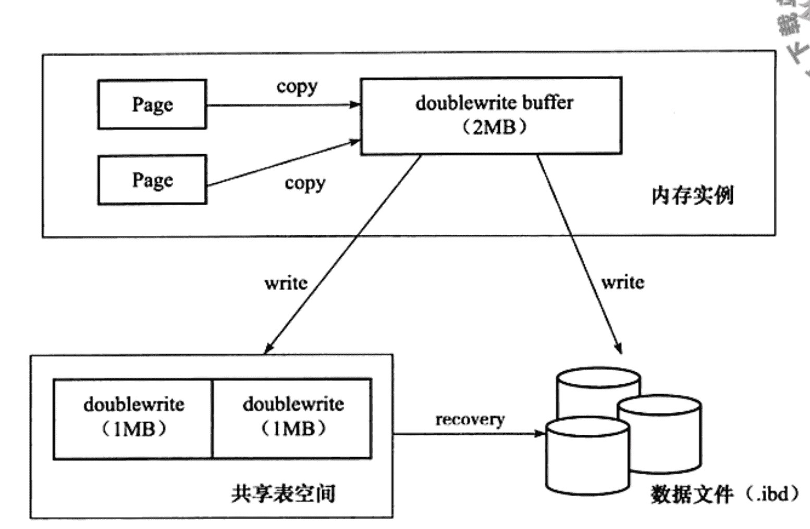
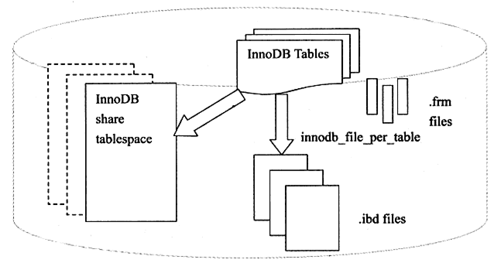
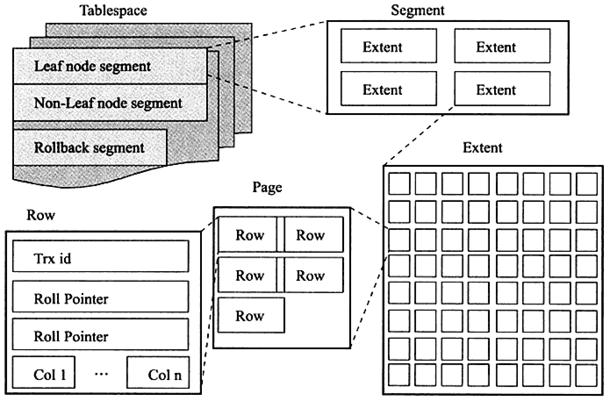

# 体系结构

>  
>
> - 连接池
> - 管理服务和工具组件
> - SQL接口组件
> - 查询分析器组件
> - 优化器组件
> - 缓冲组件
> - 插件式存储引擎
> - 物理文件

- **数据库**：物理文件或其他形式文件的集合。

- **数据库实例**：server进程，即后台线程和一个共享内存的集合。通常和数据库是一一对应的。

## 各存储引擎对比

|          特点          | MyISAM | Memory | InnoDB | Archive | NDB  |
| :--------------------: | :----: | :----: | :----: | :-----: | :--: |
|        存储限制        |   无   |   有   |  64TB  |   无    |  有  |
|          事务          |        |        |   ✅    |         |      |
|         锁粒度         | Table  | Table  |  Row   |   Row   | Row  |
|      MVCC/快照读       |        |        |   ✅    |    ✅    |  ✅   |
|        B+树索引        |   ✅    |   ✅    |   ✅    |         |  ✅   |
|        哈希索引        |        |   ✅    |   ✅    |         |  ✅   |
|        全文索引        |   ✅    |        |        |         |      |
|        聚集索引        |        |        |   ✅    |         |      |
|        缓存数据        |        |   ✅    |   ✅    |         |  ✅   |
|        缓存索引        |   ✅    |   ✅    |   ✅    |         |  ✅   |
|        压缩数据        |   ✅    |        |        |         |  ✅   |
|        加密数据        |   ✅    |   ✅    |   ✅    |    ✅    |  ✅   |
|      磁盘存储成本      |   低   |  N/A   |   高   |  很低   |  低  |
|      内存存储成本      |   低   |  中等  |   高   |   低    |  高  |
|      批量插入速度      |   高   |   高   |   低   | 非常高  |  高  |
|    支持集群的数据库    |        |        |        |         |  ✅   |
|        支持复制        |   ✅    |   ✅    |   ✅    |    ✅    |  ✅   |
|        支持外键        |        |        |   ✅    |         |      |
|    备份/时间点恢复     |   ✅    |   ✅    |   ✅    |    ✅    |  ✅   |
|      支持查询缓存      |   ✅    |   ✅    |   ✅    |    ✅    |  ✅   |
| 更新数据字典的统计信息 |   ✅    |   ✅    |   ✅    |    ✅    |  ✅   |

# innode

 

## 结构

### 后台线程

- **Master Thread**：负责将缓冲池中的数据异步刷新到磁盘，保证数据的一致性。

  > 1. 刷脏页。
  >2. 合并插入缓冲。
  > 3. UNDO页的回收等。
  
  - *innodb1.0之前*

    ```c
    void master_thread() {
      goto loop;
    loop: // 主循环
      for (int i = 0; i < 10; i++) {
        thread_sleep(1);
        // 1. 重做日志刷新到磁盘
        do log buffer flush to disk
        // 2. 如果一秒内发生的io次数小于5次，合并至多5个插入缓冲
        if (last_one_second_ios < 5) {
          do merge at most 5 insert buffer
        }
        // 3. 如果缓存中的脏页比例高于配置参数，将100个脏页写入磁盘
        if (buffer_get_modifed_radio_pct > innodb_max_dirty_pages_pct) {
          do buffer_pool flush 100 dirty page
        }
        // 4. 如果数据库空闲或者关闭，则切换到后台循环
        if (no user activity) {
          goto background loop
        }
      }
      // 1. 如果10秒内发生的io次数小于200次，将100个脏页写入磁盘
      if (last_ten_second_ios < 200) {
        do buffer_pool flush 100 dirty page
      }
      // 2. 合并至多5个插入缓冲
      do merge at most 5 insert buffer
      // 3. 重做日志刷新到磁盘
      do log buffer flush to disk
      // 4. 回收undo页，每次最多回收20个
      do full purge at most 20 undo page
      // 5. 如果缓存中的脏页比例高于70，将100个脏页写入磁盘，否则将10个脏页写入磁盘
      if (buffer_get_modifed_radio_pct > 70) {
          do buffer_pool flush 100 dirty page
      } else {
          do buffer_pool flush 10 dirty page
      }
      goto loop
    background loop: // 后台循环
      // 1. 回收undo页，每次最多回收20个
      do full purge
      // 2. 合并20个插入缓冲
      do merge 20 insert buffer
      // 3. 如果数据库不空闲，回到loop，否则跳到刷新循环
      if (not idle) {
        goto loop;
      }
      else {
        goto flush loop;
      }	
    flush loop: // 刷新循环
      // 循环刷100个脏页到磁盘，直到缓存中的脏页比例低于配置参数
      do buffer_pool flush 100 dirty page
      if (buffer_get_modifed_radio_pct > innodb_max_dirty_pages_pct) {
         goto flush loop
      }
      goto suspend loop
    suspend loop: // 暂停循环
      suspend_thread();
      waiting_event();
      goto loop;
    }
  
  - *innodb1.2之前*

    ```c
    void master_thread() {
      goto loop;
    loop: // 主循环
      for (int i = 0; i < 10; i++) {
        thread_sleep(1);
        // 1. 重做日志刷新到磁盘
        do log buffer flush to disk
        // 2. 如果一秒内发生的io次数小于io吞吐量的5%，合并io吞吐量的5%个插入缓冲
        if (last_one_second_ios < 5% * innodb_io_capacity) {
          do merge 5% * innodb_io_capacity insert buffer
        }
        // 3. 如果缓存中的脏页比例高于配置参数，将100个脏页写入磁盘
        // 如果支持自适应刷新，根据重做日志的速度，计算刷脏页的数量。
        if (buffer_get_modifed_radio_pct > innodb_max_dirty_pages_pct) {
          do buffer_pool flush 100% * innodb_io_capacity dirty page
        } else if (enable adaptive flush) {
          do buffer_pool flush desired amount dirty page
        }
        // 4. 如果数据库空闲或者关闭，则切换到后台循环
        if (no user activity) {
          goto background loop
        }
      }
      // 1. 如果10秒内发生的io次数小于innodb_io_capacity次，将innodb_io_capacity个脏页写入磁盘
      if (last_ten_second_ios < innodb_io_capacity) {
        do buffer_pool flush 100% * innodb_io_capacity dirty page
      }
      // 2. 合并5% * innodb_io_capacity个插入缓冲
      do merge 5% * innodb_io_capacity insert buffer
      // 3. 重做日志刷新到磁盘
      do log buffer flush to disk
      // 4. 回收100% * innodb_purge_batch_size 个undo页
      do full purge 100% * innodb_purge_batch_size undo page
      // 5. 如果缓存中的脏页比例高于70，将innodb_io_capacity个脏页写入磁盘，否则将10% * innodb_io_capacity个脏页写入磁盘
      if (buffer_get_modifed_radio_pct > 70) {
          do buffer_pool flush 100% * innodb_io_capacity dirty page
      } else {
          do buffer_pool flush 10% * innodb_io_capacity dirty page
      }
      goto loop
    background loop: // 后台循环
      // 1. 回收100% * innodb_purge_batch_size 个undo页
      do full purge 100% * innodb_purge_batch_size undo page
      // 2. 合并100% * innodb_io_capacity个插入缓冲
      do merge 100% * innodb_io_capacity insert buffer
      // 3. 如果数据库不空闲，回到loop，否则跳到刷新循环
      if (not idle) {
        goto loop;
      }
      else {
        goto flush loop;
      }	
    flush loop: // 刷新循环
      // 循环刷100% * innodb_io_capacity个脏页到磁盘，直到缓存中的脏页比例低于配置参数
      do buffer_pool flush 100% * innodb_io_capacity dirty page
      if (buffer_get_modifed_radio_pct > innodb_max_dirty_pages_pct) {
         goto flush loop
      }
      goto suspend loop
    suspend loop: // 暂停循环
      suspend_thread();
      waiting_event();
      goto loop;
    }
    ```
  
  - *innodb1.2*

    ```c
    void master_thread() {
      goto loop;
    loop: // 主循环
      // 空闲执行原来10秒一次的操作，非空闲执行原来每秒一次的操作
      if (innodb is idle) {
        // 1. 如果10秒内发生的io次数小于innodb_io_capacity次，将innodb_io_capacity个脏页写入磁盘
        if (last_ten_second_ios < innodb_io_capacity) {
          do buffer_pool flush 100% * innodb_io_capacity dirty page
        }
        // 2. 合并5% * innodb_io_capacity个插入缓冲
        do merge 5% * innodb_io_capacity insert buffer
        // 3. 重做日志刷新到磁盘
        do log buffer flush to disk
        // 4. 回收100% * innodb_purge_batch_size 个undo页
        do full purge 100% * innodb_purge_batch_size undo page
        // 5. 如果缓存中的脏页比例高于70，将innodb_io_capacity个脏页写入磁盘，否则将10% * innodb_io_capacity个脏页写入磁盘
        if (buffer_get_modifed_radio_pct > 70) {
            do buffer_pool flush 100% * innodb_io_capacity dirty page
        } else {
            do buffer_pool flush 10% * innodb_io_capacity dirty page
        }
      } else {
        thread_sleep(1);
        // 1. 重做日志刷新到磁盘
        do log buffer flush to disk
        // 2. 如果一秒内发生的io次数小于io吞吐量的5%，合并io吞吐量的5%个插入缓冲
        if (last_one_second_ios < 5% * innodb_io_capacity) {
          do merge 5% * innodb_io_capacity insert buffer
        }
        // 3. 如果缓存中的脏页比例高于配置参数，将100个脏页写入磁盘
        // 如果支持自适应刷新，根据重做日志的速度，计算刷脏页的数量。
        if (buffer_get_modifed_radio_pct > innodb_max_dirty_pages_pct) {
          do buffer_pool flush 100% * innodb_io_capacity dirty page
        } else if (enable adaptive flush) {
          do buffer_pool flush desired amount dirty page
        }
        // 4. 如果数据库空闲或者关闭，则切换到后台循环
        if (no user activity) {
          goto background loop
        }
      }
      goto loop
    background loop: // 后台循环
      // 1. 回收100% * innodb_purge_batch_size 个undo页
      do full purge 100% * innodb_purge_batch_size undo page
      // 2. 合并100% * innodb_io_capacity个插入缓冲
      do merge 100% * innodb_io_capacity insert buffer
      // 3. 如果数据库不空闲，回到loop，否则跳到刷新循环
      if (not idle) {
        goto loop;
      }
      else {
        goto flush loop;
      }	
    flush loop: // 刷新循环
      // 循环刷100% * innodb_io_capacity个脏页到磁盘，直到缓存中的脏页比例低于配置参数
      do buffer_pool flush 100% * innodb_io_capacity dirty page
      if (buffer_get_modifed_radio_pct > innodb_max_dirty_pages_pct) {
         goto flush loop
      }
      goto suspend loop
    suspend loop: // 暂停循环
      suspend_thread();
      waiting_event();
      goto loop;
    }
    ```
  
- **IO Thread**：负责io请求的回调处理。

  - *组成*

    - **insert buffer thread**
  - *log thread*
    
    - **read thread**
      - 1.0版本前默认1个，个数可通过参数`innodb_file_io_threads`修改【**仅限windows环境**】。
      - 1.0版本后默认4个，个数可通过参数`innodb_read_io_threads`修改。
    - **write thread**
      - 1.0版本前默认1个，个数可通过参数`innodb_file_io_threads`修改【**仅限windows环境**】。
      - 1.0版本后默认4个，个数可通过参数`innodb_write_io_threads`修改。
    
  - *命令*
  
    ```sql
    # 查看io线程
    show engine innodb statu
  
- **Purge Thread【回收】**：回收已经使用并分配的undo页。

  - 1.1版本前：没有这个线程，在**Master Thread**中实现的。

  - 1.1版本：可通过配置将回收操作独立到单独的线程，只支持一个线程。无论值设置为多少。

    ```shell
  [mysqld]
    innodb_purge_threads=1
    ```
  
  - 1.2版本：可设置为多个线程。

- **Page Cleanner Thread【刷脏页】**：innodb1.2版本之后引入的，主要用于刷脏页，减轻主线程的工作压力。

  1. 检查LRU列表是否有足够的空闲页，如果不足，需要从尾部移除。
  2. 负责 Async/sync flush checkPoint。

### 内存


- **缓冲池【innodb_buffer_pool】**

  - **Buffer pool hit rate**：缓冲池命中率，不应该小于95%。

- **插入缓冲【insert buffer】**

  - *使用方式*

    - 插入或更新索引页时，如果页在缓冲池中，直接插入或更新；

    - 否则，先放到insert_buffer中，再以一定的频率merge到索引页中。【多个插入可以合并到一个操作中】。
  
  - *使用前提*
  
    - 非聚集索引
    - 非唯一索引
  
  - *change_buffer*：1.0版本后开始引入，是insert_buffer的升级。

    - 包括insert_buffer，delete_buffer，purge_buffer，分别对应insert、delete、update操作。
    - delete_buffer将记录标记为已删除，purge_buffer真正将记录删除。
  
  - *内部实现*

    > 1. 结构为B+树，存放在共享表空间中，默认ibadata1。
    > 2. mysql4.1版本之后，全局只有一颗 insert buffer B+ 树，负责对所有表的辅助索引进行 insert_buffer 。
  
    - **非叶子存点**
  
      >  
      >
      > 存放 serachKey ，共**9**个字节。
      >
      > - space：待插记录所在表的表空间id，**4**个字节。
      > - marker：兼容老版本的insert_buffer，**1**个字节。
      > - offset：表示页所在的偏移量，整数，**4**个字节。
  
    - **叶子节点**
  
      >  
      >
      > 存放serachKey和要插入的数据。
      
      - **space、marker、offset**：和非叶子节点一样。
      - **metadata**：**4**个字节。
        - *IBUF_REC_OFFSET_COUNT*：用于存放记录进入insert_buffer的顺序。整数，**2**个字节。
        - *IBUF_REC_OFFSET_TYPE*：**1**个字节。
        - *IBUF_REC_OFFSET_FLAGS*：**1**个字节。
  
    - **特殊页【insert buffer bitmap】**
  
      > 每个bitmap页用来追踪16384个辅助索引页，即256个区【64页为1区】。每个bitmap页都在这16384个页的第二页。每个辅助索引页的记录占**4**位。
  
      - *IBUF_BITMAP_FREE*：标识辅助页的可用空间数量，**2**bit。
      - 0：无可用剩余空间。
        - 1：剩余空间大于1/32页【512字节】。
        - 2：剩余空间大于1/16页。
        - 3：剩余空间大于1/8页。
      
    - *IBUF_BITMAP_BUFFERED*：1表示该辅助索引页有记录被缓存在insert buffer中。**1**bit。
      
    - *IBUF_BITMAP_IBUF*：1表示该页为索引页。**1**bit。
  
  
    - **merge insert buffer**：将 insert buffer 合并到索引中。
  - 辅助索引被读取到缓冲池。
      - insert buffer bitmap 追踪到辅助索引页已无可用空间。小于1/32时，会强制进行一次合并操作。
  - Master Thread：每秒或每10秒做一定数量的merge。合并时会随机选取一段。
  


- **数据页【data page】**

  - *LRU List*：用来管理已经读取到的页。

    - **midpoint**：中间点，一般设置为5/8处，midpoint之前的列表称为new 列表（**热点数据**），之后的列表称为old列表。

      > **作用**：如果直接将读到的页放到首部，某些偶发的SQL操作（全表扫描）可能会访问大量或全部页，将有可能把热点数据从LRU尾部移除，从而影响缓冲池的命中率。

    - **midpoint_insertion_strategy算法**：新访问的页放在 **midponit** 位置。

    - **unzip_LRU**：用来管理被压缩后的页。

      - 压缩页：innodb1.0之后的版本支持压缩页，将16KB的页压缩为1、2、4、8KB。

      - 分配内存：以申请4KB的页为例

        > 1. 检查4KB的unzip_LRU列表是否有可用的空闲页。
      > 2. 若有直接使用。
        > 3. 否则检查8KB的unzip_LRU列表。
      > 4. 若能够得到空闲页，则将页分成2个4KB的页，存放到4KB的unzip_LRU列表中。
        > 5. 若不能得到，则从LRU列表中申请16KB的页，将页分成1个8，两个4KB的页，分别存放到对应的unzip_LRU列表中。

  - *Free List*：管理空闲页。

    > - 数据库刚启动时，页都存放在free 列表中。缓存数据时，先从free列表中查询空闲页，然后从free列表中删除，放到LRU列表中。
    >
    > - 没有空闲页，淘汰LRU列表尾部的页，重新分配给LRU。
    
  - *Flush List*：管理 **脏页**。

    > - LRU 列表的页被修改后，缓冲池中和磁盘中的页产生了不一致，不一致的页称为脏页。
    >
    > - LRU 列表和 Flush 列表中都会有脏页。
  
- **重做日志缓冲【redo_log_buffer】**

  - **持久化时机**
    - master thread 每秒刷新一次。
    - 每个事务提交时。由参数 `innodb_flush_log_at_trx_commit` 控制，表示在提交【commit】时，处理重做日志的方式。
  
    - 缓冲池剩余空间小于 1/2。
  
- **额外内存池【innodb_additional_mem_pool_size】**

  - 缓存缓冲池的**帧缓冲**和对应的**缓冲控制对象**【LRU，锁，等待等信息】
  
  - 当额外内存池不够时，会从缓存池进行申请。
  
  - 当申请很大的缓冲池时，相应增大额外内存池的大小。

## 版本

|     版本     |               功能               |
| :----------: | :------------------------------: |
| 老版本InnoDB |    支持ACID，行锁设计，MVCC，    |
| InnoDB 1.0.x |   增加了compress和dyamic页格式   |
| InnoDB 1.1.x |       增加了AIO，多回滚段        |
| InnoDB 1.2.x | 增加了全文索引支持，在线索引增加 |

## 特性

### 插入缓冲

>  
>
> - 内存中的 **double write buffer**，大小为2M
> - 物理磁盘上共享表表空间连续的 128 个页，也就是2个区。

- **二次写【doubleWrite】**：当部分写失效时，如果没有doubleWrite，页已损坏，无法恢复，所以需要在写入时先增加一个副本，通过页的副本还原该页，再进行重做。

- **部分写失效**：innodb正在写入某个页，可能只写了一部分，之后就发生了宕机。

- **刷脏页过程**

  1. 通过 memcpy 函数将脏页复制到内存的 **double write buffer** 中。
  2. 分两次，每次1M，顺序写到共享表空间的物理磁盘上。
  3. 立马调用 **fsync** 函数，避免操作系统缓冲写带来问题。
  4. 将内存中的 **double write buffer** 写到各个表空间文件中。

### 自适应哈希索引【AHI】

> innodb存储引擎会自动根据访问的 **频率** 和 **模式** 来自动的为某些热点页建立哈希索引。

- **优势**：启动AHI后，**读写操作** 可以 **提高两倍**，辅助索引的 **连接操作** 性能可以 **提高5倍**。

- **前提**

  > - 对页的连续访问模式【**查询条件是一样的**】必须是一样的。
  > - 以某一个模式访问了 **100** 次。
  > - 页通过该模式访问了 N 次，N = 页中记录 * 1/16。

- **查看使用情况**

  ```sql
  show engine innodb status
  ```

### 异步IO【AIO】

> 并发IO，提高读写性能。
>
> IO Merge，如果访问的页连续，可以将多个io合并成一个。

- **实现**

  > Innodb1.1之前，通过 innodb 的代码来模拟实现。
  >
  > Innodb1.1之后，提供了内核级别的 AIO ，称为 native AIO。编译 mysql 时，需要 libaio 库支持。

### 刷新邻接页

> 当刷新一个页时，innodb会检测该区所在页是否有脏页，如果有一起刷新。
>
> **传统机械硬盘** 建议 开启此功能，固态硬盘有较好的 IOPS，可以通过innodb_flush_neighbors关闭这个功能。

### 检查点技术【checkPoint】

- **Write-ahead-log**：先写重做日志，再修改页。防止数据库宕机造成数据丢失。

- **Sharp checkPoint**：数据库关闭时，所有脏页都刷新回磁盘。

- **Fuzzy checkPoint**：运行时，只刷新部分脏页。

  - *发生场景*

    - **Matser thread checkPoint**：每秒或每十秒从脏页列表中异步刷新一部分，用户查询不阻塞。

    - **Flush_LRU_LIST checkPoint**：当LRU列表中的空闲页不足时，从尾部移除部分页，如果有脏页，需要强制刷新。

    - **Aync/Sync FLUSH checkPoint**：重做日志不可用时，从脏页列表顺序刷新，前移 redo_lsn。

      - *参数定义*

        > - redo_lsn：已经写入到重做日志的LSN。
        >
        > - checkpoint_lsn：已经刷新回磁盘最新页的LSN。
        >
        > - checkpoint_age： checkpoint_lsn - redo_lsn。
        >
        > - async_water_mark：异步刷新水位线标记，75%*total_redo_log_file_size。
        >
        > - sync_water_mark：同步刷新水位线标记，90%*total_redo_log_file_size。

      - *刷新时机*

        > 1. checkpoint_age < async_water_mark：不需要刷脏页。
        > 2. async_water_mark < checkpoint_age < sync_water_mark：触发async flush，从flush脏页列表中刷新脏页到磁盘，直到checkpoint_age < async_water_mark。
        > 3. checkpoint_age > sync_water_mark：很少发生，比如在批量插入或者重做日志太小时会发生，此时触发sync flush，从flush脏页列表中刷新脏页到磁盘，直到 checkpoint_age < async_water_mark。

    - **Dirty Page Too Much checkPoint**：脏页数量太多。由参数 innodb_max_dirty_pages_pct 控制。

## 其他

### 配置参数

- **mysql启停**

  |         参数          |          定义           | 备注                                                         |
  | :-------------------: | :---------------------: | ------------------------------------------------------------ |
  | innodb_fast_shutdown  | mysql关闭时innodb的行为 | 0：需要完成所有 full purge 和 merge insert buffer 操作，并将所有脏页刷新回磁盘。<br>1：默认值，不需要完成full purge和 merge insert buffer 操作，只需要刷脏页。<br/>2：需要将所有日志文件刷到磁盘，启动时进行恢复。 |
  | innode_force_recovery | mysql启动时innodb的行为 | 0：默认值，进行所有恢复操作，不能有效恢复时【如数据页发生部分写失效】，数据库会宕机，并把错误写到错误日志中。<br>1：忽略检查到的corrupt页。<br>2：阻止Master Thread线程的运行。<br/>3：不进行事物的回滚操作。<br/>4：不进行插入缓冲的合并操作。<br/>5：不查看undo log，将未提交的事务视为已提交。<br/>6：不进行前滚的操作。<br>非0时，可以对表进行select、create和drop操作，不可以进行insert、update、delete操作。 |

- **后台线程**

  |                       参数 |        定义        | 备注                                                         |
  | -------------------------: | :----------------: | :----------------------------------------------------------- |
  | innodb_max_dirty_pages_pct | 缓冲池中脏页的比例 | innodb1.0版本之前是90%，<br />之后是75%                      |
  |         innodb_io_capacity |      io吞吐量      | 默认200，每秒刷脏页的数量为吞吐量；<br />合并插入缓冲的数量为5%吞吐量。 |
  |   innodb_adaptive_flushing |     自适应刷新     | 如果开启了，则通过buf_flush_get_desired_flush_rate函数，<br />判断需要刷新脏页的合适数量，<br />此函数通过判断产生重做日志的速度来决定刷脏页数量。 |
  |    innodb_purge_batch_size |  undo页回收的个数  | 默认20                                                       |

- **内存**

  |                        参数名 |                       定义                       | 备注                                                         |
  | ----------------------------: | :----------------------------------------------: | :----------------------------------------------------------- |
  |       innodb_buffer_pool_size |                    缓冲池大小                    | 一般设置为15GB                                               |
  | innodb_buffer_pool_insatances |                  缓冲池实例个数                  | innodb1.0版本之后，支持多个实例                              |
  |         innodb_old_blocks_pct |                 LRU midpoint位置                 | 默认距尾部37%                                                |
  |        innodb_old_blocks_time | 再次读到old列表中的数据，需要等待多久进入new列表 | 默认0，单位毫秒<br>page made young：页从old->new<br>page made no young：因time设置导致页没有从old->new |
  |        innodb_log_buffer_size |                 重做日志缓冲大小                 | 默认为8MB                                                    |
  |         innodb_lru_scan_depth |              LRU列表中可用页的数量               | 默认1024                                                     |
  |   IBUF_pool_size_per_max_size |         insert_buffer占buffer_pool的比例         | 默认是2，代表占1/2内存                                       |
  |       innodb_change_buffering |             用来开启各种buffer的选项             | 默认是all，inserts，deletes，purges，changes(inserts+deletes)，all, none |
  | innodb_change_buffer_max_size |         change_buffer最大使用内存的比例          | 默认25，最大有效值50。                                       |
  |       skip_innodb_doublewrite |             禁止使用doublewrite功能              | 从库为提高性能可以启动。                                     |
  |    innodb_adaptive_hash_index |                  禁用或启动AHI                   | 默认开启                                                     |
  |         innodb_use_native_aio |               是否启动 native aio                | 默认开启                                                     |
  |        innodb_flush_neighbors |                是否开启刷新邻接页                | 默认开启                                                     |

### 变量

- **GLOBAL STATUS**

  |              参数名              |               定义               | 备注                                                         |
  | :------------------------------: | :------------------------------: | ------------------------------------------------------------ |
  |    innodb_dblwe_pages_wirteen    |        两次写一共写的页数        |                                                              |
  |       innodb_dblwe_wirtes        |         两次写写入的次数         | 正常情况下是innodb_dblwe_pages_wirteen的64/1                 |
  | innodb_buffer_pool_pages_flushed | 当钱从缓冲池中刷入到磁盘页的数量 | mysql 5.5.24之前有bug，是innodb_dblwe_pages_wirteen的两倍，之后修复了。 |

### 表

- **information_schema**

  |            表            |             定义              | 备注 |
  | :----------------------: | :---------------------------: | :--: |
  | innodb_buffer_pool_stats |        查询缓冲池状态         |      |
  |  innodb_buffer_page_lru  | 查看LRU列表中每个页的具体信息 |      |

# 文件

## 参数文件

- **查找文件位置**

  ```shell
  mysql --help | grep my.cnf
  ```
  
- **查看参数**

  ```shell
  show variables like "参数名"
  select * from information_schema.GLOBAL_VARIABLES where name = "参数名"
  ```

- **参数类型**

  - *动态【dynamic】*：实例运行中可以修改。

    > - 会话【session】：autocommit
    >- 全局【global】：binlog_cache_size。
    > - 全局和会话：read_buffer_size。
    
    - **修改动态参数**

      ```sql
      set
      | [global | session] system_var_name = expr
      | [@@global | @@session | @@] system_var_name = expr
      ```
    
  - *静态【static】*：整个实例生命周期内都不可以修改。

    > - 修改会报错：参数是只读的。

## 日志文件

- **查看参数**

  ```shell
  show variables like "log_error"
  ```

### 错误日志【error log】

记录了mysql启动，运行，关闭过程的错误和warn。

### 慢查询日志【slow query log】

> |                  参数                  | 含义                                                    | 备注                                                         |
> | :------------------------------------: | ------------------------------------------------------- | ------------------------------------------------------------ |
> |            long_query_time             | 慢sql阈值                                               | mysql5.1之后单位为微秒；之前是秒                             |
> |             slow_query_log             | 是否启动慢查询日志                                      | 默认OFF                                                      |
> |     log_queries_not_using_indexes      | 没有使用索引，会被记录到慢查询日志中                    | 默认OFF                                                      |
> |               log_output               | 日志输出格式，全局的动态参数                            | file：默认，日志存放在data下面，文件名为主机名.log<br>table：表示记录到mysql.slow_log中。 |
> |          slow_query_log_file           | slow log的位置                                          | 默认在data下，文件名：[主机名]-slow.log                      |
> | log_throttle_queries_not_using_indexes | 每分钟允许记录到slow log，且没有使用索引的sql语句的次数 | 默认是0，没有限制                                            |
> |             long_query_io              | 超过指定逻辑io次数的sql语句记录到slow log中             | 用于innoSQL版本<br>innoSQL版本对slow_log增加了逻辑读取【磁盘+缓冲池】和物理读取【从磁盘进行读取】的统计。 |
> |            slow_query_type             | 启动slow_log的方式                                      | 用于innoSQL版本<br>0：不将sql记录到slow_log中<br>1：根据运行时间将sql记录到slow_log中<br>2：根据逻辑io次数将sql记录到slow_log中<br>3：根据运行时间及逻辑io次数将sql记录到slow_log中 |

- **log变量**

  > |      参数      | 含义         | 备注                     |
  > | :------------: | ------------ | ------------------------ |
  > | Logical_reads  | 逻辑读取次数 | 磁盘+缓冲池，innoSQL版本 |
  > | Physical_reads | 物理读取次数 | 从磁盘进行，innoSQL版本  |

- **日志分析**

  ```shell
  mysqldumpslow  [可选参数] <文件名>
  # 查执行时间最长的sql
  mysqldumpslow -s al -n 10 <文件名>
  ```

### 查询日志【log】

> 记录了对mysql请求的信息。

|       参数       | 含义                         | 备注                                                         |
| :--------------: | ---------------------------- | ------------------------------------------------------------ |
|   general_log    | 是否开启查询日志             | 默认OFF                                                      |
| general_log_file | 文件位置                     | 默认在data下，文件名：[主机名].log                           |
|    log_output    | 日志输出格式，全局的动态参数 | file：默认，日志存放在data下面，文件名为主机名.log<br>table：表示记录到mysql.general_log表中。 |

### 二进制日志【binary log】

> - 记录了对mysql更改的所有操作，不包括select，show这类操作。
> - binlog.index为二进制的索引文件，用来存储过往的二进制文件的序号。
> - 默认文件名为主机名，后缀名为二进制日志的序列号。
>

|              参数 | 含义                             | 备注                                                         |
| ----------------: | -------------------------------- | ------------------------------------------------------------ |
|           log-bin | 是否开启binlog                   | 默认不开启，值为日志的文件名。位置在datadir下。              |
|   max_binlog_size | 单个二进制文件的最大容量，默认1G | 如果超过最大值，产生新的二进制文件，后缀名+1，记录到.index文件 |
| binlog_cache_size | 存放一个事务产生日志的内存大小   | 基于会话的，默认大小为32K。                                  |
|       sync_binlog | 从操作系统缓冲同步到磁盘的频率   | 0：默认，按操作系统同步的方式来。<br>1：同步写磁盘，即每次调用fsync函数。<br>n：如果使用复制功能，建议该值设置非0。 |
|      binlog_do_db | 哪些库写入日志                   |                                                              |
|  binlog_ignore_db | 哪些库不写入日志                 |                                                              |
| log_slave_updates | 从库是否写binlog                 | 默认ON，如果搭建master->slave-slave架构，该参数必须为ON      |
|     binlog_format | 动态参数，binlog格式             | statement：日志的逻辑sql语句<br>row：记录表的行更改情况<br>mixed：默认使用statement，特殊情况下使用 row，比如：使用了UUID等不确定函数；使用了临时表；使用了用户定义函数；使用了INSERT DELAY语句。 |

- **binlog_cache_size**

  - 开启事务时，事务未提交前，会把日志记录到一个缓冲中去，等事务提交时，直接将缓冲池的日志文件写入二进制日志文件。
  
  - 默认大小：32K，该值设置过小，mysql会把缓冲中的日志写入临时文件。
  
  - 判断大小是否合适：
  
    通过show global status命令查看参数binlog_cache_use【使用缓冲写】和binlog_cache_disk_use【使用临时文件写】，如果binlog_cache_disk_use较大，应增大该值。

- **statement的问题**

  1. 主从复制时数据不一致，例如使用了uuid、主从选取的索引不同。
  2. 在 `read commit` 隔离级别下，会造成主从不一致。

#### 变量

|         参数          | 含义           | 备注 |
| :-------------------: | -------------- | ---- |
|   binlog_cache_use    | 使用缓冲写     |      |
| binlog_cache_disk_use | 使用临时文件写 |      |

#### 作用

- 恢复：某些数据的恢复需要二进制日志，比如通过二进制日志进行 point-in-time 的恢复。
- 复制：通过复制和执行二进制日志，使一台远程mysql【slave】与另一台【master】实时同步
- 审计：通过二进制文件进行审计，判断是否有对数据库进行注入的攻击。

#### 日志分析

```shell
mysqlbinlog <filename>
```

- `--start-position` ：开始点位
- `-v` 或 `-vv` ：展示执行的具体信息，`-vv` 多展示更新的类型。

## 套接字文件

> unix系统下本地连接mysql可以采用unix套接字方式，需要一个套接字（scoket）文件。

```sql
# 查看文件位置
show varialbes like 'socket'
```

## pid文件

>  当mysql实例启动了，将自己的进程ID写到pid文件中，文件名为主机名.pid。

```sql
# 查看文件位置
show varialbes like 'pid_file'
```

## 表结构定义文件

- **表**：每个表对应一个以 `frm` 为后缀名的表结构定义文件。
- **视图**：frm还用来存放视图的定义。
- 该文件可以通过 `cat` 命令查看，cat a.frm。

## Innodb存储引擎文件

### 表空间文件

> innodb将存储的表按照表空间进行存放。

- **表空间【tablespace】**

  - *默认【共享】表空间*

    > 1. 是初始大小为10M，名为ibdata1的文件。
    >
    > 2. 可以通过参数 `innodb_data_file_path` 进行设置。
    >
    >    ```shell
    >    innodb_data_file_path=datafile_space1[;datefile_space2]...
    >    # /db/ibdata1和/db/ibdata2组成表空间，大小都为2000M，用完了可以自动增长
    >    innodb_data_file_path=/db/ibdata1:2000M;/db/ibdata2:2000M;autoextend
    >    ```
    >
    > 3. 设置了 `innodb_data_file_path` 后，所有innodb引擎的表都会记录到共享表空间中。

  - *独立表空间*

    > 1. 设置了参数 `innodb_file_per_table=ON` 每个inndodb引擎的表对应一个**独立表空间**。
    >
    > 2. **命名规则**：**表名.ibd**
    >
    > 3. 单独的表空间只存储该表的**数据**，**索引**，**插入缓冲bitmap** 等信息。
    >
    >    其余信息【比如回滚信息，插入缓冲索引页，系统事务信息，二次写缓冲等】还是存放在默认的表空间中。

### 重做日志文件【redo log】

- **重做日志组**

   

  - 每个innodb 存储引擎至少有 **1 个重做日志组**，每个文件组下至少有 **2 个重做日志文件**，默认的`ib_logfile0`和`ib_logfile1`。
  - 用户可以设置 **多个镜像日志组**，将不同的文件组放在不同的磁盘上，可以提升重做日志的 **高可用性**。
  - 每个重做日志的大小一样，以**循环写入**的方式运行。

- **和binlog的区别**

  - **服务的引擎不同**：redolog 只记 innode，binlog 记录所有引擎。
  - **内容不同**：记录了关于每个页的更改的物理情况，binlog记录逻辑修改。
  - **同步到磁盘的时间**：在事务进行的过程中，不断有重做日志条目【redo entry】被写入到重做日志中。binlog 在提交后才同步。

- **作用**：数据库宕机后，可以通过redo log把数据恢复到掉电之前的状态。

- **工作原理**

   

  - 每个重做日志的**大小一样**，以循环写入的方式运行。
  - 从重做日志缓冲往磁盘写入时，按照一个扇区【521B】的大小进行写入，扇区是写入的最小单位，必须写成功，因此需要doublewrite。

- **参数**

  |                           参数 | 含义                                       | 备注                                                         |
  | -----------------------------: | ------------------------------------------ | ------------------------------------------------------------ |
  |           innodb_log_file_size | 重做日志总大小                             | innodb1.2之前总大小不超过4G<br />innodb1.2扩大到521GB        |
  |      innodb_log_files_in_group | 日志文件组中重做日志文件的数量             | 默认2                                                        |
  |     innodb_mirrored_log_groups | 日志镜像文件组的数量                       | 默认1，标识只有一个文件组，没有镜像                          |
  |      innodb_log_group_home_dir | 日志文件组所在目录                         | 默认./，标识在mysql数据库的数据目录下                        |
  | innodb_flush_log_at_trx_commit | 表示在提交【commit】时，处理重做日志的方式 | 0：提交事务时，并不把事务的重做日志写入磁盘的日志文件中，等待主线程每秒的刷新。<br>1：提交事务时，把事务的重做日志同步写入磁盘，为保证ACID，必须设置为1。<br>2：提交事务时，把事务的重做日志异步写入磁盘 |

- **redo entry**

   

  - redo_log_type：占用1个字节，表示重做日志的类型。

  - sapce：表示表空间的ID，采用压缩的方式，占用的空间可能小于4字节。

  - page_no：页的偏移量，采用压缩的方式。

  - redo_log_body：每个重做日志的数据部分，恢复时需要调用相应的函数进行解析。

# 表

 

## 索引组织表【index organized table】

> 根据主键顺序组织存放的表。

- **主键选择**
  1. **显式指定**。
  2. **表中唯一的非空索引**：当表中有多个唯一索引时，选择第一个创建的索引作为主键。
  3. **自动创建**：innodb自动创建一个6字节大小的指针。
  
- **rowid**：单个主键可以通过rowid查询主键列，联合索引做主键不行。

## 表空间

逻辑结构的最高层。

## 段

- **类型**：表空间由各个段组成，常见有**数据段【B+树的叶子节点】**、**索引段【B+树的非叶子节点】**、**回滚段**等。

- **管理**：由引擎自己管理。DBA不能对其进行控制。

## 区

> - 由连续的页组成，大小：1MB。
>
> - 为保证区中页的连续性，存储引擎一次向磁盘申请 4 - 5 个区。
>
> - 一般情况下，一个区中有64个连续的页。

- **申请**

  1. *Innode引擎* 从磁盘申请：为保证区中页的连续性，一次从磁盘中申请 4 ~5 个区。
  2. 表从 *Innode引擎* 申请：
     1. 在每个段开始时，先用 32 个页大小的碎片页【**fragment page**】来存放数据。
     2. 使用完这些页后，才是 64 个连续页的申请。

## 页

 

- 磁盘管理的最小单位。
- 默认页大小为**16K**，innodb1.2之后，可以通过参数 `innodb_page_size` 设置页大小为 4K，8K，16K，设置好后不可修改。

### 组成

- **File Header**

  | 名称                             | 大小（字节） | 说明                                                     |
  | -------------------------------- | :----------: | -------------------------------------------------------- |
  | fil_page_space_or_checksum       |      4       | Mysql4.0.14前为0，之后代表该页的校验和                   |
  | fil_page_offset                  |      4       | 表空间中页的偏移值，表示该页在所有页中的位置             |
  | fil_page_prev                    |      4       | 当前页的上一个页                                         |
  | fil_page_next                    |      4       | 当前页的下一个页                                         |
  | fil_page_lsn                     |      8       | 页最后被修改的日志序列位置                               |
  | fil_page_type                    |      2       | innodb存储页的类型，常见类型见下表<br>0x45BF：B+树叶节点 |
  | fil_page_file_flush_lsn          |      8       | 独立表空间该值为 0                                       |
  | fil_page_arch_log_no_or_space_id |      4       | 属于的表空间 id                                          |
  
  - 38个字节，8部分
  - 记录页的头信息

- **Page type**

  | 名称                    | 16进制 | 说明                   |
  | ----------------------- | ------ | ---------------------- |
  | fil_page_index          | 0x45BF | B+树叶节点             |
  | fil_page_undo_log       | 0x0002 | Undo lod 页            |
  | fil_page_innode         | 0x0003 | 索引节点               |
  | fil_page_ibuf_free_list | 0x0004 | insert buffer 空闲列表 |
  | fil_page_type_allocated | 0x0000 | 最新分配页             |
  | fil_page_ibuf_bitmap    | 0x0005 | insert buffer 位图     |
  | fil_page_type_sys       | 0x0006 | 系统页                 |
  | fil_page_type_ter_sys   | 0x0007 | 事务系统数据           |
  | fil_page_type_fsp_hdr   | 0x0008 | File space header      |
  | fil_page_type_xdes      | 0x0009 | 扩展描述页             |
  | fil_page_type_blob      | 0x000a | blob页                 |

- **Page Header**

  | 名称              | 大小(字节) | 说明                                                         |
  | ----------------- | ---------- | ------------------------------------------------------------ |
  | page_n_dir_slots  | 2          | 在page directroy中的槽数                                     |
  | page_head_top     | 2          | 堆中第一个空闲空间的头指针（在页中的偏移量）                 |
  | page_n_heap       | 2          | 堆中的记录数，包含infimum 和 supermum两个伪行，最高位代表行记录格式<br>1：compact<br>0：redundant |
  | page_free         | 2          | 指向可重用空间的首指针，无可重用的为0x0000                   |
  | page_garbage      | 2          | 已删除记录的字节总数                                         |
  | page_last_insert  | 2          | 最后插入记录的字节偏移量，直接指向数据列，而不是变长长度列表 |
  | page_direction    | 2          | 最后插入的方向<br>0x01：page_left<br>0x02：page_right<br/>0x03：page_same_rec<br/>0x04：page_same_page<br/>0x05：page_no_direction |
  | page_n_direction  | 2          | 一个方向连续插入记录的数量                                   |
  | page_n_recs       | 2          | 该页中记录的数量，不包含伪行和标识位                         |
  | page_max_trx_id   | 8          | 修改当前页的最大事务ID，仅在二级索引中定义                   |
  | page_level        | 2          | 当前页在索引树中的位置，0x00：叶节点                         |
  | page_index_id     | 8          | 索引id，表示当前页属于哪个索引                               |
  | page_btr_seg_leaf | 10         | B+树数据页非叶节点所在段的segment header 注意：仅在root页中定义。 |
  | page_btr_seg_top  | 10         | B+树数据页所在段的segment header 注意：仅在root页中定义。    |
  
  - 56个字节，16部分
  - 记录数据页的状态信息。

- **Infimum和Supermum**

   
  
  - 各26字节，每行包含5字节的record header 和 固定8字节【char(8)】的数据列
  - Infimum：代表页面中的最小记录。
  - Supremum：代表页面中的最大记录。
  - **规定**：无论向页中插入了多少条记录，任何用户记录都比 Infimum 记录大，都比 Supremum 记录小。

- **User Recorder和Free Space**

  - User records：实际存储行的数据。
  
  - free space：空闲空间，链表数据结构，在一条记录被删除后，该记录的空间会被加入到空闲空间。

- **Page Directory**【页目录】

  - 页目录中存放了记录【槽|目录槽】的相对位置【页相对位置，非偏移量】。
  - 槽【slots】是一个稀疏目录，每一个槽可能包含多个记录
  - 每个槽2个字节，逆序存放。
  - 当记录被插入或删除时，需要对槽进行分裂或平衡的维护操作。
  - 查找一条记录的过程如下：
    1. 先根据B+树索引找到页
    2. 根据目录槽在内存中再进行二叉树查找，可能找到的不是对应记录，还需要根据行的n_owned确定有几条记录，再根据next_recorder继续查找。

- **File Trailer**

  | 名称             | 字节 | 说明                                                         |
  | ---------------- | ---- | ------------------------------------------------------------ |
  | fil_page_end_lsn | 8    | 前4个字节：代表该页的checksum值，通过checksum函数与file header里的fil_page_space_or_checksum值比较，不是等值比较。<br>后4个字节：和file_header里的fil_page_lsn的后4个字节等值比较 |
  
  **8字节**，保证页的完整性，检验页是否完整的写入磁盘，比如可能发生写入过程中磁盘损坏。

### 页格式【文件格式】

 

- **Antelope**：支持Compact和Redundant行记录格式。

- **Barracuda**：1.0.x版本开始引入该文件格式，支持Compressed和Dynamic行记录格式。

## 行

> innodb存储引擎是面向行存储的，即 `row-oriented`。

### 记录限制

- **每页记录数**

  - 最多存放 `16KB / 2 - 200` 条记录，即 7992 行记录。
  - 最少存放 2 条记录。记录超过8098字节一定会发生**行溢出**。

- **每行长度**：每行定义的总字节数不能超过 65532。

  > - latin1：varchar(65532)，char(65532)。
  >- GBK：varchar(32767)，char(32767)。
  > - UTF8：varchar(218459)，char(218459)。

### 记录格式

- **compact**

   

  - *变长字段长度列表*

    - 列的长度小于255，用1个字节表示。

    - 列的长度大于255，用2个字节表示，因为varchar最大长度65535个字节。

    - 按列的顺序逆序放置。

    - **存放内容举例**

      > - 表结构：`create table mytest (t1 varchar(10), t2 varchar(10), char(10),t4 varchar(10)) engine=innodb charset=latin1 row_format=compact; `。
      > - 行：`insert into mytest values('d', null, null, 'fff');`
      > - 存放：`03 01`

  - *NULL标志位*：默认1个字节，用来表示行数据中是否有NULL值，有则用1表示。e.g. 00000110表示本行数据第2列和第3列为null。

  - *记录头信息【recorder header】*

    |         名称 | 大小（bit） | 描述                                                         |
    | -----------: | ----------- | ------------------------------------------------------------ |
    |            - | 1           | 预留                                                         |
    |            - | 1           | 预留                                                         |
    | deleted_flag | 1           | 该行是否已经被删除                                           |
    | min_rec_flag | 1           | 为1表示该记录是预先被定义为最小的记录（在 B+ 树（后面索引会讲到）中每层非 叶子节点中的最小的目录项，都会添加此标记） |
    |      n_owned | 4           | 一个页面中的记录被分为若干个组，每个组里有一个记录是“大哥”，其他记录都是“小弟”。而这位“大哥”记录的 n_owned 就是所在组的所有记录条数，而小弟们的 n_owned 都是 0 |
    |      heap_no | 13          | 表示当前记录在页面堆中的相对位置。<br>1. 在页面前面的记录 heap_no 相对较小。<br>2. 在页面后面的记录 heap_no 相对较大。<br>3. 每申请一条记录的存储空间时，该记录比物理位置在它之前的那条记录的 heap_no 值大 1。<br>4. 从2开始，0和1分别被虚拟记录 Infimum 和 Supremum 使用。 |
    |  record_type | 3           | 表示当前记录的类型，0是普通记录，1是 B+树非叶节点的目录项记录，2是 Infimum 记录，3是 Suprememum 记录 |
    |  next_record | 16          | 表示从当前记录的真实数据到下一条记录的真实数据之间的距离。<br>1. 属性值为正数：说明当前记录的下一条记录在当前记录的后面。<br>2. 属性值为负数：说明当前记录的下一条记录在当前记录的前面。 |
    
    > 固定占5字节。

  - *列数据*

    > - ROWID列：6字节，如果没有指定主键，mysql会分配6字节大小的默认主键。
    > - 事务ID列【隐藏列】：6字节
    > - 回滚指针列【隐藏列】：7字节
    > - 数据列：不固定。

- ~~**redundant**~~：不常用，5.0版本前的。

   

  - *字段长度偏移列表*

    > - 列的长度小于255，用1个字节表示。
    > - 列的长度大于255，用2个字节表示。
    > - 按列的顺序逆序放置。
    > - **存放内容**：**包含隐藏列**，并且**累增计数**。e.g.
    >   - 表结构：`create table mytest (t1 varchar(10), t2 varchar(10), char(10),t4 varchar(10)) engine=innodb charset=latin1 row_format=compact; `。
    >   - 行：`insert into mytest values('d', null, null, 'fff');`
    >   - 存放：`21 1e 14 14 13 0c 06`

  - *记录头信息*

    |            名称 | 大小（bit） | 描述                                                         |
    | --------------: | ----------- | ------------------------------------------------------------ |
    |               - | 1           | 预留                                                         |
    |               - | 1           | 预留                                                         |
    |    deleted_flag | 1           | 该行是否已经被删除                                           |
    |    min_rec_flag | 1           | 为1表示该记录是预先被定义为最小的记录【在 B+ 树（后面索引会讲到）中每层非 叶子节点中的最小的目录项，都会添加此标记】 |
    |         n_owned | 4           | 一个页面中的记录被分为若干个组，每个组里有一个记录是“大哥”，其他记录都是“小弟”。而这位“大哥”记录的 n_owned 就是所在组的所有记录条数，而小弟们的 n_owned 都是 0 |
    |         heap_no | 13          | 表示当前记录在页面堆中的相对位置。<br>1. 在页面前面的记录 heap_no 相对较小。<br>2. 在页面后面的记录 heap_no 相对较大。<br>3. 每申请一条记录的存储空间时，该记录比物理位置在它之前的那条记录的 heap_no 值大 1。<br>4. 从2开始，0和1分别被虚拟记录 Infimum 和 Supremum 使用。 |
    |       no_fields | 10          | 记录列的数量，包含隐藏列                                     |
    | 1byte_offs_flag | 1           | 偏移列表为1字节还是2字节                                     |
    |     next_record | 16          | 表示从当前记录的真实数据到下一条记录的真实数据之间的距离。<br>1. 属性值为正数：说明当前记录的下一条记录在当前记录的后面。<br>2. 属性值为负数：说明当前记录的下一条记录在当前记录的前面。 |
    
    > 固定占6字节。

  - *列数据*

    > 同compact。

- **Compressed**

  > 存放的行都会以zlib算法进行压缩。

- **Dynamtic**

### 行溢出数据

> 将一条记录中的某些数据存储在真正的数据页面之外。【页类型为 Uncompress BLOB 页中】。

- **非BLOB类型**

  > 单行数据超过8098字节时，会发生行溢出。只在数据页记录前缀768字节和指向BLOB PAGE的偏移量。

- **BLOB类型**

  - **Antelope文件格式**

     

    > 单行数据超过8098字节时，会发生行溢出。

  - **Compressed 和 Dynamic文件格式**
  
     
    
    > 完全的行溢出。

## 列

### 数据列

- **varchar**：数据行开始时会记录变长字段长度。

- **char**

  > - char(N)，N是指字符的**长度**。
  > - 不同的编码格式，实际能存放的字节数不同，在多字节字符编码下，innodb存储引擎在内部视为变长字符类型。
  > - 对于未能占满长度的字符填充0x20。

## 约束

### 数据完整性

- **实体完整性**：通过 **primary key**、**unique key** 来保证。

- **域完整性**

  - 数据类型。
  - 外键约束。
  - 编写触发器。
  - DEFAULT约束。

- **参照完整性**：**外键**

### 约束类型

- **primary key**

- **unique key**

- **foreign key**

  ```sql
  [constraint [symbol]] foreign key
  [index_name](index_col_name...)
  references table_name(index_col_name...)
  [on delete reference_option]
  [on update reference_option]
  ```

  > reference_option
  >
  > - casecade：父表发生update或delete时，子表响应修改。
  > - set null：父表发生update或delete时，子表更新为null，**要求列必须可以为null**。
  > - no action：发生错误，不允许这类操作。
  > - restrict：发生错误，不允许这类操作。**默认配置**。

  - *索引*：外键会默认加索引，避免无索引导致死锁问题。

  - *弊端*

    > - 按行进行外键检查【**即时检查**】，浪费时间。
    > - 外键检查参数：`foreign_key_checks`。
    >   - 0：检查
    >   - 1：不检查。
  
  - 查看属性

    ```sql
    select * from information_schema.referential_constraints where constraint_schema='database_name';
    ```
  
- **default**

- **Not null**

- **错误数据约束**：数据库本身没有对数据的正确性进行约束，会在内部转为合法的值，发出警告。`show warning`。

  - *设置严格模式*

    ```sql
    set sql_mode = 'STRACT_TRANS_TABLES';
    ```
  
- **check 约束**：通过enum和set进行约束。

- **触发器**

  ```sql
  -- 创建触发器 --
  create 
  [definer = {user | current_user}]
  trigger trigger_name before|after insert|update|delete
  on table_name for each row trigger_stmt
  ```
  
  - *限制*
  
    > - 最多建立6个触发器。
    > - 只支持按行触发。
    > - 只有super用户有权限。

### 创建约束

1. 表建立时进行约束定义
2. alter table

### 查看约束

```sql
select constraint_name, constraint_type from information_schema.TABLE_CONSTRAINT where table_schema = 'database_name' and table_name = 'table_name';
```

### 约束和索引的区别

1. 约束是逻辑的概念，用来保证数据的完整性。
2. 索引是一个数据结构，既有逻辑的概念也有物理存储。

## 视图

> - 是**虚表**，由一个sql查询来定义。
> - 视图中的数据没有实际的物理存储。

- **创建**

  ```sql
  -- 语句后添加标识
  with check option
  ```

- **作用**：用作抽象装置，起到安全层作用。

- **查询视图**

  ```sql
  select * from information_schema.Views where table_schema = 'database_name';
  ```

- **物化视图**：mysql不支持，可通过触发器实现。

## 分区

> 如果表中存在主键和唯一索引，分区列必须是唯一索引的一个组成部分；如果表没有主键，没有唯一索引时，分区列可以是任意列。
>
> - 水平分区：将同一表中不同行的记录分配到不同的物理文件中。**mysql只支持水平分区**。
> - 垂直分区：将同一表中不同列的记录分配到不同的物理文件中。
> - 局部分区索引：一个分区中既存放了数据又存放了索引。**mysql只支持局部分区索引**。
> - 全局分区索引：数据存放在各个分区中，所有数据的索引放在一个对象中。

- **参数**

  > - have_partition：yes 为开启。
  > - show plugins。

- **性能**

  > - 分区并不一定就能提升性能，跨分区查找需要查询多个B+树。
  > - 尽量别分区。

- **查看分区表**

  ```sql
  select * from information_schema.PARTITIONS where table_schema = '库名' and table_name = '表名'
  ```

- **分类**

  - *RANGE*

    - **分区规则**：行数据基于属于一个给定连续区间的列值被放入分区。
    
    - **示例**：
    
    - **特点**
      - 启动分区后，表不再只有一个ibd文件，而是由建立分区时的**各个分区idb文件**组成。
      - 当插入一个不在分区定义的值时，mysql会报错，可以添加一个 MAXVALUE 值的分区。
      - **分区列可以为 null** ，会把 null 值看做最小的值。
    
    
    - **应用场景**：日期类的分区。

  - *list*

    - **分区规则**：和range类似，只是list面向的是离散的值，而非连续的。
    
    - **示例**：
    
    - **特点**
      - 批量插入时遇到分区未定义的值，myisam会把之前的行数据正常插入，innodb直接失败，不做不插入。
      - 使用 null 值，必须显示的 **指定哪个分区** 可以插入null值。
  
  - *hash*
    - **分区规则**
      - 根据用户自定义的表达式的返回值来分区。返回值不能是负数。
    
      - 表达式的值必须是整数，可以是整型列。
    
    - **示例**：
    
    - **特点**：插入null时，分区函数返回0。
  
    - *KEY*
      - **分区规则**：根据mysql数据库提供的哈希函数来分区。
      
      - **示例**：
      
      - **特性**：插入null时，分区函数返回0。
      
  
    - *COLUMNS*：多列分区
  
      - **示例**：
      
      - **特点**
      
        - 支持更多的数据类型，包括所有整型，日期，字符串【blob和text不支持】。
      
        - list | range columuns：
  


### 子分区

 

> 在分区的基础上再进行分区。

- **注意事项**

  - 每个子分区的数量必须相同。
  - 要在一个分区表的任何分区上使用 subpartition 了来明确定义子分区，就必须定义所有的子分区。
  - 每个 subpartition 子句必须包括子分区的一个名字。
  - 子分区的名字必须是唯一的。

### 在表和分区间交换数据

- **注意**

  - 分区表和非分区表交换数据时：
    - 如果非分区的数据为空，则相当于把分区的移动到了非分区。

    - 如果分区为空，相当于把外部表导入到分区。

  - 非分区表和分区表的结构必须相同。

- **步骤**

  1. *建立分区表*：
  
  2. *建立表结构一样的基础表*
  
     ```sql
     create table e2 like e;
     alter table e2 remove partitioning;
     ```
  
  3. *移动数据*
  
     ```sql
     alter table e exchange partition p0 with table e2
     ```

# 索引

## B+树索引

### B+树

- **插入**

  |   叶结点【leaf page】    | 索引节点【index page】 | 操作                                                         |
  | :----------------------: | :--------------------: | ------------------------------------------------------------ |
  | 当前节点满，左右兄弟没满 |         无所谓         | 优先左旋：将记录移到所在页的兄弟节点上。                     |
  |           没满           |          没满          | 直接将记录插入到叶子节点                                     |
  |            满            |          没满          | 1. 拆分叶结点。<br>2. 将中间的节点放到索引节点中。<br/>3. 小于中间记录的节点放左边。<br>4. 大于等于中间记录的节点放左边。 |
  |            满            |           满           | 1. 拆分叶结点。<br/>2. 将中间的节点放到索引节点中。<br/>3. 小于中间记录的节点放左边。<br/>4. 大于等于中间记录的节点放左边。<br/>5. 拆分索引节点。<br/>6. 小于中间记录的节点放左边。<br/>7. 大于等于中间记录的节点放左边。<br/>8. 中间的节点放到上一层索引节点中。 |

- **删除**

  > 根据填充因子【full factor】来控制树的删除变化。最小值：50%。
  
  | 叶子节点小于填充因子 | 中间节点小于填充因子 | 操作                                                         |
  | :------------------: | :------------------: | :----------------------------------------------------------- |
  |          No          |          No          | 直接将记录从叶子节点删除，如果该节点还是index page的节点，用该节点的右节点代替。 |
  |         Yes          |          No          | 合并叶子节点和它的兄弟节点，同时更新到index page。           |
  |         Yes          |         Yes          | 1. 合并叶子节点和它的兄弟节点。<br>2. 更新index page。<br>3. 合并index page和它的兄弟节点。 |

#### 聚集索引【clustered index】

- 按照表的主键构造一棵B+树，叶子节点【数据页】存放的是整张表的行记录数据。
- 聚集索引的存储并不是物理上连续的，而是逻辑上连续的。
  - 页通过双向链表链接，页按照逐渐的顺序排序。
  - 页中的记录是单向链表，物理存储上同样可以不按照主键存储。

- 主键排序查找和范围查找非常快。

#### 辅助索引【secondary index】【非聚集索引】

当无法使用覆盖索引时，当访问的数据占表中整个数据超过 **20%** 时。不会使用辅助索引。

### 索引分裂

- 索引页的分裂并不总是从页的中间记录开始的，这样可能会导致页空间的浪费。

- 根据page header中的*page_last_insert*、*page_direction*、*page_n_direction*决定向左还是向右分裂，分裂点是哪个。
  - 若插入是随机的，取页的中间记录作为分裂点的记录。
  - 若往同一方向插入的记录数量为5，并且已经定位到的记录之后还有3条记录，则分裂点的记录为定位记录后面的第三条记录。否则分裂点记录就是待插入的记录。
  - 定位：定位到的记录就是待插入记录的前一条记录。

### 索引管理

- **创建**

  ```sql
  alter table [table_name] add {index|key} [index_name] 
  [index_type] (index_columns_name, ...) 
  [index_option]...
  algorithm [=] {DEFAULT|INPLACE|COPY}
  lock [=] {DEFAULT|NONE|SHARE|EXCLUSIVE};
  
  create [unique] index index_name [index_type] on table_name (index_columns_name, ...);
  ```

  - *algorithm*：创建和删除索引的算法

    > - **COPY**：类似与mysql5.1之前，需要创建临时表。
    > - **INPLACE**：不需要创建临时表。
    > - **DEFAULT**：根据 `old_alter_table` 参数判断使用哪种算法。默认是OFF【INPLACE】。

  - *lock*：索引创建和删除时，对表添加锁的情况

    > - **NONE**：不添加任何锁。并发度最高。
    > - **SHARE**：加读锁。不支持share模式，会返回错误信息。
    > - **EXCLUSIVE**：加写锁，阻塞所有事物。
    > - **DEFAULT**：根据事务的最大并发性来自动选择模式。

- **删除**

  ```sql
  alter table table_name drop {primary key | {index|key} index_name};
  drop index index_name on table_name;
  ```

- **详情**

  ```sql
  show index from table_name
  ```

  |         字段 | 说明                                                         |
  | -----------: | ------------------------------------------------------------ |
  |        table | 索引所在表名                                                 |
  |    no_unique | 非唯一的索引 1-非唯一 0：唯一                                |
  |     key_name | 索引的名字                                                   |
  | seq_in_index | 索引中该列的位置                                             |
  |  column_name | 索引列的名称                                                 |
  |    collation | 列以什么方式存储在索引中。<br>A：排序的，B+树索引总为A<br>NULL：Hash索引为NULL。 |
  |  cardinality | 索引中唯一值的数目的估计值。关键值。                         |
  |     sub_part | 是否是列的部分被索引，如果索引整个列，该字段值为NULL。       |
  |       packed | 关键字如何被压缩，没有被压缩，则为null。                     |
  |         null | 索引的值是否含有NULL值。                                     |
  |   index_type | 索引的类型，innodb存储引擎为btree。                          |
  |      comment | 注释                                                         |

  - *cardinality*

    > - 表示索引中不重复记录数量的预估值，非准确值。
    > - 统计是放在存储引擎层实现的。通过采样完成。

    - *更新时机*
      - 表中 1/16 的数据已发生过变化。
      - stat_modified_counter【引擎内部计数器，发生变化的次数】 > 2000000000【20亿】。
      - 执行 analyze table 时。
      - 执行 *show table status*、*show index*、访问 *infomation_schema* 的表 *tables* 和 *statistics* 时。**参数控制**。
    - *计算方式*
      1. 取得B+树索引中叶子节点的数量，记为A。
      2. 随机取得B+树索引中8个叶子节点，统计每个页不同记录的个数，即P1..P8。
      3. cardinality = ((P1+P2+....+P8)/8)*A。

    - *相关参数*

      |                 参数                 |   版本   | 说明                                                         |
      | :----------------------------------: | :------: | ------------------------------------------------------------ |
      |       innodb_stats_persistent        |  1.2后   | 是否将 analyze table 计算得到的cardinality值存放到磁盘上。<br>好处是可以减少重新计算每个索引的 cardinality 值，比如mysql重启。<br>用户也可以通过 create table 和 alter table 的选项 stats_persistent 来对每张表进行控制。<br>默认值：OFF。 |
      |       innodb_stats_no_metadata       |  1.2后   | 通过命令 *show table status*、*show index*、访问 *infomation_schema* 的表 *tables* 和 *statistics* 时，是否需要重新计算索引的cardinality值。<br/>默认值：OFF。 |
      | innodb_stats_persistent_sample_pages |  1.2后   | innodb_stats_persistent设置为ON，analyze table每次采样的页数。<br>默认值：20。 |
      |  Innodb_stats_tranient_sample_pages  |  1.2后   | 用来替代之前版本的参数innodb_stats_sample_pages，表示每次采样的数量。<br>默认值：8。 |
      |      innodb_stats_sample_pages       |  1.2前   | 表示每次采样的数量。<br>默认值：8。                          |
      |         Innodb_stats_method          | 无论版本 | 如何对待索引中出现的null值记录。<br>nulls_equal：null值记录视为相同的记录，默认值<br>nulls_unequal：null值记录视为不同的记录<br/>nulls_ignored：忽略null值记录。 |

  - **快速索引创建【FIC】【Fast Index Creation】**

    - **mysql5.5之前，不包括5.5**，对于索引的添加和删除，mysql的操作过程。

      > - 创建一张新的临时表。表结构通过 *alter table* 新定义的结构。
      > - 把原表中数据导入临时表。
      > - 删除原表。
      > - 将临时表重命名为原来的表名。

    - **mysql5.5之后，innodb1.0.x版本开始**。引入FIC。

    - **临时表**：临时表的创建路径是通过参数 *tmpdir* 设置的，空间不足时，创建删除索引会失败。

  - *限制条件*：只限定于辅助索引，主键同样需要重建表。

  - *创建*：对表上一个s锁，该表只能进行读操作。不需要重建表。

  - *删除*

    - 更新内部视图
    - 将辅助索引的空间标记为可用。
    - 删除mysql数据库内部视图上对该表的索引定义。

  - **在线架构改变【OSC】【online schema change】**

    > 在线执行DDL，`在线`是指事务创建的过程中，可以有读写事务对表进行操作。

    - *实现OSC的步骤*
      1. init*，初始化阶段，对创建的表做一些验证工作，检查表是否有主键，触发器和外键。
      2. *createCopyTable*，创建和原始表结构一样的新表。
      3. *alterCopyTable*，对创建的新表进行alter table操作，新增索引或者列。
      4. *createDeltasTable*，中间表，作用是为下一步创建的触发器所使用，之后对原表的DML操作会记录在这个表中。
      5. *createTriggers*，对原表创建INSERT，DELETE，UPDATE操作的触发器，触发操作产生的记录被写入到deltas表中。
      6. *startSnpshotXact*，开始OSC操作的事务。
      7. *selectTableIntoOutFile*，将原表中的数据写入到新表，通过分片【大小默认为500000】将数据输出到多个外部文件，然后将外部表中的数据导入到copy表中。
      8. *dropNCIndexs*，在导入到新表前，删除新表中所有的辅助索引。
      9. *loadCopyTable*，将导出的分片文件导入到新表。
      10. *replayChanges*，将OSC过程中保存在deltas中的原表DML操作的记录应用到新表中。
      11. *recreatesNCIndexs*，重新创建辅助索引。
      12. *replayChanges*，再次进行DML日志的回放操作，这些日志是在上述创建辅助索引的过程中产生的新日志。
      13. *swapTables*，将原表和新表换名字。
    - *局限性*
      - 要求表必须有主键，不能有触发器和外键。
      - 进行osc过程中，允许 *set sql_bin_log=0*, 可能导致主从不一致。

  - **在线数据定义【online DDL】**

    > mysql5.6之后支持online DDL操作，支持创建和删除索引时，可以在线DML。

    - *支持在线操作的DDL*
      - 辅助索引的创建和删除。
      - 改变自增长值。
      - 添加或删除外键约束。
      - 列的重命名。
      

    - *原理*
      1. 将DML操作日志写到缓存中，待完成索引创建后再将重做应用到表中。
      2. 缓存大小由参数 `innodb_online_alter_log_max_size` 控制：默认大小128MB。
      3. 缓存空间不足时，会抛出错误。

### 联合索引

### 覆盖索引【covering index】【索引覆盖】

> 从辅助索引中就可以查到记录，而不需要查询聚集索引的记录。**不回表**。

- **优势**：从辅助索引中就可以得到查询的记录，而不需要查询聚集索引中的记录。可减少大量IO操作。

- **版本支持**：innodb版本小于1.0，mysql数据库版本小于等于5.0，不支持覆盖索引。

- **使用场景**：通常情况下，例如联合索引【a, b】，一般是不会选择列b中所谓的查询条件，但如果是统计操作，并且是**覆盖索引**的，可以用到索引

  ```sql
  select count(*) from test where b=1
  ```

### 索引提示

- **使用场景**

  - 优化器选择了错误的索引。
  - 可选索引非常的，优化器选择索引的时间开销大于sql语句本身。

- **use index**：建议优化器选择，但优化器不一定会选择。

  ```sql
  select * from t use index (a) where a = 1 and b = 2
  ```

- **force index**：强制优化器选择。

  ```sql
  select * from t force index (a) where a = 1 and b = 2
  ```


### MRR

> Mysql5.6版本开始支持。

- **使用场景**：range，ref，eq_ref类型的查询。

  - *join*

    > 对于 innodb 和 myisam 存储引擎，MRR的工作方式如下：
    >
    > 1. 将查询得到的辅助索引键值存放到一个缓存中，缓存中的数据是按照辅助索引键值排序的。
    > 2. 将缓存中的键值根据rowID进行排序。
    > 3. 根据 rowId 的排序顺序来访问实际的数据文件。
  
  - *范围查询*

    ```sql
    # 表t有联合索引 (key_part1， key_part2)
    select * from t where key_part1 >= 1000 and key_part1 < 2000 and key_part2 = 10000
    ```
  
    > - **不使用MRR**：sql优化器会先将key_part1满足条件的记录取出来，然后再根据key_part2进行筛选。这样会导致无用的数据被取出。
    > - **启用MRR**：优化器会先将查询条件拆分成【1000， 10000】，【1001，10000】.....【1999，10000】，最后再根据拆分出的条件进行查询。
  
- **解决问题**：目的是减少磁盘的随机访问。

- **优势**：使数据访问变的较为顺序，在查询辅助索引时，先根据得到的查询结果，按照主键进行排序再回表。

  > - 减少缓冲页中页被替换的次数。
  > - 批量处理对键值的查询操作。
  
- **参数**

  - *optimizer_switch*

    ```sql
    # mrr=on表示启动MRR，mrr_cost_based表示是否通过cost based的方式来启动MRR
    set @@optimizer_switch = 'mrr=on,mrr_cost_based=off'// 
    ```

    > 默认不开启，以上是开启

  - *read_rnd_buffer_size*

    > - 用来控制键值的缓冲区大小，默认 **256K**。
    >
    > - 当大于设定的值时，执行器对已经缓存的数据根据 rowId 进行排序，通过 rowId 来取行数据。

### 索引下推【ICP】【index condition pushdown】

> 取出索引的同时，判断是否可以通过where条件过滤【也就是将where条件的部分放在了存储引擎层】。
>
> 当优化器选择 index condition pushdown 优化时，explain extra 会看到 using index condition。
>
> Mysql5.6开始支持。

- **使用场景**：用于range，ref，eq_ref类型的查询。

## 哈希索引

- **索引冲突**：拉链法。

- **使用场景**

  - ***缓冲页的* hash 表**：在缓冲池中的page页都有一个chain指针，它指向相同哈希函数值的页，对于除法散列，m的取值为略大于2倍的缓冲池中页的数量的质数。比如：innodb_buffer_pool_size = 10M，共有640个页，则需要的槽数为比640*2略大的质数1399，在启动时分配1399个槽的哈希表。

    - hash算法：对缓冲池中的页进行查找时，需要将页转化成自然数。

      ```shell
      关键字k = space_id << 20 + space_id + offset
      ```
    
  - **自适应hash索引**

## 全文检索【FULL-TEXT SEARCH】

> 将存储于数据库中的整本书或整篇文章中的任意内容查找出来的技术。
>
> 从innodb1.2.x版本开始，innodb开始支持全文索引。

### 倒排索引

> 一种索引结构，它在辅助表中存储了单词与单词自身在一个或多个文档中所在的位置之间的映射。利用关联数组实现。

 

- **inverted file index**：{单词，单词所在文档的ID}

   

- **full inverted index**：{单词，（单词所在文档的ID，在具体文档中的位置）}

   

### INNODB全文检索

> 采用 `full inverted index` 方式。

- **局限性**

  - 每张表只能有一个全文检索的索引。
  - 由多列组合而成的全文检索的索引列必须使用相同的字符集与排序规则。
  - 不支持没有单词界定符的语言。（中文，日语，韩文）

- **辅助表【auxiliary table】**

  > - innodb共有6张辅助表，存放word。
  > - 有两个列：一列是word字段(设有索引)，一列是ilist字段(DocumentId, Position)。
  > - 辅助表是持久的表，存放在磁盘上。

  ```sql
  set global innodb_ft_aux_table = '库名/表名';
  select * from information_schema.INNODB_FT_INDEX_TABLE;
  ```

- **全文检索索引缓存【FTS Index Cache】**：辅助表的缓存。红黑树结构。根据 (word,ilist) 进行排序。

  - *刷新时机*

    > - 当全文索引进行查询时，`auxiliary table` 首先将在 `FTS Index Cache` 中对应的word字段合并到 `auxiliary table` 中，再进行查询。
    > - 当数据库关闭时。
    > - `FTS Index Cache`满了。
  
  - *参数*

    > `FTS Index Cache`的大小由 `innodb_ft_cache_size` 控制，默认为：32M。

### FTS Document ID

> - 全文索引表需要一个列 FTS_DOC_ID 与 word 表进行映射。
> - `FTS_DOC_ID` 的类型必须是 `BIGINT UNSIGNED NOT NULL` ，innodb会自动创建该列并且innodb会自动为该列加一个名为`FTS_DOC_ID_INDEX` 的 `unique index`。
> - 用户也可以在建表时自动添加 `FTS_DOC_ID` 和索引。

### 分词

> 上面说的word

- **操作**

  - *插入*

    > 事务提交时，将分词刷新到 `FTS Index Cache` 中，再批量更新到磁盘。

  - *删除*

    > - 删除分词，在事务提交时，不删除磁盘 `auxiliary table` 的记录，只删除 `FTS Index Cache` 中的记录。
    >
    > - `auxiliary table` 中被删除的记录，innodb会将其 `FTS_DOC_ID` 保存到 `deleted auxiliary table`。
    >
    > - 查询已经被删除的 `FTS Document ID`。
    >
    >   ```sql
    >   select * from information_schema.INNODB_FT_DELETED;
    >   ```
    >

- **表优化【Optimize Table】**

  > - 把已经删除的记录从索引中彻底的删除。
  >
  > - 此命令还会导致其他的操作，比如cardinality的重新计算。若只想删除倒排索引，可以做如下操作。
  >
  >   ```sql
  >   # 默认值：0
  >   set global innodb_optimize_fulltext_only = 1
  >   ```
  >
  > - 设置每次实际删除的分词数量
  >
  >   ```sql
  >   # 默认值：2000
  >   set innodb_ft_num_word_optimize = 200
  >   ```
  >

- **Stopword list**

  > - 表示该列表中的word不需要对其进行索引分词操作。
  >
  > - stopword list位置：information_schema/INNODB_FT_DEFAULT_STOPWORD，默认共36个。
  >
  > - 自定义stopwordlist命令
  >
  >   ```sql
  >   set global innodb_ft_server_stopword_table = '库名/表名'
  >   ```
  >

### 全文检索查询

```sql
# MATCH指定了需要被查询的列。
# AGAINST指定了使用何种方式去查询。
MATCH(col1,col2) AGAINST (expr [search_modifier])
```

- **局限性**

  > - 查询的word的字符长度需要在区间 `[innodb_ft_min_token_size,innodb_ft_max_token_size]` 内，innodb_ft_min_token_size默认3，innodb_ft_max_token_size默认84。
  > - 查询的word在stoplist中，则忽略此查询。

- **相关性**：查询结果是根据相关性(relevance)进行降序排列的。relevance是一个非负的浮点数，0表示没有相关性。

  - *计算依据*
  
    > - word是否在文档中出现。
    > - word在文档中出现的次数。
    > - word在索引列中的数量。
    > - 多少个文档包含该word。
  
- **查询模式**

  - *Natural Language【默认】*：

    - 表示查询带有指定word的文档。
    
    - 查询结果是根据相关性(relevance)进行降序排列的。
    
  - *Boolean*：

    > 使用这个模式，查询字符串的前后字符会有特殊的含义。
  
    | 操作符        | 含义                                                         |
    | ------------- | ------------------------------------------------------------ |
    | +             | word必须存在                                                 |
    | -             | word必须被排除                                               |
    | (No operator) | word是可选的，如果出现，相关性会更高                         |
    | @distance     | 表示查询的多个单词的距离是否在distance之内，distance的单位是字节。这种查询也称为Proximity Search。 |
    | >             | 出现该单词时增加相关性                                       |
    | <             | 出现该单词时减少相关性                                       |
    | ~             | 表示允许出现该单词，出现时相关性为负                         |
    |               | 表示以该单词开头的单词                                       |
    | "             | 表示短语                                                     |
    
  - *Query Expansion【扩展查询】*：
  
    > 用于全文检索的扩展查询，当查询的关键词太短，用户需要 `impied knowledge` 【**隐含知识**】时进行。
  
    - *使用方法*

      > 开启全文索引的 `impied knowledge`  ：with query expansion，in Natural Language mode with query expansion。
  
    - *查询过程*

      > 1. 根据搜索的单词进行全文索引查询。
  > 2. 根据第一阶段产生的分词再进行一次全文索引查询。

# 锁

## lock与latch

|          |                  lock                   | latch【闩「shuān」锁，轻量级锁。】 |
| -------: | :-------------------------------------: | :--------------------------------: |
|     对象 |                  事务                   |                线程                |
|     保护 |               数据库内容                |            内存数据结构            |
| 持续时间 |              整个事务过程               |              临界资源              |
|     模式 |           行锁、表锁和意向锁            | mutex「互斥量」和rwlock「读写锁」  |
|     死锁 | 通过wait-for graph和、timeout等机制检测 |               无检测               |
|   存在于 |          lock manger的hash表中          |         每个数据结构对象中         |

### latch

```sql
show engine innodb mutex; # debug模式下信息更全。
```

> - count：mutex 被请求的次数。
> - spin_waits：自旋锁的次数，不能获得锁时先自旋，自旋后还不能获得锁，进入等待状态。
> - spin_rounds：自旋内部循环的总次数，每次自旋的内部循环是个随机数。
> - os_waits：操作系统等待的次数。
> - os_yields：进行os_thread_yield唤醒操作的次数。
> - os_wait_times：操作系统等待的时间，单位为ms。

### lock

```sql
show engine innodb status
```

> 查看infomation_schema 下的 innodb_trx、innodb_locks、innodb_lock_waits

```sql
show engine innodb status
```

> **当前锁请求的信息**
>
> 

```sql
select * information_schema.innodb_trx from
```

- **当前进行中的事务**

  |        字段名         | 说明                                                         |
  | :-------------------: | ------------------------------------------------------------ |
  |        trx_id         | innodb存储引擎内部唯一的事务ID                               |
  |       trx_state       | 当前事务的状态                                               |
  |      trx_started      | 事务的开始时间                                               |
  | trx_requested_lock_id | 等待事务的锁id                                               |
  |   trx_wait_started    | 事务开始等待的时间                                           |
  |      trx_weight       | 事务的权重，事务修改和锁住的行数，死锁时，会选择该值最小的进行回滚。 |
  |  trx_mysql_thread_id  | mysql线程id                                                  |
  |       trx_query       | 事务运行的sql语句                                            |

## 一致性非锁定读

通过行多版本控制的方式读取数据，如果当前执行的数据在做update|delete，读操作不需要等待，而是读取一个快照数据。

### 多版本并发控制【Mutil Version Concurrency Control】【MVCC】

> 一个行记录可能不止一个快照数据，称为行多版本技术，由此带来的并发控制，称为多版本并发控制。
>
> | 隔离级别        | 非锁定读的内容         |
> | --------------- | ---------------------- |
> | read committed  | 最新一份提交的快照数据 |
> | repeatable read | 事务开始时的行数据版本 |

## 一致性锁定读

> 读操作支持上锁。
>
> - 读锁：`select ... lock in share mode`
> - 写锁：`select ... for update`
