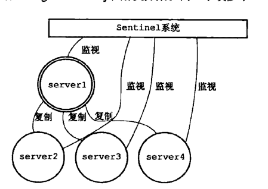
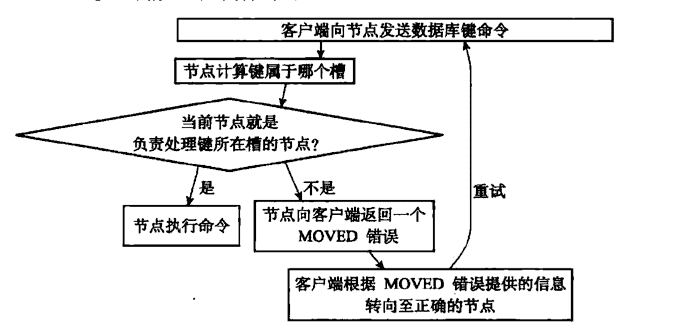

# 数据结构

## 简单动态字符串「SDS」

```c
struct sdshdr {
  // 记录buf数组中已使用字节的数量，即字符串长度。
  int len;
  // 记录buf数组中未使用字节的数量
  int free;
  // 字节数组，用于保存字符串
  char buf[];
}
```

> 字符串仍以\0结尾，只不过\0这个字节不记录在len中。

### SDS和C语言string区别

1. **长度**：C语言获取字符串长度需要**遍历**，sds直接取`len`。
2. **溢出**：C提供的API不安全。redis可以杜绝缓冲区溢出，在拼接【append】之前会通过free去判断是否足够。
3. **惰性**：C字符串每次修改长度都需要重新分配和回收。redis基于`free`实现**空间预分配**和**惰性空间释放**两种优化策略。
4. **二进制安全**：程序在写入时是什么样，拿出来就是什么样。sds 中可以存储`\0`。所以可以存储二进制数据。

### 空间预分配

发生在字符串增长操作。字符串增长，并且需要空间扩展。

**扩展后**

- `len < 1MB`：额外分配 `free = len`。
- `len > 1MB`：额外分配 `free = 1MB`。

### 惰性空间释放

用于优化SDS字符串缩短操作。用 `free` 记录起来，并不立即回收。

### API

| 函数        | 作用                                                         | 时间复杂度                    |
| :---------- | :----------------------------------------------------------- | :---------------------------- |
| sdsnew      | 创建一个包含给定c字符串的SDS                                 | O(n)                          |
| sdsempty    | 创建一个空的SDS                                              | O(1)                          |
| sdsfree     | 释放给定的SDS                                                | O(n)                          |
| sdslen      | 获取SDS的已使用空间字节数                                    | O(1)                          |
| sdsavail    | 获取SDS的未使用空间字节数                                    | O(1)                          |
| sdsdup      | 创建给定SDS的副本                                            | O(n)                          |
| sdsclear    | 清空SDS保存的字符串内容                                      | O(1)，惰性空间释放。          |
| sdscat      | 将给定的C字符串拼到SDS字符串的结尾                           | O(n)，要拼接的字符串长度。    |
| sdscatsds   | 将给定的SDS字符串拼到SDS字符串的结尾                         | O(n)，要拼接的字符串长度。    |
| sdscpy      | 将给定的C字符串复制到SDS里，覆盖SDS原有的字符串              | O(n)                          |
| sdsgrowzero | 用空字符将SDS扩展至给定长度                                  | O(n)，新增的字节数。          |
| sdsrange    | 保留给定区间中的内容，其余清除                               | O(n)，保留区间的字节数        |
| sdstrim     | 接收一个SDS和C字符串作为参数，从SDS中移除所有在C字符串中出现的字符 | O(n * n)，给定c字符串的长度。 |
| sdscmp      | 对比两个SDS字符串是否相同                                    | O(n)                          |

## 链表「list」
> 应用于**列表键**、**发布与订阅**、**慢查询**、**监视器**。

```c
// 链表节点
struct listNode {
  struct listNode *prev; // 前驱节点
  struct listNode *next; // 后驱节点
  void *value			 // 值
}

// 链表
struct list {
  listNode *head;						// 头指针
  listNode *tail;						// 尾指针
  unsigned long len; 					// 链表包含的节点数量
  void (*dup) (void *ptr); 				// 节点值赋值函数
  void (*free) (void *ptr);				// 节点值释放函数
  int (*match) (void *ptr, void *key);	// 节点值对比函数
}
```

> **双端**、**无环**、**双带头**、带**长度计数器**、**多态**【void来保存节点值】

### API
| 函数               | 作用                                               | 时间复杂度 |
| :----------------- | :------------------------------------------------- | :--------- |
| listSetDupMethod   | 将给定的函数设置为链表的节点值复制函数             | O(1)       |
| listGetDupMethod   | 返回链表的当前的节点值复制函数                     | O(1)       |
| listSetFreeMethod  | 将给定的函数设置为链表的节点值释放函数             | O(1)       |
| listGetFreeMethod  | 返回链表的当前的节点值释放函数                     | O(1)       |
| listSetMatchMethod | 将给定的函数设置为链表的节点值对比函数             | O(1)       |
| listGetMatchMethod | 返回链表的当前的节点值对比函数                     | O(1)       |
| listLength         | 获取链表长度                                       | O(1)       |
| listFast           | 获取链表表头节点                                   | O(1)       |
| listLast           | 获取链表表尾节点                                   | O(1)       |
| listPrevNode       | 获取给定节点的前置节点                             | O(1)       |
| listNextNode       | 获取给定节点的后置节点                             | O(1)       |
| listCreate         | 创建一个空链表                                     | O(1)       |
| listAddNodeHead    | 将一个包含给定值的新节点添加到给定链表的表头       | O(1)       |
| listAddNodeTail    | 将一个包含给定值的新节点添加到给定链表的表尾       | O(1)       |
| listInsertNode     | 将一个包含给定值的新节点添加到给定节点的之前或之后 | O(1)       |
| listSearchKey      | 查找并返回链表中包含给定值的节点                   | O(n)       |
| listIndex          | 返回链表在给定索引上的节点                         | O(n)       |
| listDelNode        | 从链表中删除给定值的节点                           | O(n)       |
| listRotate         | 将链表的表尾节点弹出，放至链表表头                 | O(1)       |
| listDup            | 复制一个给定链表的副本                             | O(n)       |
| listRelese         | 释放给定链表，以及链表中的所有节点                 | O(n)       |

## 整数集合「intset」

当集合「set」中只包含整数，并且元素数量不多时，使用整数集合。

```c
// 整数集合
struct intset {
  unit32_t encoding;	// 编码方式
  unit32_t length;  	// 集合包含的元素数量
  int8_t contents[]; 	// 元素按值的大小有序排列，不包含任何重复项。
}
```
- **contents**：元素按值的大小有序排列，不包含任何重复项。

- **encoding**：contents数组的真正取值取决于encoding的值。并不存int8_t。

    - **INTSET_ENC_INT16**：int16_t
    - **INTSET_ENC_INT32**：int32_t
    - **INTSET_ENC_INT64**：int64_t
    
    > **redis直接通过偏移暴力提取数字**。

### 升级

当添加新元素，且新元素比整数集合现有所有元素的类型都长时。

- **步骤**
  1. 根据新元素的类型，扩展整数集合底层数组的空间大小，并为新元素分配空间。
  2. 将底层所有元素转换成与新元素相同的类型，并放到相应位置，保证有序性。
  3. 将新元素添加到底层数组。
  
- **好处**

  1. **提升灵活性**：redis可以将不同类型的整数添加到集合中，不用担心出现类型错误，使用灵活。
  1. **节约内存**
### 降级
redis不支持降级操作。

### API
| 函数          | 作用                         | 时间复杂度         |
| :------------ | :--------------------------- | :----------------- |
| intsetNew     | 创建新的整数集合             | O(1)               |
| intsetAdd     | 将给定元素添加到整数集合中   | O(n)               |
| intsetRemove  | 从整数集合中移除给定元素     | O(n)               |
| intsetFind    | 检查给定值是否在集合         | O(log2 n) 二分查找 |
| intsetRandom  | 随机返回一个元素             | O(1)               |
| intsetGet     | 取出数组在给定索引上的元素   | O(1)               |
| intsetLen     | 获取数组长度                 | O(1)               |
| intsetBlobLen | 返回整数集合占用的内存字节数 | O(1)               |

## 压缩列表「ziplist」

列表中只包含少量元素，并且元素都是小整数值或短的字符串，用压缩列表实现。

| zlbytes | zltail | zllen | entry1 | entry2 | ...  | zlend |
| :-----: | :----: | :---: | :----: | :----: | :--: | :---: |

- **zlbytes**：unit32_t，记录占用字节数，**内存重分配**或**计算zlend位置**时使用。

- **zltail**：unit32_t，记录表尾节点到起始地址的字节数。通过这个偏移量，直接找到尾节点。

- **zllen**：unit16_t，节点数量，最多2的16次方，当真实长度大于65535时，就需要遍历了。

- **entry**：节点。每个节点可以保存一个**字节数组**或**整数值**。每个节点由 `previous_entry_length` 、`encoding`、`content`三个部分组成

  - **previous_entry_length**：前一个节点的字节长度。用于后序遍历。前一节点长度影响 `previous_entry_length` 字段占用的字节数。

    > - `<254`：1字节。
    > - `>254`：5字节，第一个字节存254，标识是5个字节存长度，后四个字节存真实长度。
  
  - **encoding**
  
    | 编码     | 字段长度 | 值长度     | 类型                      |
    | -------- | -------- | ---------- | ------------------------- |
    | 00xxxxxx | 1字节    | xxxxxx字节 | 字符串                    |
    | 01xxxxxx | 2字节    | xxxxxx字节 | 字符串                    |
    | 10xxxxxx | 5字节    | xxxxxx字节 | 字符串                    |
    | 11000000 | 1字节    | 2字节      | int16_t                   |
    | 11010000 | 1字节    | 4字节      | int32_t                   |
    | 11100000 | 1字节    | 8字节      | int64_t                   |
    | 11110000 | 1字节    | 3字节      | 24位有符号整数            |
    | 11111110 | 1字节    | 1字节      | 8位有符号整数             |
    | 1111xxxx | 1字节    | 0字节      | xxxx 表示的 >0 <12 的整数 |
  
  - **content**：存储节点的值。
  
- **zlend**：1字节，存255，用于标记结束。

### 连锁更新
多个连续的，长度介于250字节到253字节之间的节点。其中一个节点字符串变长，会导致后面的previous_entry_length连锁更新。

1. 增加节点和删除节点都有可能发生。
2. 出现概率不高。
3. 即使出现，更新的数量也不会很多。

### API
| 函数               | 作用                             | 时间复杂度                  |
| :----------------- | :------------------------------- | :-------------------------- |
| ziplistNew         | 创建压缩列表                     | O(1)                        |
| ziplistPush        | 将新节点添加到表头或表尾         | O(n)，最坏O(n2)，连锁更新。 |
| ziplistInsert      | 将新节点添加到给定节点之后       | O(n)，最坏O(n2)，连锁更新。 |
| ziplistIndex       | 返回压缩列表给定索引上的节点     | O(n)                        |
| ziplistFind        | 查找并返回给定值的节点           | O(n2)，字符串匹配           |
| ziplistNext        | 返回给定节点的下一个节点         | O(1)                        |
| ziplistPrev        | 返回给定节点的上一个节点         | O(1)                        |
| ziplistGet         | 获取给定节点保存的值             | O(1)                        |
| ziplistDelete      | 删除指定节点                     | O(n)，最坏O(n2)，连锁更新。 |
| ziplistDeleteRange | 删除范围节点                     | O(n)，最坏O(n2)，连锁更新。 |
| ziplistLen         | 返回压缩列表目前的元素个数       | O(1)                        |
| ziplistBlobLen     | 返回压缩列表目前占用的内存字节数 | O(1)                        |

## 字典「hash」

又称**符号表**、**关联数组**。**映射**。应用于表示 **数据库**、**hash**、**set**

```c
// 字典
struct dict {
  dictType *type;	// 类型特定函数
  void *privdata;	// 私有数据
  dictht ht[2];		// 哈希表，ht[0]存储hash表，ht[1]rehash时用。
  int trehashidx;	// rehash索引，rehash时使用，其他时候为-1。
}

// 哈希表
struct dictht {
  dictEntry **table; 		// 哈希表数组
  unsigned long size; 		// 哈希表大小
  unsigned long sizemask; 	// 哈希表大小掩码，用于计算索引值，size-1
  unsigned long used; 		// 哈希表已有节点的数量
}

// 哈希表节点
struct dictEntry {
  void *key; 				// 键
  union {
    void *val;
    unit64_tu64;
    int64_ts64;
  } v;						// 值
  struct dictEntry *next; 	// 指向下个hash表结点，形成链表，解决冲突问题。
}

// 函数
struct dictType {
  unsigned int (*hashFunction)(const void *key);							// 计算哈希值的函数
  void *(*keyDup)(void *privdata, const void *key);							// 复制键的函数
  void *(*valDup)(void *privdata, const void *obj);							// 复制值的函数
  void (*keyCompare)(void *privdata, const void *key1, const void *key2);	// 对比键的函数
  void *(*keyDetructor)(void *privdata, const void *key);					// 销毁键的函数
  void *(*valDetructor)(void *privdata, const void *obj);					// 销毁值的函数
}
```

### 哈希算法
```c
// hash函数获取
hash = dict->type->hashFunction(key);

// 位操作直接获取index，除留余数法
index = hash & dict->ht[x].sizemark;
```

- **解决键冲突**：**链地址法**，`dictEntry` 组成的链表没有表尾指针，所以使用**头插法**。

- **rehash**

  > 1. 为字典的ht[1]分配空间
  >    1. 执行扩展操作：第一个大于等于ht[0].used * 2 的 2的n次方;
  >    2. 执行收缩操作：第一个大于等于ht[0].used 的 2的n次方;
  > 2. 重新计算ht[0]每个值的index，放于ht[1]中。
  > 3. 释放ht[0]，交换ht[0]和ht[1]。

- **渐进式rehash【按表长分次hash】**

  > 1. 为ht[1]分配空间，让字典同时持有ht[0]和ht[1]两个哈希表。
  > 2. 在字典中维持索引计数器变表rehashidx，值置为0，表示rehash正式开始工作。
  > 3. rehash进行期间，**每次对字典执行增删改查操作**，顺带将ht[0]哈希表在rehashidx上所有的键值对rehash到ht[1]上，当rehash工作完成之后，程序将rehashidx属性的值加1。
  > 4. 直到所有键值对rehash完成，rehashidx值为-1，调换ht[0]和ht[1]。表示操作完成。

  - *期间hash表的操作*

    - **查找**：如果ht[0]中没有找到，会再到ht[1]中查找一遍。

    - **添加**：直接添加到ht[1]中。


### 哈希表的扩展和收缩
- **扩展**
  
    - 没有执行 **BGSAVE**或 **BGREWRITEAOF** 命令，负载因子大于等于1。
    - 执行 **BGSAVE** 或 **BGREWRITEAOF** 命令，负载因子大于等于5。
    
- **收缩**：负载因子小于0.1。

$$
负载因子 = 哈希表已保存节点数 / 哈希表大小
$$

### API
| 函数             | 作用                                     | 时间复杂度 |
| :--------------- | :--------------------------------------- | :--------- |
| dictCreate       | 创建一个新的字典                         | O(1)       |
| dictAdd          | 将给定的键值对添加到字典                 | O(1)       |
| dictReplace      | 将给定的键值对添加到字典，如果有，则覆盖 | O(1)       |
| dictFetchValue   | 返回给定键的值                           | O(1)       |
| dictGetRandomKey | 随机返回一个键值对                       | O(1)       |
| dictDelete       | 删除给定键的键值对                       | O(1)       |
| dictRelease      | 释放字典                                 | O(n)       |

## 跳表「skiplist」

当有序表包含的元素数量较多，或者元素的成员是比较长的字符串，用跳表存储有序表。

```c
// 跳跃表
struct zskiplist {
  structtz zskiplistNode *header, *tail;	// 头尾节点，迅速找到表头表尾。
  unsigned long length;						// 表中节点的数量，迅速返回count。
  int level;								// 表中层数最大的节点的层数，不包含头结点。
}

// 表结点
struct skiplistNode {
  struct zskiplistLevel {
    struct skiplistNoed *forward; 	// 前进指针 
    unsigned int span; 				// 跨度
  } level[]; 						// 层
  struct skiplistNoed *backword;	// 后退指针
  double score;						// 分值
  robj *obj							// 成员对象
}
```

- **表节点**

  - *层*：每次创建一个新跳跃表节点时，程序通过幂次定律「越大的数出现的概率越小」。这个大小就是层的高度。
    1~32之间的随机数。
    - *前进指针*：用于从表头向表尾访问节点。
    - *跨度*：记录两个节点间的距离，**用来计算rank**。
  - *后退指针*：表尾向表头遍历跳跃表的所有节点。
    - *分值*：浮点数，节点按照分值从大到小排序。
  - *成员*：指向一个字符串对象，分值相同的成员按照对象在字典序中的大小来排序。

### API
| 函数                  | 作用                                                   | 时间复杂度         |
| :-------------------- | :----------------------------------------------------- | :----------------- |
| zslCreate             | 创建一个新的跳跃表                                     | O(1)               |
| zslFree               | 释放跳跃表                                             | O(n)               |
| zslInsert             | 将包含给定成员和分值的新节点添加到跳跃表中             | O(log n)           |
| zslDelete             | 删除跳跃表中给定成员和分值的节点                       | O(log n)           |
| zslGetRank            | 返回给定成员和分值的节点的排名                         | O(log n)           |
| zslGetElementByRank   | 返回排名的节点                                         | O(log n)           |
| zslIsInRange          | 如果跳表中至少有一个节点在给定范围内，返回1，否则返回0 | O(1)               |
| zslFirstInRange       | 返回范围内的第一个节点                                 | O(log n)           |
| zslLastInRange        | 返回范围内的最后一个节点                               | O(log n)           |
| zslDeleteRangeByScore | 按分值范围删除节点                                     | O(n)，删除的节点数 |
| zslDeleteRangeByRank  | 按排名范围删除节点                                     | O(n)，删除的节点数 |

# 对象类型

```c
struct redisObject {
  unsigned type:4;		// 类型
  unsigned encoding:4;	// 编码
  void *ptr;			// 指向底层数据结构的指针
  int recount;			// 引用计数
  unsigned lru:22		// 最后一次被命令程序访问的时间
    ....
}
```

- **类型**

  |   类型常量   | 对象名称 |
  | :----------: | :------: |
  | REDIS_STRING |  字符串  |
  |  REDIS_LIST  |   列表   |
  |  REDIS_HASH  |   哈希   |
  |  REDIS_SET   |   集合   |
  |  REDIS_ZSET  | 有序集合 |
  
  ```shell
  # 查看对象类型
  type keyName
  ```
  
- **编码**

  |         编码常量          | 底层数据结构               |
  | :-----------------------: | :------------------------- |
  |    REDIS_ENCODING_INT     | long类型的整数             |
  |   REDIS_ENCODING_EMBSTR   | embstr编码的简单动态字符串 |
  |    REDIS_ENCODING_RAW     | 简单动态字符串             |
  |     REDIS_ENCODING_HT     | 字典                       |
  | REDIS_ENCODING_LINKEDLIST | 双端链表                   |
  |  REDIS_ENCODING_ZIPLIST   | 压缩列表                   |
  |   REDIS_ENCODING_INTSET   | 整数集合                   |
  |  REDIS_ENCODING_SKIPLIST  | 跳跃表                     |
  
  ```shell
  # 查看编码类型
  OBJECT ENCODING keyName
  ```
  
- **类型和编码的对应关系**

  |     类型     |           编码            |
  | :----------: | :-----------------------: |
  | REDIS_STRING |    REDIS_ENCODING_INT     |
  | REDIS_STRING |   REDIS_ENCODING_EMBSTR   |
  | REDIS_STRING |    REDIS_ENCODING_RAW     |
  |  REDIS_LIST  | REDIS_ENCODING_LINKEDLIST |
  |  REDIS_LIST  |  REDIS_ENCODING_ZIPLIST   |
  |  REDIS_HASH  |  REDIS_ENCODING_ZIPLIST   |
  |  REDIS_HASH  |     REDIS_ENCODING_HT     |
  |  REDIS_SET   |   REDIS_ENCODING_INTSET   |
  |  REDIS_SET   |     REDIS_ENCODING_HT     |
  |  REDIS_ZSET  |  REDIS_ENCODING_ZIPLIST   |
  |  REDIS_ZSET  |  REDIS_ENCODING_SKIPLIST  |

## 字符串

- **编码**

  - **int**：保存整数值，并且可以用long类型表示。
  - **smbstr**：字符串长度小于32。smbstr所分配的空间和字符串对象是**在一起**的。创建和释放字符串对象都只需要操作一次。
  - **raw**：大于32字节的字符串
  
- **值与编码**

  |             值             |  编码  |
  | :------------------------: | :----: |
  |       long类型的整数       |  int   |
  |  long double类型的浮点数   | smbstr |
  | 字符长，大整数和大double数 |  raw   |

- **嵌套**：字符串对象是唯一一种会被其他对象嵌套的对象。

### 编码转换

- **数字变为字符串**：int -> raw


- **smbstr只要发生任何变化**都会转成raw类型。

## 列表

编码可以是 **ziplist** 和 **linkedlist**。

### 编码转换

- **ziplist**：同时满足两点要求。
    - `list-max-ziplist-value`：**默认64**，每个元素的长度必须都小于这个参数的字节数。
    
    - `list-max-ziplist-entries`：**默认512**，元素数量小于这个参数。
    
- **linkedlist**：其他情况。

## 哈希
编码可以是 **ziplist** 和 **hashtable**

| zlbytes | zltail | zllen | entry1【键1】 | entry2【值1】 | ...  | zlend |
| :-----: | :----: | :---: | :-----------: | :-----------: | :--: | :---: |

### 编码转换

- **ziplist**：同时满足两点要求。
    - `hash-max-ziplist-value`：**默认64**，每个元素的长度必须都小于这个参数的字节数。
    
    - `hash-max-ziplist-entries`：**默认512**，元素数量小于这个参数。
    
- **hashtable**：其他情况。

## 集合
编码可以是 **intset** 和 **hashtable**

### 编码转换
- **intset**：同时满足两点要求。
    - 所有元素都是整数值。
    
    - `set-max-intset-entries`：**默认512**，元素数量小于这个参数。
    
- **hashtable**：其他情况。


## 有序集合

编码可以是 **ziplist** 和 **skiplist**

- **ziplist**

  | zlbytes | zltail | zllen | entry1【成员1】 | entry2【分值1】 | ...  | zlend |
  | :-----: | :----: | :---: | :-------------: | :-------------: | :--: | ----- |

- **skiplist**：需要同时使用字典【通过元素查找分值O(1)】和跳表。

### 编码转换

- **ziplist**：同时满足两点要求。
  - `zset-max-ziplist-value`：**默认64**，每个元素的长度必须都小于这个参数的字节数。
  
  - `zset-max-ziplist-entries`：**默认128**，元素数量小于这个参数。
  
- **skiplist**：其他情况。

# 服务器对象

## 数据库

```c
struct redisDb {
  dict *dict;		// 键空间，保存着数据库中所有的键值对
  dict *expire;		// 过期字典，保存着键的过期时间
  dict *watch_keys;	// 正在被 watch 命令监视的键
}
```

- **键空间**

  - **键**：就是数据库中的键。每个键都是一个字符串对象。

  - **值**：就是数据库中的值，每个值可以是字符串对象、列表对象、哈希表对象、集合对象、有序集合对象。

  - **操作**
    - 添加：set、zset、ladd...

    - 删除：del

    - 更新：二次set

    - 取值：get、hget...

    - 清空数据库：flushdb

    - 随机返回一个键：randomkey

    - 获取数据库键数量：dbsize

    - 修改键名：rename

    - 设置过期时间：expire

    - 获取匹配的键：keys、scan...

- **读取键空间时的维护操作**

  - *更新键的命中「hit」和不命中次数「miss」*

    > hit：info stats中keyspace_hits。
    >
    > miss：info stats中keyspace_misses。

  - *读取键后，更新键的最后一次使用时间：LRU*

    ```shell
    # 查看key的闲置时间。
    object idletime keyName
    ```
    
  - *读取时发现键过期，会先删除，再返回*。

  - *watch命令监视这个键后，如果这个键被修改，会标记为dirty「脏」*。

  - *每修改一个键，都会对dirty键计数器加1，这个计数器会触发服务器的持久化以及复制操作*。

  - *如果开启了数据库通知功能，在对键进行修改后，会按配置发送相应的数据库通知*。

### 数据库通知

数据库通知可以让客户端通过订阅给定的频道或模式，来获取数据库中键值的变化。

- **客户端接收通知**

  - *键空间通知*

    ```shell
    # 0号数据库对 message 键执行的操作
    SUBSCRISE _ _keyspace@0_ _:messgae
    ```

  - *键事件通知*

    ```shell
    # 0号数据库执行del操作的键
    SUBSCRISE _ _keyevent@0_ _:del
    ```

- **服务端发送通知**：通过  `notify-keyspace-events`  参数来配置。

  - AKE：发送所有类型的键空间和键事件通知。
  - AK：发送所有类型的键空间通知。
  - AE：发送所有类型的键事件通知。
  - A$：只和字符串有关的键空间通知。
  - El：只和列表键有关的键事件通知。

## 服务器

```c
struct redisServer {
    redisDb *db;										// 一个数组，保存着服务器中的所有数据。
    int dbNum;											// 服务器的数据库数量
    struct saveParam *saveParams;						// 记录了保存条件的数组
    long dirty;											// 修改计数器
    time_t lastsave;									// 上一次执行保存的时间
    sds aof_buf;										// AOF缓冲区
    
    struct timeEvent *timeEvents;						// 所有的时间事件链表
    
    list *client;										// 所有的客户端状态
    
    time_t unixtime;									// 保存了秒级精度的系统当前unix时间戳
    long long mstime;									// 保存了毫秒级精度的系统当前unix时间戳

    long long lruclock;									// 用于计算数据库键空转时间。

    long long ops_sec_last_sample_time;					// 上一次进行抽样的时间
    long long ops_sec_last_sample_ops;					// 上一次抽样时，服务器已执行命令数量
    long long ops_sec_samples[REDIS_OPS_SEC_SAMPLES]; 	// REDIS_OPS_SEC_SAMPLES【默认16】大小的环形数组，每个项都记录了一次抽样结果。
    int ops_sect_idx;									// ops_sec_samples数组的索引值，每次抽样，自增1，到16时，置回0。
    
    size_t stat_peak_memory;							// 已使用内存峰值
    int aof_rewrite_scheduled;							// 如果为1，表示有BGREWRITEAOF被延迟执行了
    pid_t rdb_child_pid;								// 记录BGSAVE的进程id，没有为-1
    pid_t aof_child_pid;								// 记录BGREWRITEAOF的进程id，没有为-1
    int cornloops;										// 记录serverCron函数的运行次数。

    // 订阅
    dict *publish_channels;								// 频道订阅，字典key是频道，值是list
    list *publish_patterns;								// 模式订阅关系

    // 慢查询
    long long slowlog_entry_id;							// 下一条慢查询日志的id
    list *slowlog;										// 保存了所有慢查询日志的链表
    long long slowlog-log-slower-than;					// 服务器配置 slowlog-log-slower-than 选项的值
    unsigned long showlog-max-len;						// 服务器配置 showlog-max-len 选项的值

    list *monitors;										// 监视器链表
}
```

### 命令请求的执行过程
<span style="color:green">set key value 到 回复ok</span>

1. **客户端向服务器发送命令请求  `set key value`。**
   
    > 1. 用户输入请求。
    > 2. 客户端将命令转换成协议格式。
    > 3. 连接到服务器的套接字。
    > 4. 将协议格式的命令发送到服务器。
    
2. **服务器接收并处理客户端发来的命令请求 `set key value`，在数据库中进行设置，并产生命令回复OK。**
   
    > 读取命令请求。当客户端与服务器之间的连接套接字因客户端的输入变的可读时。
    
    1. *读取套接字中协议格式的命令请求，保存到客户端状态的输入缓冲区中。*
    
    2. *对缓冲区内容分析，提取命令参数、参数个数，存到argv和argc中。*
    
    3. *调用命令执行器，执行客户端指定的命令。*
       
        1. **查找命令实现。**
        
            > 根据argv[0]的值，在命令表【command table】中找到对应的redisCommand。
            
        2. **执行预备操作。**
           
            > 1. 检查客户端cmd指针是否指向null，指向null向客户端返回错误。
            > 2. 通过arity参数检查参数是否正确，不正确返回错误。
            > 3. 检查客户端是否通过了身份验证。
            > 4. 如果服务器打开了 maxmemory 功能，先检查内存占用情况，需要时进行回收，回收失败返回错误。
            > 5. 如果上一次执行bgsave出错，并且服务器打开了 `stop-writes-on-bgsave-error` 功能，写命令返回错误。
            > 6. 如果客户端正在订阅频道，命令必须是订阅命令，否则返回错误。
            > 7. 服务器正在执行载入。发送的命令必须带有l标识，否则返回错误。
            > 8. 服务器因lua脚本超时进入阻塞状态，服务器只执行 shotdown、nosave 和 client kill 命令。
            > 9. 如果正在执行事务，其他命令放事务队列，只执行exec、discard、multi、watch命令。
            > 10. 服务器打开监视器功能，服务器会将要执行的命令和参数发送给监视器。
            
        3. **调用命令的实现函数。执行相应操作，生成相应命令回复，保存到客户端的输出缓存区中。**
        
        4. **执行后续工作。**
           
            > 1. 如果开启了慢日志，慢日志模块检查是否需要添加日志。
            > 2. 更新 redisCommand的 `calls` 和 `millseconds` 属性。
            > 3. 如果服务器开启了AOF持久化，AOF持久化模块将命令写到AOF缓冲区中。
            > 4. 如果其他服务器正在复制，将命令传播给所有从服务器。
    
3. **服务器将命令回复OK发送给客户端。**
   
    > 1. 命令实现函数为客户端的套接字关联回复处理器。
    > 2. 当套接字可写状态时，执行回复处理器，将保存在缓冲区的数据发送给客户端。
    > 3. 发送完毕，回复处理器清空缓冲区。
    
4. **客户端接收服务器返回的命令OK，并打印给客户端看。**
   
    > 1. 将协议格式的命令回复转换成人类可读的形式。
    > 2. 打印出来。
### 服务器初始化

```c
void initServerConfig(void) {
  // 设置服务器的运行id
  getRandomHexChars(server.run_id, REDIS_RUN_ID_SIZE);
  // 为运行id加上结尾字符
  server.run_id[REDIS_RUN_ID_SIZE] = '\0';
  // 设置默认配置文件路径
  server.configfile = null;
  // 设置默认服务器频率
  server.hz = REDIS_DEFAULT_HZ;
  // 设置服务器的运行架构
  server.arch_bits = (sizeof(long) == 8) ? 64 : 32;
  // 设置默认服务器端口号
  server.port = REDIS_SERVERPORT;
  // 设置服务器的默认RDB持久化条件和AOF持久化条件。
  // 初始化服务器的lru时钟
  // 创建命令表
  ....
}
```

- **载入配置选项**：用从配置文件中读到的配置更新默认值。
- **初始化服务器数据结构**
  1. server.clients链表
  2. server.db数组
  3. 用于保存订阅频道频道信息的server.publish_channels字典，和用于保存模式订阅信息的server.publish_patterns链表。
  4. 用与执行Lua脚本的lua环境server.lua。
  5. 用于保存慢日志的server.slowlog属性。
- **设置操作**
  1. 为服务器设置进程信号处理器。
  2. 创建共享对象：ok、err、1到10000的整数的字符串对象。
  3. 打开服务器的监听端口，并为监听套接字关联连接应答事件处理器。
  4. 为serverCron创建时间事件。
  5. 如果AOF持久化功能已经打开，打开现有AOF文件，如果文件不存在，创建并打开一个新的AOF文件。
  6. 初始化服务器的后台 I/O 模块。
- **还原数据库状态**

  1. 通过AOF或RDB文件载入数据。
  2. 还原之后，在日志中打印载入时间和载入耗时。
- **执行事件循环**

### serverCron函数

1. **更新服务器时间缓存**：redis有不少功能都需要获取系统的当前时间，每次获取都需要执行系统调用，为了减少执行次数，不执行系统调用，每100毫秒更新一次缓存的系统时间。

2. **更新LRU时钟**：每个redis对象都有一个lru属性，lru记录了这个对象最后一次被命令访问的时间，以计算数据库键的**空转时间**。

   > `redisServer.lruclock` 每10秒更新一次，所以时间是非实时的。
   
3. **更新服务器每秒执行命令次数**：`trackOperationsPerSeond` 。

   > - 函数以每100毫秒一次执行。
   >
   > - 计算每毫秒执行的次数 * 1000，存入 ops_sec_samples 数组中。
   >   
   >   `(当前已执行命令数ops_sec_last_sample_ops) / (redisServer.mstime - redisServer.ops_sec_last_sample_time) * 1000`
   >   
   >- info 命令从环形数组获取平均结果。
   > 
   >  ```c
   >   long long getOperationsPerSeond {
   >     int j;
   >     long long sum = 0;
   >     // 计算所有取样值的总和
   >     for (i = 0; i < REDIS_OPS_SEC_SAMPLES; i++) {
   >       sum += ops_sec_samples[i];
   >     }
   >     // 计算取样的平均值
   >     return sum / REDIS_OPS_SEC_SAMPLES
   >   }
   >  ```
   
4. **更新服务器内存峰值记录**：取当前内存值和 `redisServer.stat_peak_memory` 的最大值，更新 `redisServer.stat_peak_memory` 。

5. **处理SIGNTERM信号**：redis拦截SIGNTERM信号，定期处理并进行持久化，不做直接退出。

6. **管理客户端资源**：调用clientCron函数，对一定数量的客户端进行检查。

   > 1. 检查连接超时。
   > 2. 检查输入缓冲区。
   
7. **管理数据库资源**：调用databasesCron

   > 1. 删除过期键。
   > 2. 在有需要时，对字典进行收缩。

8. **执行被延时的BGREWRITEAOF操作**：检查 `BGSAVE` 和 `BGREWRITEAOF` 是否在执行，如果没有执行，并且 `redisServer.aof_rewrite_scheduled = 1` ，执行 `BGREWRITEAOF` 命令。

9. **检查持久化操作的运行状态**：检查 `redisServer.rdb_child_pid` 和 `redisServer.aof_child_pid`;

         1. 如果有一个不为-1，执行 wait 函数。检查子进程是否有信号发来。
            1. 有信号到达，执行后续操作。
            2. 无信号，表示持久化未完成，不作操作。
         2. 如果都为-1。
               1. 检查是否有 `BGREWRITEAOF` 被延时。
               2. 检查自动保存条件是否满足。
               3. 检查AOF重写条件是否满足。
   
10. **将AOF缓冲区的内容写入AOF文件**

11. **关闭异常客户端**：关闭输出缓冲区超出大小的客户端。

12. **增加cornloops计数器的值。**

## 客户端
```shell
# 获取所有客户端
client list
```

```c
struct redisClient {
    int fd;											// 客户端套接字描述符
    robj *name;										// 客户端名字
    int flags;										// 客户端的标志值
    redis *db;										// 记录客户正在使用的数据库，以及数据库的号码
    sds querybuf;									// 客户端的输入缓冲区
    robj **argv;									// 命令与命令参数
    int argc; 										// 命令的实现函数
    struct redisCommand *cmd;						// 固定的输出缓冲区
    char buf[REDIS_REPLY_CHUNK_BYTES];
    int bufpos;
    
    list *reply;									// 可变大小的输出缓冲区
    int authenticated;								// 客户端的身份验证标识
    time_t ctime;									// 客户端创建时间
    time_t lastinteration;							// 客户端和服务器最后一次的通信时间
    time_t obuf_soft_limit_reache_time;				// 客户端的输出缓冲区大小超出软性限制的时间
    // 客户端的复制状态信息、以及复制所需的数据结构
    // 客户端执行BRPOP、BLPOP等列表阻塞命令时使用的数据结构

    // 客户端执行发布和订阅功能时，执行的数据结构
    int slave_listening_port;						// 从服务器的监听端口
    multiState mstate;								// 客户端的事务状态，以及执行WATCH命令时用到的数据结构
}
```

- **fd**：套接字描述符。

  1. 伪套接字「AOF或LUA脚本」的fd为-1。
  2. 普通客户端的请求为大于-1的整数。

- **name**：客户端名字。

  1. 默认是没有名字的。
  2. 可以执行client setname命令设置名称

- **flags**：标志

  >1. 记录客户端的角色
  >2. 属性值可以是单个标志，也可以是多个标志的二进制或。

  - *REDIS_MASTER*：表示客户端代表的是主服务器「主从复制时，主服务器会变成从服务器的客户端」。
  - *REDIS_SLAVE*：表示客户端代表的是从服务器。
  - *REDIS_PRE_PSYNC*：主服务器不能使用psync命令同步，必须在REDIS_SLAVE标志打开情况下使用。
  - *REDIS_LUA_CLIENT*：表示用于处理lua脚本里包含的redis命令的客户端。
  - *REDIS_MONITOR*：客户端正在执行 REDIS_MONITOR 命令。
  - *REDIS_UNIX_SOCKET*：服务器使用unix套接字来连接客户端。
  - *REDIS_BLOCKED*：客户端正在被BRPOP、BLPOP等命令阻塞。
  - *REDIS_UNBLOCKED*：客户端从阻塞状态脱离出来，只有在 REDIS_BLOCKED 打开时使用
  - *REDIS_MULTI*：客户端正在执行事务。
  - *REDIS_DIRTY_CAS*：表示事务使用watch命令监视的键已经被修改。
  - *REDIS_DIRTY_EXEC*：表示事务在命令入队时出现了错误。
  - *REDIS_CLOSE_ASAP*：客户端的输出缓冲区超出了服务器允许的范围，服务器会在下一次执行serverCron函数时关闭这个客户端。
  - *REDIS_CLOES_AFTER_REPLY*：表示有用户对这个客户端执行了CLIENT KILL 操作。
  - *REDIS_ASKING*：表示客户端向集群节点发送了 ASKING 命令。
  - *REDIS_FORCE_AOF*：强制服务器将当前执行的命令写入到AOF中。
  - *REDIS_FORCE_REPL*：
  - *REDIS_MASTER_FORCE_REPLY*：

- **querybuf**：输入缓冲区

  > 客户端发送的命令请求转成的的字符串对象。

- **argv**：对命令分析后，拆成的参数。

  > 数组，每个元素都是字符串对象，0存命令，其他存命令参数。

- **argc**：记录argv数组的长度。

- **redisCommand**：命令的实现函数

  > 1. redis有一个命令表示字典，key是命令名称，值是 redisCommand 结构。
  > 2. 保存了命令的实现函数、命令的标志、命令应该给定的参数个数、命令的总执行次数、总消耗时长等统计信息。

- **buf、bufpos**：固定大小缓冲区。

  > 1. 用于保存长度比较小的回复。
  > 2. buf 是 REDIS_REPLY_CHUNK_BYTES 字节的字节数组，默认16KB。
  > 3. bufpos记录buf已使用的字节数。
  > 4. 回复太大时，开始使用可变缓冲区。

- **reply**：可变大小的输出缓冲区

  > 用链表连接多个字符串。

- **authenticated**：身份验证

  >0：表示未通过，除了auth外，其他命令都被拒绝。
  >
  >1：表示已通过。

- **ctime**：客户端创建时间。

- **lastinteration**：客户端与服务器最后一次互动的时间。

- **obuf_soft_limit_reache_time**：输出缓冲区第一次到达软性限制的时间。

### redisCommand

```c
struct redisCommand {
  char *name;						// 命令的名字
  redisCommandProc *proc;			// 函数指针，指向命令的实现函数
  int arity;					    // 命令参数的个数 -N表示大于等于N
  char *sflags;					    // 字符串形式的标识符，记录了命令的属性
  int flags;					    // 对sflags标识进行分析得出的二进制标识，由程序自动生成。
  long long calls;					// 服务器执行该命令的次数
  long long milliseconds;			// 服务器执行这个命令耗费的总时长
}
```

- **sflags**

  | 标识 | 意义                                                        | 命令                             |
  | :--- | :---------------------------------------------------------- | :------------------------------- |
  | w    | 写入命令，可能会改变数据库                                  | set、del、rpush等                |
  | r    | 只读命令，不会修改数据库                                    | get、exists等                    |
  | m    | 可能会占用大量内存，执行前要检查内存占用情况                | set、append、sadd、sinterstore等 |
  | a    | 管理命令                                                    | save、bgsave、shotdown等         |
  | p    | 发布与订阅命令                                              | publish、subscribe、pubsub等等   |
  | s    | 不可以在lua脚本中使用                                       | brpop、brpoplpush等              |
  | R    | 随机指令                                                    | spop、sscan等                    |
  | S    | 在lua脚本中使用这个命令时，对这个命令的输出结果进行一次排序 | sinter、sunion等                 |
  | l    | 可以在服务器载入数据的过程中使用                            | info、shotdown、publish等        |
  | t    | 允许从服务器在带有过期数据时使用                            | slavof、ping、info等             |
  | M    | 监视器模式下不会自动被传播                                  | exec                             |

### 创建与关闭

- **普通客户端**

  - *创建*：客户端使用connect函数连接到服务器时，服务器会调用连接事件处理器，为客户端创建相应的客户端状态，并将这个新的客户端状态添加到服务器状态结构clients链表的末尾。

  - *关闭*
    
      > 1. 客户端进程退出或被杀死。
      > 2. 客户端向服务端发送了不符合协议格式的命令请求。
      > 3. 客户端成为了client kill 的目标。
      > 4. 为服务器配置了 timeout 配置。「空转时间」
      > 5. 客户端输入的命令请求超过了输入缓冲区的限制大小「默认1GB」。
      > 6. 发送给客户端的回复超过了输出缓冲区的限制大小。
      
      - 输出缓冲区的限制
      
        > 1. 硬性限制：超出立即关闭。
        > 2. 软性限制：如果客户端在一定时间内，一直超过服务器设置的软性限制。
        > 3. 受 `client-output-buffer-limit` 参数控制。格式：【功能类型 硬性限制 软性限制 时间】，0表示不限制。


- **LUA的伪客户端**

  - *创建*：服务器初始化时，创建负责执行lua命令的伪客户端。

  - *关闭*：服务器被关闭时。


- **AOF的伪客户端**
- *创建*：载入aof文件时。
  
- *关闭*：载入完成之后。

# 对象使用

- **命令**

  - *可以对任意键使用*：`del`、`expire`、`rename`、`type`、`object`。

  - *只能对特定类型使用*

      > **string**：set、get、appent、strlen
      >
      > **list**：rpush、lpop、llen、linster
      >
      > **hash**：hdel、hset、hget、hlen
      >
      > **set**：sadd、spop、sinter、scard
      >
      > **zset**：zadd、zcard、zrank、zscore


- **类型检查**：执行命令前，先检查该命令是否能被键所属对象执行。

- **命令多态**：实际执行命令时，redis会根据实际编码类型 **调用不同的函数** 来执行操作。

- **内存回收**：引用计数器。

- **对象共享**：redis不共享包含字符串的对象，只共享int型。

- **空转时长**

  ```shell
  # 当前时间 - 键值的lru。OBJECT IDLETIME在访问对象时，不更新lru。
  OBJECT IDLETIME [keyName
  ```
  

# 生命周期

## 过期时间

- **设置**：最终设置时底层都会转换成pexpireat进行设置。

  - *在指定时间之后过期*

    ```shell
    # 以秒为精度设置过期时间。
    expire [keyName]
    # 以毫秒为精度设置过期时间。
    pexpire [keyName]
    ```
  
  - *指定某个时间戳过期*

    ```shell
    expireat [keyName]
    pexpireat [keyName]
    ```
  
- **时间存储**：过期时间并不和对象在一起存储，而是单独存储在 `redisDb.expire` 属性内，`expire` 也是一个 `dict`。

- **移除**

  ```shell
  persist [keyName]
  ```

## 剩余生存时间

$$
剩余生存时间 = 过期时间 - 当前时间
$$

```shell
ttl [keyName]
pttl [keyName]
```

## 标准过期删除策略
- **定时删除**

  > - 每个键都创建一个定时器，过期时间来临之前立即进行删除。
  > - 对内存友好，但对CPU不友好，当前时间的实现方式是无序链表。时间复杂度也高。

- **惰性删除**

  > - 不设置定时器，在读取时判断过期。
  > - 对内存不友好，对cpu友好。

- **定期删除**

  > 每隔一段时间执行一次过期键删除操作。并通过限制删除操作执行的时长和频率来减少删除操作对cpu时间的影响。

  - *难点*

    > - 执行频繁或执行时间长：浪费CPU。
    > - 执行不频繁或执行时间短：浪费内存。

## reids过期删除策略
> redis使用 **定期删除** 加 **惰性删除**。

- **惰性删除**

  > 每个命令都需要实现以下逻辑。
  >
  > 1. 键存在时，照常执行。
  > 2. 键不存在或 `expireIfneeded` 函数删除，按照键不存在的情况执行。

- **定期删除**

  > 1. 函数名 `activeExpireCycle` 。
  > 2. 每次运行时，都取出一定量的数据库键执行。「**数据库维度**」。
  > 3. 全局变量 `current_db`，记录检查进度。
  > 4. 全部数据检查完后，`current_db` 重置为0，开启新一轮检查。

## RDB

- **生成**：save 和 bgsave 命令执行时，程序会对数据库中的键进行检查，已过期的不会保存到rdb文件中。

- **载入**：redis启动时。
  - *主服务器模式*：检查过期时间，过期的不载入。
  - *从服务器模式*：不考虑过期时间，因为连到主服务器时，所有数据都会被情空。

## AOF

- **生成**
  - 数据追加时不会验证过期时间。

  - 惰性删除或定期删除时，会追加一条del命令。

- **重写**：重写时会检查键的过期时间，已过期的键不在AOF文件中。

## 复制

1. 过期键删除由主服务器控制。
2. 主服务器删除键后，会显式发送del命令。
3. 从服务器的读命令，不会执行惰性删除。

# 持久化

## RDB

### 创建

- **主动**

  - *save*：阻塞redis服务器进程，所有命令都会被拒绝。直到rdb文件创建完成为止。

  - *bgsave*

    > 1. 派生子进程，由子进程创建rdb文件，主进程继续接收请求。
    > 2. bgsave执行期间，bgsave命令被拒绝、bgrewriteaof 命令会被延时到 bgsave 命令执行完成后执行。
    > 3. bgrewriteaof  命令执行期间，bgsave 命令被拒绝。
  
- **自动**

  ```shell
  # 配置：通过save配置项。表示多少秒内执行了多少次修改操作。
  save [秒] [修改次数]
  ```
  
  ```c
  // 内存结构
  struct saveParam {
    // 秒数
    time_t seconds;
    // 修改数
    int changes;
  }
  ```

  - 服务器对象中的 `dirty` 记录上一次执行save命令成功之后，进行了多少次修改。
  - 服务器对象中的 `lastsave` 记录上一次执行save命令的时间戳。
  - **serverCron**函数每100毫秒执行一次，其中一项工作就是检查save保存的条件是否满足，满足后，执行bgsave命令。

### 载入
> 服务器启动时自动执行。

1. 载入期间，进程处于阻塞状态。
2. 如果服务器开启了AOF持久化功能，服务器优先使用AOF文件来还原数据库状态。
3. 如果服务器关闭了AOF持久化功能，使用RDB文件来还原。

### 文件结构

| REDIS | db_version | databases | EOF  | check_num |
| :---: | :--------: | :-------: | :--: | :-------: |

- REDIS：5个字节，保存REDIS这5个字符。
- db_version：4个字节，记录rdb文件的版本号。
- databases：包含0个或多个数据库和键值对
  - 数据为空：0字节。
  - 非空：根据数据长度不同，字节数也不同。
- EOF：1字节，标识数据已读完。
- check_num：8字节的无符号整数，通过前面4部分内容计算得到，载入时检查文件是否损坏。

#### databases

只存储database非空的数据库。

| database1 | database2 |
| --------- | --------- |

#### database

| SELECTDB | db_number | key_value_pairs |
| :------: | :-------: | :-------------: |

- SELECTDB：1字节，标识接下来要读数据库号码。
- db_number：可以是1字节、2字节或5字节，服务器调用select命令，切换到对应数据库。
- key_value_pairs：所有的键值对数据。

#### key_value_pairs

| TYPE | KEY  | VALUE |
| :--: | :--: | :---: |

> 不带过期时间的键值对。

| EXPIRETIME_MS |  ms  | TYPE | KEY  | VALUE |
| :-----------: | :--: | :--: | :--: | :---: |

> 带过期时间的键值对。

- TYPE：1字节。

  > - REDIS_RDB_TYPE_STRING
  > - REDIS_RDB_TYPE_LIST
  > - REDIS_RDB_TYPE_SET
  > - REDIS_RDB_TYPE_ZSET
  > - REDIS_RDB_TYPE_HASH
  > - REDIS_RDB_TYPE_LIST_ZIPLIST
  > - REDIS_RDB_TYPE_SET_INTSET
  > - REDIS_RDB_TYPE_ZSET_HASH
  > - REDIS_RDB_TYPE_HASH_ZIPLIST

- key：字符串对象，编码方式和 REDIS_RDB_TYPE_STRING 一样。

- value：和 TYPE 有关

  > ##### 字符串对象
  >
  > - 整型
  >
  >   | ENCODING | int  |
  >   | :------: | :--: |
  >
  >   - ENCODING：1字节
  >     - REDIS_RDB_ENC_INT8：8位保存整数
  >     - REDIS_RDB_ENC_INT16：16位保存整数
  >     - REDIS_RDB_ENC_INT32：32位保存整数
  >
  > - 字符串
  >
  >   - 不压缩
  >
  >     | ENCODING | len  | string |
  >     | :------: | :--: | :----: |
  >
  >     - ENCODING：REDIS_RDB_ENC_RAW
  >
  >   - 压缩
  >
  >     | ENCODING | compressed_len | origin_len | string |
  >     | :-: | :-: | :-: |  :-: |
  >
  >     - ENCODING：REDIS_RDB_ENC_LZF，使用lzf算法压缩。
  >     - compressed_len：压缩之后的长度。
  >     - origin_len：原长。
  >     - string：字符串本身。
  >
  > ##### 列表对象
  >
  > | list_length | 字符串对象1 | 字符串对象2 | ...  |
  > | :---------: | :---------: | :---------: | :--: |
  >
  > ##### 集合对象
  >
  > | size_length | 字符串对象1 | 字符串对象2 | ...  |
  > | :---------: | :---------: | :---------: | :--: |
  >
  > ##### 哈希表对象
  >
  > | hash_size | key字符串对象1 | value字符串对象2 | ...  |
  > | :-------: | :------------: | :--------------: | :--: |
  >
  > ##### 有序集合对象
  >
  > | hash_size | member字符串对象1 | score字符串对象2 | ...  |
  > | :-------: | :---------------: | :--------------: | :--: |
  >
  > ##### INTSET集合
  >
  > - 保存先将整数集合转换成字符串对象，然后保存至RDB。
  > - 载入：再转换回整数。
  >
  > ##### ZIPLIST
  >
  > - 保存：将压缩列表转换为字符串对象
  > - 载入
  >   - 转换成压缩列表。
  >   - 根据TYPE，生成相应的type类型。

- EXPIRETIME_MS：1字节，标识要读入一个毫秒为单位的过期时间。

- ms：8字节无符号整数，记录毫秒为单位的时间戳。


### 文件分析
```shell
od -c rdb.dump
od -xc dump.rdb
```

## AOF【append only file】

### 命令追加
> 服务器执行完一个写命令后，会以请求协议格式追加到服务器状态的 `aof_buf` 缓冲区的末尾。

### 写入和同步
- **配置**：`appendonly：no  yes`。

- **文件的写入和同步**

    > - 用户调用 write 函数，操作系统会将写入数据暂时保存在一个内存缓冲区中，等缓冲区空间被填满、或超过指定时限后，才真正将缓冲区的数据写入到磁盘中。
    > - `fsync` 和 `fdatasync`：强制将缓冲区数据写入到磁盘中。

    - *appendfsync*

      > - 每次事件循环执行 `flushAppendOnlyFile` 函数。
      > - `flushAppendOnlyFile` 函数根据服务器配置的 `appendfsync` 选项的值来决定写入和同步AOF文件的频率。

      |    值    | flushAppendOnlyFile函数行为                                  |
      | :------: | :----------------------------------------------------------- |
      |  always  | 每次都将 aof_buf缓冲区 内容「写入」并「同步」AOF文件。       |
      | everysec | 每次都将 aof_buf缓冲区 内容「写入」AOF文件，判断上次「同步」AOF文件的时间，和当前时间超过1秒就「同步」。 |
      |    no    | 每次都将 aof_buf缓冲区 内容「写入」AOF文件，由操作系统决定何时「同步」。 |

### 文件载入和数据还原
1. 创建一个不带链接的伪客户端。
2. 从 AOF 文件中分析并读取出一条写指令。
3. 使用伪客户端执行命令。
4. 重复步骤2、3，直到执行完为止。

### AOF重写
> - redis将生成新的aof文件替换旧的aof文件的操作定义为aof重写。
> - aof重写并不会对旧的aof文件执行任何读取、分析、写入操作。
> - 为了避免执行命令造成缓冲区溢出，重写程序在处理列表、哈希、集合、有序集合时，会先检查元素个数。
>   - 如果元素超过64个，会解析成多条命令。

-  **后台重写**

  > 1. 子进程进行重写AOF期间，父进程可以继续处理请求。
  > 2. 子进程带有主进程的数据副本。使用进程而不是线程，可以避免锁的耗时。
  > 3. 使用 AOF缓冲区 和 AOF重写缓冲区 处理不一致。
  > 4. 命令：`BGREWRITEAOF`。

- **重写期间，主进程需要做的工作**

  > 1. 执行客户端发来的请求。
  > 2. 将执行后的写命令追加到 AOF缓冲区。
  > 3. 将执行后的写命令追加到 AOF重写缓冲区。

- **缓冲区双写的好处**

  > 1. 旧的AOF文件处理照常进行。
  > 2. 开启重写子进程后，所有命令都要写入重写缓冲区。

- **重写过程**

  > 1. fork一个子进程，子进程内有主进程的数据副本。
  > 2. 主进程开始缓冲区双写。
  > 3. 子进程重写完成后，向主进程发送信号。
  > 4. 主进程接受到信号，进程阻塞。
  > 5. 主进程将重写缓冲区的数据追加入新的AOF文件。
  > 6. 主进程对新的AOF文件进行改名，覆盖旧的AOF文件。
  > 7. 主进程继续正常工作。

#       事件

## redis进程

 

- **进程是个死循环。**
- **redis是个事件驱动程序。需要处理两类事件**：**文件事件**、**时间事件**。

- **循环中执行的内容**

  > - 文件事件负责接收客户端客户端的命令请求，以及向客户端发送命令回复。
  > - 时间事件执行像serverCron一样需要定时执行的任务。
  > - aof持久化事件

## 文件事件

> redis通过套接字与客户端「或其他redis服务器」进行连接，文件事件是对套接字的抽象。服务器与客户端的的通信会产生相应的文件事件，服务器通过监听并处理这些事件来完成一系列网络通信操作。

- **事件类型**

  1. 当有套接字可读时，或者有新的可应答套接字出现时，套接字产生 `AE_READABLE` 事件。
  2. 当套接字变得可写时，套接字产生 `AE_WRITEABLE` 事件。
  3. 如果一个套接字可读又可写时，先读后写。

- **文件事件处理器**：多个事件处理器分别用于实现不同的网络通信需求。

   
  
  - **连接应答处理器**：当redis初始化时，程序会将处理器与服务器监听套接字的 `AE_READABLE` 事件关联起来。

  - **命令请求处理器**：当客户端通过连接应答处理器连接到服务器后，服务器会将客户端的套接字和命令请求处理器关联起来，当客户端发送请求时，套接字产生 `AE_READABLE` 事件，引发命令请求处理器执行，并执行相关套接字的读入操作。

  - **命令回复处理器**：当服务器有命令回复需要传送给客户端时，服务器会将客户端的 `AE_WRITEABLE` 事件与命令回复处理器关联起来，当客户端准备好接收时，产生 `AE_WRITEABLE` 事件，引发命令回复处理器执行，并执行相应的套接字写入操作。命令回复发送完毕后，服务器断开回复处理器和套接字 `AE_WRITEABLE` 事件的关联。

  - **复制处理器**：主从。

## 时间事件

> redis服务器中的一些操作需要在给定时间点执行，时间事件就是对这类定时操作的抽象。

- **类别**

  - **定时事件**：让一段程序在指定的时间之后执行一次。
  
  - **周期性事件**：让一段程序每隔一段时间执行一次。
  
- **类型**：取决于事件处理器的返回值。

  - **AE_NOMORE**：定时事件，到达后将事件删除。
  
  - **非AE_NOMORE的整数值**：周期性事件，根据返回值对when进行更新。「**目前只有周期性事件**」。
  
- **实现**
  
   
  
  > - 无序列表头插。无序指不按when排序，仍然按照ID由大到小排序。
  > - 因此每次执行时间事件，需要从头到尾进行遍历。
  
  - **属性**
    - id：服务器为时间事件创建的全局唯一ID，id按从小到大排列，新事件的id号比旧事件的id号大。
    - when：记录事件的到达时间。时间戳。
    - timeProc：时间事件处理器，一个函数。
  
- **举例**：serverCron函数。

  > 1. 更新服务器的各类统计信息，比如时间、内存占用、数据库占用时间。
  > 2. 清理数据库中过期键值对。
  > 3. 关闭和清理连接失败的客户端。
  > 4. 尝试进行 AOF 或 RDB 持久化操作。
  > 5. 如果服务器是主服务器，对从服务器进行定期同步。
  > 6. 如果处于集群模式，对集群进行定期同步和连接测试。
  > 7. 默认每秒运行10次，可根据hz参数修改。
  > 8. 一般情况下时间事件只执行 serverCron 函数。

## 调度与执行

- **进程启动**

  ```python
  def main() {
      # 初始化服务器
      init_server();
      # 一直处理事件，直到服务器关闭为止
      while server_is_not_shotdown() {
          aeProcessEvents();
      }
      # 服务器关闭，执行清理操作
      server_clean();
  }
  ```

- **事件调度**

  ```python
  def aeProcessEvents() {
      # 获取到达时间离当前时间最接近的时间事件
      time_event = aeSearchNearestTimer();
      # 计算和当前时间的时间差
      remaind_ms = time_event.when - unix_ts_now();
      # 如果时间已到达，设置为0
      if (remaind_ms < 0) {
          remaind_ms = 0;
      }
      # 根据remaind_ms的值，创建timeval结构
      timeval = create_timeval_with_ms(remaind_ms);
      # 阻塞并等待文件事件产生
      aeApiPoll(timeval);
      # 处理已产生的文件事件
      processFileEvents();
      # 处理已到达的时间事件
      processTimeEvents();
  }
  ```

  1. `aeApiPoll` 函数的最大阻塞时间由到达时间最接近当前时间的时间事件决定。**避免频繁轮询**。
  2. 因为文件事件是随机出现的，如果等待并处理完一次文件事件之后，没有新的文件事件到达，服务器再次等待，时间会逐渐向最近的时间事件的到达时间逼近，然后处理时间事件。
  3. 对文件事件和时间事件都是同步、有序、原子的执行，事件不会中断。因此每个事件处理器都要尽可能减少程序阻塞时间。
  4. 因为时间事件都是在文件事件之后执行，并且不会抢占，所以实际处理时间会晚于设定时间。

- **时间事件处理**

  ```python
  def processTimeEvents() {
      # 遍历服务器中的所有事件
      for time_event in all_time_events() {
          # 判断事件是否到达
          if (time_event.when <= unix_ts_now()) {
              # 执行事件处理器
              retvel = time_event.timeProc();
              # 判断事件类型
              if (retvel == AE_NOMORE) {
                  # 从事件链表中删除事件
                  delete_time_event_rom_server(time_event);
              } else {
                  # 更新任务执行时间
                  update_when(time_event, retvel)
              }
          }
      }        
  }
  ```

# 多机服务器

## 哨兵「sentinel」

 

**高可用性的解决方案**：由1个或多个 **sentinel** 实例组成的sentinel系统可以监视任意多个主服务器，以及这些主服务下的所有从服务器，并在监视的主服务器处于下线状态时，自动将属下的某个从服务器升级为主服务器。当server1的下线时长超过用户设定的下线时长上限时，sentinel就会对server1进行故障转移操作。

### 启动并初始化哨兵

#### 启动

```shell
redis-sentinel sentinel.conf
redis-server sentinel.conf --sentinel
```

#### 执行步骤

1. **初始化哨兵服务器**：初始化一个普通的redis服务器。

2. 将普通服务器使用的代码替换为 **sentinel 专用代码**：用以限制命令，修改端口。

    

3. **初始化 sentinel 状态**

   1. **初始化一个sentinelState的数据结构**

      ```c
      struct sentinelState {
          unit64_t current_epoch;		// 当前纪元，用于实现故障转移。
          // 保存了所有监视的主服务器
          dict *masters;				// key是主服务器的名称，值是一个指向 sentinelRedisInstance 对象的指针。
          int tilt;					// 是否进入了 TILT 模式
          int runing_scripts;			// 目前正在执行的脚本数量
          mstime_t tilt_start_time;	// 进入 TILT 模式的时间
          mstime_t previous_time;		// 最后一次执行时间处理器的时间
          list *scripts_queue;		// 一个 fifo 队列包含所有需要执行的用户脚本
      }
      ```
      
   2. **初始化sentinel状态的master属性**
   
      ```c
      struct sentinelRedisInstance {
          int flags;						// 标识值，记录实例的类型和实例的当前状态
          char *name;				    	// 实例的名称，从服务器格式为ip:port，主服务name为配置文件中设置
          char *run_id;					// 实例的运行id
          unit64_t current_epoch;			// 配置纪元，用于实现故障转移。
          sentinelAddr *addr;				// 实例地址
          mstime_t down_after_period;		// 实例无响应多少毫秒后才会判断主观下线。由 sentinel down-after-milliseconds 控制
          int quorum;						// 判断这个实例客观下线所需的支持投票数，由 monitor {master-name} {IP} {port} {quorum} 的quorum参数控制
          int paraller_syncs;				// 在执行故障转移操作时，可以同时对新的主服务进行同步的从服务器数量, sentinel paraller_syncs {master-nam} {number}
          mstime_t failover_time;			// 刷新故障转移状态的最大时限 sentinel failover_time {master-name} {ms}
          dict *slaves;					// 从服务器节点
          dict * sentinels			    // 其他sentinelRedisInstance 节点
      }
      
      struct sentinelAddr {
          char *ip;
          int port;
      }
      ```
   
4. 根据给定的配置文件，**初始化sentinel监听的服务器列表**。

5. **创建连向主服务器的网络连接**：创建两个连向主服务器的异步网络连接。

   > - **命令连接**：专门用于向主服务发送命令，并接收回复。
   > - **订阅连接**：订阅主服务器的 `_sentinel_:hello` 频道。

### 信息交互

#### 获取主服务器信息

> 以10秒一次的频率，向主服务器发送 info 命令获取主服务器的信息。

1. 获取主服务器的run_id，和flags角色。

2. 获取主服务属下的所有从服务器slaves。

   > **slaves**是一个字典，`key` 是 `ip:port` ，`value` 是 `sentinelRedisInstance` 结构体的一个指针。

   - 如果从服务器节点存在，对结构体进行更新。

   - 如果从服务器节点不存在，创建结构体。

   - 主服务器的flags属性值为 `SRI_MASTER`，从服务器的flags属性值为 `SRI_SLAVE`。

#### 获取从服务器信息
> 获取到从服务器后，为从服务器创建命令连接和订阅连接。**每10秒1次通过info命令获取从服务信息**。

1. run_id：从服务器的运行ID
2. role：从服务器的角色
3. 主服务器的ip和端口：master_host和master_port；
4. master_link_status：主从服务器的连接状态
5. slave_priority：从服务器的优先级
6. slave_repl_offset：从服务器的复制偏移量。

#### 向主服务器和从服务器发送信息

> 每两秒一次发送命令 。

- **发布频道**

  ```shell
  PUBLISH _sentinel_ :hello "{s_ip},{s_port},{s_runid},{s_epoch},{m_name},{m_ip},{m_port},{m_epoch}"
  ```

  > - **s_ip**：哨兵的ip地址。
  > - **s_port**：哨兵的端口号。
  > - **s_runid**：哨兵的运行id。
  > - **s_epoch**：当前的配置纪元。
  > - **m_ip**：主服务器的ip地址。
  > - **m_port**：主服务器的端口号。
  > - **m_runid**：主服务器的运行id。
  > - **m_epoch**：主服务器的配置纪元。

#### 接收来自主服务器和从服务器的频道信息

- **订阅频道**

  ```shell
  SUBSCRIBE _sentinel_ :hello
  ```

  > 和服务器建立连接之后，订阅持续到和服务器断开连接为止。
  >
  > 这个订阅可以接收其他 sentinel 发布的信息。可以通过其他 sentinel 的信息更新主服务器实例结构。

- **更新sentinel字典**：更新该服务器实例的 sentinels 属性，存储其他哨兵的信息。

- **创建连向其他哨兵的命令连接**：使用命令连接相连的各个哨兵可以通过向其他哨兵发送命令来进行信息交换。

### 故障转移

1. sentinel挑选server1属下的一个从服务器，将选中的从服务器升级为主服务器。

   > 1. 挑选一个状态良好，数据完整的从服务器，向服务器发送 `slaveof no one` 命令，将这个服务换为主服务器。
   > 2. 发送 `slaveof no one` 命令后，每秒一次向被升级的服务器发送 info 命令，当角色变为 mster 后，标识已经升级成功。

2. sentinel向所有的从服务器发送新的复制指令，让他们成为新的主服务器的从服务器，当所有从服务器都开始复制新的主服务器时，故障转移操作完毕。

   > 向其他从服务器发送新的 `slaveof` 命令。

3. sentinel继续监视server1服务器，在其上线后，设置为新的主服务器的从服务器。

   > 修改结构体的结构。

#### 检查主观下线状态

每秒向服务器发送 `ping` 命令，并通过返回值判断是否在线。如果持续不在线超过 `down_after_period` 毫秒后，将master标记为主观下线，主服务器的 flags 属性中打开 `STR_S_DOWN` 标识。

#### 检查客观下线状态

- **向其他哨兵发送命令**：判断主观下线之后，询问其他哨兵是否同意主服务器下线。

  ```shell
  sentinel is-master-down-by-addr {ip} {port} {current_epoch} {run_id}
  ```

  > - **ip**：被哨兵判断为主观下线的主服务器的IP地址。
  > - **port**：被哨兵判断为主观下线的主服务器的端口号。
  > - **current_epoch**：sentinel当前的配置纪元，用于选取 **领头** 哨兵。
  > - **runid**：可以是 *** 符号** 或 **哨兵的运行id**。
  >   - *：用于检测主服务器的客观下线。
  >   - 运行id：选举领头哨兵。

- **接收 sentinel 命令，将返回3个结果**
  
    - down_state：对主服务器的检查结果
        - 1主服务器已下线，
        - 2主服务器未下线。
    - leader_runid：
        - *代 表仅仅用于检测服务器的下线状态，
        - sentinel_id 则用于选举**领头** sentinel。
    - leader_epoch：局部领头 sentinel 的配置纪元。
    
- **接收sentinel命令回复**
  
    - 统计同意主服务下线的 sentinel 数量，超过上限后，将主服务器flags属性的 `SRI_O_DOWN` 标识打开。

#### 选举领头 sentinel
1. 所有监视服务器的在线 sentinel 都有被选举为领头 sentinel 的资格。
2. 每次选举之后，无论成功与否，所有 sentinel 的配置纪元都自增一次。
3. 在一个配置纪元里，所有 sentinel 都有一次将某个 sentinel 设置为局部头领的资格，并且局部头领一但设置，在这个配置纪元里就不能再更改。
4. 每个发现主服务进入客观下线的 sentinel 都会要求其他 sentinel 将自己设置为局部头领。
5. runid参数不是 * 时，表示源要求其他 sentinel 将自己设置为后者的局部头领。
6. 设置局部头领先到先得，其他的要求设置局部头领的要求会被拒绝。
7. 目标 sentinel 接收到 sentinel 命令后，回复记录了目标局部头领的 sentinel 的运行id和配置纪元。
8. 接收到 sentinel 回复之后，检查回复的配置纪元和自己的是否相同，相同判断运行id和自己的是否一致，一致表明目标 sentinel 将自己设置为了局部头领。
9. 被半数以上的 sentinel 设置为局部领头，则被设置的 sentinel 成为领头 sentinel。
10. 一个配置纪元中只能设置一次局部领头。
11. 如果在给定时限内没有选举出领头，会隔一段时间再选举，直到选出为止。

## 复制

> 复制其他服务器的数据。

- **命令**：`slaveof ip prot`。

### 旧版复制
> 复制功能分为同步和命令传播两个操作。

- **同步【sync】**：将从服务器的数据库状态更新为主服务器的状态。

   
  
- **命令传播【command propagete】**：主服务器发生变更时，修改从服务器，保持一致性。

  - *步骤*：主服务器将自己执行的写命令发送给从服务器。

  - *缺陷*：初次复制没有问题，断线后复制有问题，效率很低。需要重新同步。

  - *断线后重连*

     

### 新版复制

> **psync 代替 sync 命令**，具有完整重同步和部分重同步两种模式。

 

- `fullresync {run_id} {offiset}`

  - *run_id*：主服务器的run_id；
  - *offiset*：主服务器当前的偏移量，从服务器需要作为自己的初始偏移量。
  
- **完整重同步**：和初次复制一样。

- **部分重同步**

  - *复制偏移量*：主从服务器分别维护一个复制偏移量。

    > - 主服务器每次向从服务器传播N个字节的数据时，自身维护的偏移量+N
    >- 从服务器每接收到主服务传播的N个字节数据，偏移量+N。
    > - 重连时，从服务器向主服务器报告偏移量。
    
  - *复制积压缓冲区*

    > 1. 主服务器维护的一个固定长度「默认1MB」的先进先出队列。
    > 2. 主服务器进行命令传播时，不仅把命令发给从服务器，并且将写命令入队复制积压缓冲区。
    > 3. 队列为每个字节记录相应的复制偏移量。
    > 4. 主服务根据偏移量觉得执行何种 psync 操作。
    >    1. 如果偏移量在队列中，执行部分重同步。
    >    2. 如果不在队列，执行完整重同步。

  - *服务运行ID*

    > 1. 运行id服务器启动时自动生成，40个随机的16进制。
    > 2. 当服务器初次复制时，主服务将自己的运行ID发送给从服务器，从服务器保存。
    > 3. 断线重连，从服务器发送保存的运行ID。
    > 4. 主服务器判断运行ID是否和自己一致。
    >    1. 一致：跟进复制积压缓冲区进行部分重同步。
    >    2. 不一致：执行完整重同步。

### 复制的实现
1. **设置主服务器的地址和端口**

    ```shell
    # slaveof是个异步命令
    slaveof ip prot
    ```

2. **建立套接字连接**

    > 1. 从服务器创建向主服务器的套接字连接，如果能成功连接，从服务器将为这个套接字关联一个专门用于处理复制工作的文件处理器。负责执行后续的复制工作，接收rdb文件，接收写命令。
    > 2. 主服务器接收到套接字连接后，创建相应的客户端连接。

3. **发送 ping 命令**：从服务器成为主服务器的客户端之后，首先向主服务器发送 **ping** 命令。

    - **作用**

        > 1. 检查套接字的读写是否正常。
        > 2. 检查主服务器能否正常处理命令请求。
    - **返回**

        > 1. 主服务器发送了回复，从服务器不能在规定时间内读取回复，说明网络不佳，从服务器断开并重新创建套接字。
        > 2. 主服务返回错误，表示主服务器暂时不能处理从服务器的命令。从服务器断开并重新创建套接字。
        > 3. 返回 pong，从服务器继续执行复制的下个步骤。

4. **身份验证【auth】**

    - **作用**

      > - 如果从服务器设置了 `masterauth` 选项，进行身份验证。向主服务器发送 `auth` 命令，参数为 `masterauth` 选项的值。
      > - 如果从服务器没有设置 `masterauth` 选项，不进行身份验证。

    - **返回**
      
        > - 如果主服务器没有设置 `requirepass` 选项，返回 `no password is set`，终止复制，重建套接字。
        > - 如果主服务器设置 `requirepass` 选项，没有通过，返回 `invaild password` 错误，终止复制，重建套接字。
        > - 通过验证，继续复制。

5. **发送端口信息**

    > 1. 从服务器发送 `replconf listening-port {port}`。表示从服务器的监听端口。
    > 2. 主服务器将端口号记录在客户端的 `slave_listening_port` 属性中。

6. **同步**

    > 1. 从服务器向主服务器发送 `psync` 命令，执行同步操作。
    > 2. 在执行同步后，主服务也变成了从服务器的客户端。主服务需要发送缓冲区写命令或复制缓冲区的写命令。

7. **命令传播**：主服务器一直将执行的写命令发送给从服务器。
### 心跳监测
命令传播阶段，从服务器以默认每秒一次的频率，向主服务器发送 `replconf asc {replication_offset}` 命令。

- **检测主从服务器的连接状态**

  - `info replication` 命令，查看从服务器最后一次ack到现在的秒数

  - lag值超过1s，说明主从连接出了问题。


- **辅助实现min-slaves配置选项**

  ```shell
  min-slaves-to-write 3
  min-slaves-max-lag 10
  ```

  > 表示如果从服务器数量超过3个，并且每个lag值都超过10s。主服务器拒绝写命令。

- **检测命令丢失**：如果命令丢失，主服务器从复制积压缓冲区找到丢失的请求，重新发送。

## 集群

```c
// 集群状态
struct clusterState {
    clusterNode *myself;						// 指向当前节点的指针
    unit64_t configEpoch;						// 配置纪元
    int state;									// 集群当前的状态
    int size;									// 集群中至少处理着一个槽的节点的数量
    dict *nodes;								// 集群节点名单
    clusterNode *slots[16384];					// 槽指派信息
    ziplist *slot_to_key;						// 槽和键之间的关系
    clusterNode *importing_slots_form[16384];	// 记录当前节点正在被其他节点导入的槽
    clusterNode *migrate_slots_to[16384];		// 记录了当前节点正在迁移至其他节点的槽
}
```

### 节点

```c
// 集群节点
struct clusterNode {
    mstime_t ctime;							// 创建节点的时间
    char name[REDIS_CLUSTER_NAMELEN];		// 节点的名字，40位16进制数
    int flags;								// 节点标识
    unit64_t configEpoch;					// 节点当前的配置纪元，用于实现故障转移
    char ip[REDIS_IP_STR_LEN];				// 节点的ip地址
    int port;								// 节点的端口号
    clusterLink *link;						// 保存连接节点所需的有关信息

    // 槽
    unsigned char slots[16384/8];			// 二进制数组，处理的槽
    int numslots;							// 处理的槽的数量

    struct clusterNode *slaveof;			// 如果是一个从节点，那么指向主节点
    int numslaves;							// 正在复制这个主节点的从节点数量
    struct clusterNode **slaves;			// 一个数组，指向每个复制该节点的从节点

    list *fail_reports;						// 一个链表，记录了所有其他节点对该节点的下线报告
}

// 连接节点
struct clusterLink {
    mstime_t ctime;				// 连接的创建时间
    int fd;						// TCP套接字描述符
    sds sndbuf;					// 输出缓冲区
    sds rcvbuf;					// 输入缓冲区
    strcut clusterNode *node;	// 与这个连接相关联的节点
}
```

- **相关命令**

  ```shell
  # 连接节点
  cluster meet {ip} {port}
  # 查看集群节点
  cluster nodes

- **启动节点**

  > 1. 通过配置文件「cluster enable」参数来决定。
  > 2. 节点继续使用文件事件处理器来处理命令请求和命令回复。
  > 3. 节点继续调用serverCron时间函数，serverCron会调用clusterCron函数。
  > 4. 节点继续使用数据库来保存键值对对象。
  > 5. 继续使用 AOF 和 RDB 持久化。
  > 6. 节点继续使用订阅和发布功能。
  > 7. 节点会继续使用复制模块来进行工作。
  > 8. 节点会继续使用lua脚本环境来执行用户端输入的lua脚本。

- **CLUSTER MEET实现**

  > 1. 客户端向节点A发送meet命令。
  > 2. 节点A为节点B创建一个clusterNode结构，并将该结构添加到自己的clusterState.nodes字典中。
  > 3. 节点A根据meet中的ip和端口号，向节点B发送meet消息。
  > 4. 节点B收到meet消息，为节点A创建一个clusterNode，并保存到节点B的clusterState.nodes字典中。
  > 5. 节点B回复一个PONG消息。
  > 6. 节点A向节点B发送一个PING消息。
  > 7. 至此，三次握手完成。
  > 8. 节点A还会把节点B的消息通过Gossip协议传播给集群中的其他节点，让其他节点和节点B进行握手。

### 槽指派

- 集群的整个数据库分为 16384 个槽。
- 每个节点可以分配 0-16384 个槽。
- 当所有的槽都有节点在处理时，集群处于上线状态。
- 任何一个槽没有被处理，集群处于下线状态。

```shell
# 将槽指派给当前节点负责
cluster addslots {slot} [slot slot ... ]
```

#### 实现

```python
def CLUSTER_ADDSLOTS(*all_input_slots):
    // 遍历所有指派槽，检查它们是否都是未指派槽
    for i in all_input_slots:
        // 如果有任意一个槽指派给了其他节点，返回错误，并终止命令执行。
        if clusterState.slots[i] != null:
            reply_error();
            return;
        // 再次遍历输入槽，将这些槽指派给当前节点
        for i in all_input_slots:
            // 设置clusterState.slots数组
            clusterState.slots[i] = myself;
            // 访问代表当前的节点的clusterNode节点，将数组i位上的值置为1。
            setSlotBit(clusterState.myself.slots, i);
```

- **记录节点的槽指派信息**

  - slot属性是一个二进制数组
      - 二进制位上值为1：节点负责处理槽
      - 二进制位上值为0：节点不负责处理槽

  - numslots：记录节点处理的槽的数量。


- **传播节点的槽指派信息**：设置槽后，节点会通过消息向其他节点通知，告知自己负责的槽，其他节点会在自己保存的dict中修改节点负责的槽。

- **记录集群的所有槽指派信息**

  > 1. clusterState.slots是一个数组，包含16384个指针，
  > 2. slots[i]的指针指向null，表示槽没有被指派。
  > 3. slots[i]指向一个clusterNode结构，表示槽i已经指派给了那个节点。

### 在集群中执行命令
 

- **计算键属于哪个槽**

  ```python
  def solt_number(key):
    return CRE16(key) & 16383
  ```

  ```shell
  # 查看键所在槽位
  cluster keyslot {key}
  ```
  
- **判断槽是否由当前节点负责处理**：判断clusterState.slots[i] 是否等于 clusterState.myself。

- **moved错误**

  ```shell
  moved {slot} {ip}:{port} 
  ```

  > - 集群客户端通常会与集群中的多个节点创建套接字连接，所谓节点转向实际上就是换一个套接字发送命令。
  > - 集群模式下的cli并不会打印出moved错误。

- **节点数据库的实现**

  > - 用跳跃表 `clusterState.slot_to_keys` 来保存 **键** 和 **槽** 的关系，score是槽，value是键值
  > - 保存和删除键时需要操作这个跳表
  > - 用命令 `cluster getkeysinslot {slot} {count}`  来返回最多count个slot槽的键。

### 分片

#### 重新分片

> redis可以在线重新分片，`redis-trib` 负责执行。

 

> 1. redis-trib对目标节点发送 `cluster setslot {slot} importing {source_id}` 命令，让目标节点准备好从源节点导入slot槽的键值对。
>2. redis-trib对源节点发送 `cluster setslot {slot} migrate {target_id}` 命令，让源节点准备好将属于槽slot的键值对迁移至目标节点。
> 3. redis-trib向源节点发送 `cluster getkeysinslot {slot} {count}` 命令，获取最多 count 个属于槽 slot 的键值对的键名。
>4. 对每个键名，redis-trib向源节点发送 `migrate {target_ip} {target_port} {key_name} 0 {timeout}` 命令，将键迁移至目标节点。
> 5. 重复执行步骤3和步骤4，直到没有键为止。
> 6. redis-trib向集群中任意一个节点发送 `cluster setslot {slot} NODE {target_id}` 命令，将槽slot指派给目标节点，这一指派信息会通过消息发送至整个集群，最终所有的节点都会知道槽slot已经指派给了目标节点。

#### ASK错误

> ask错误也不打印，而是被自动转发

 

```shell
ask {slot} {ip}:{port}
```

> 1. 如果没有在自己的数据库中找到key，如果目标节点正在向其他节点导入槽，返回ask错误。
>2. 客户端接收到ask错误后转向目标节点。
> 3. 客户端再发送 asking 命令。
>4. 再次发送执行命令。

- **`cluster setslot importing` 命令的实现**

  如果clusterState.importing_slots_from.[i]指向的不为null，表示节点正在从 clusterNode 所代表的节点导入槽。

- **`cluster setslot migrate` 命令的实现**

  如果clusterState.migrate_slots_to.[i]指向的不为null，表示节点正在将槽导入clusterNode所代表的节点。

#### ASKING的实现

 

> 1. 打开客户端的REDIS_ASKING标识
>2. 标识打开后，redis会破例执行关于这个槽的命令一次。
> 3. 执行结束后，关闭REDIS_ASKING标识。

#### ask错误和moved错误的区别

1. moved 表示时这个槽的负责权已经转到了另一个节点。
2. ask 是槽转移过程中的一种补救措施。

### 复制与故障转移

> **转移前**：
>
> **转移后**：
>
> 如果主节点再次上线，主节点会变成从节点的从节点。

- **设置从节点**

  > 1. 向一个节点发送命令：`cluster replacete {node_id}`
  > 2. 接收到这个命令的节点会首先在自己的 `clusterNode.nodes` 字典中找到 `node_id` 对应的节点的 `clusterNode` 结构，并将自己的 `clusterState.myself.sloveof` 指向这个节点。
  > 3. 然后修改自己节点的 `clusterState.myself.flags` 属性，打开 `REDIS_NODE_SLAVE` 标识。
  > 4. 调用复制代码，根据主节点的ip和端口号开始主从复制。
  > 5. 复制过程中，给其他节点发送消息，其他节点都会知道这个节点正在复制。
  > 6. 集群中的每个节点都会在代表这个主节点的结构中记录复制信息。slaves和numslaves。

- **故障检测**

  ```c
  struct clusterNodeFailReport {
    struct clusterNode *node;	// 报告目标节点已经下线的节点
    mstime_t time;			// 最后一次收到下线报告的时间
  }
  ```
  
  > - 集群中每个节点都会定期的向其他节点发送 `ping` 消息，来检测对方是否在线，如果没有在规定时间内收到 `pong` 回复，会标记疑似下线。
  > - 各个节点会用互相发送消息的方式交换自己对各个节点的检测。检测结果放在被标记疑似下线的 `fail_reports` 链表中。
  > - 如果半数以上**负责处理槽的节点**都认为这个节点疑似下线，会将这个节点标记为已下线FAIL，然后通知其他节点，其他节点也会把这个节点标记为已下线。
  
- **故障转移**

  > 1. 复制下线主节点的所有从节点中，会有一个节点被选中。
  > 2. 被选中的节点执行 `slave no noe` 命令，成为新的主节点。
  > 3. 新的主节点会撤销所有对已下线节点的槽指派，并将槽全部指向自己。
  > 4. 向集群广播 pong 消息，其他节点也将槽指派导新的主节点。
  > 5. 新的主节点开始处理命令，故障转移结束。

  - *选举新的主节点*：同选举sentinel领头的方式一样。


### 消息

#### 消息类型

- **meet**：收到meet命令的节点向接收者发送meet消息，请求接收者加入到发送者所属的集群中。
- **ping**：集群中的每个节点每隔1秒从已知节点列表中随机选5个节点，然后对这5个节点中最长时间没有发送过ping消息的节点发送ping消息，来检测节点是否在线。如果节点A最后一次收到节点B的pong消息超过节点A设置的 `cluster-node-timeout` 的一半，也会发送ping消息。
- **pong**：当接收者收到meet和ping消息后，会回复pong消息。另外当故障转移完成之后，这个节点会广播 pong 消息，表示自己已经是主节点了。
- **fail**：当检测到某节点已经下线后，会广播这个节点的fail消息，其他节点都会更新该节点状态。
- **publish**：当节点收到一个publish命令后，节点会执行这个命令，并向集群广播一条 publish 消息，所有收到这个 publist 消息的节点都会执行相同的 publish 命令。

#### 消息头

```c
struct clusterMsg {
  unit32_t totlen;									// 消息的长度
  unit16_t type;									// 消息的类型
  unit16_t count;									// 消息正文包含的节点信息数量，只在meet、ping、pong时使用
  unit64_t configEpoch;								// 发送者所处的配置纪元
  char sender[REDIS_CLUSTER_NAMELEN];				// 发送者的名字
  unsignd char myslots[REDIS_CLUSTER_SLOTS/8];		// 发送者目前的槽指派信息
  char slaveof[REDIS_CLUSTER_NAMELEN];				// 从节点复制时使用，主节点名称
  unit16_t port;									// 发送者的端口号
  unit16_t flags;									// 发送者的标识
  unit15_t char state;								// 发送者所处的集群状态
  union clusterMsgData data;						// 消息的正文
}

union clusterMsgData {
  struct {
    clusterMsgDataGossip gossip[1];				// 每个消息都包含两个clusterMsgDataGossip结构
  } ping;										// meet、ping、pong的消息正文
  struct {
    clusterMsgDataFail about;				
  } fail;										// fail消息的正文
  struct {
    clusterMsgDataPublist msg;
  } publist;									// publish 消息的正文
  ...											// 其他消息的正文
}
```

#### meet、ping、pong消息的实现

> 接收者收到消息后，会根据clusterMsgDataGossip消息更新clusterNode中的信息。

```c
struct clusterMsgDataGossip {
  char nodename[REDIS_CLUSTER_NAMELEN];		// 节点名称
  unit32_t ping_sent;						// 最后一次向该节点发送ping消息的时间戳
  unit32_t ping_received;					// 最后一次从该节点接收到pong消息的时间戳
  char ip[16];								// 节点的ip
  unit16_t port;							// 节点的端口号
  unit16_t flags;							// 节点的标识
}
```

#### fail消息的实现

```c
struct clusterMsgDataFail {
  char nodename[REDIS_CLUSTER_NAMELEN];		// 节点名称
}
```

#### publish消息的实现

```c
struct clusterMsgDataPublist {
  unit32_t channel_len;						// 渠道长度
  unit32_t message_len;						// 消息长度
  unsigned char bulk_data[8];				// 消息内容
}
```

# 独立功能

## 发布与订阅

### 订阅

- **频道**：频道的订阅关系都保存在 `server.publish_channels` 里，键是频道名，value是一个链表，所有订阅了这个频道的客户端。

  - **订阅**

    > 1. 客户端发送 `SUBSCRIBE` 命令，订阅某个或某些频道。
    > 2. 如果频道已有订阅者，将客户端添加到订阅链表的尾端。
    > 3. 如果频道没有订阅者，频道订阅字典添加频道key，value 是空链表，然后将将客户端添加到订阅链表的尾端。
  
  - **退订**

    > 1. 客户端发送 `UNSUBSCRIBE` 命令。
    > 2. 程序根据退订频道的名字，删除链表中的相应客户端的信息。
    > 3. 如果链表空了，删除字典中的频道信息。
  
- **模式**：模式的订阅关系都保存在 `server.publish_patterns` 中，`publist_patterns` 是一个链表。链表节点是 `publishPattern`。

  > ```c
  >struct publishPattern {
  > 	redisClient *client;		// 订阅模式的客户端
  > 	robj *pattern;				// 被订阅的模式
  >   }
  >   ```
  
  - **订阅**
    - 客户端发送 `PSUBSCRIBE` 命令，订阅某个或某些模式。
    - 对每个被订阅的模式新建一个 `publishPattern` 结构。
    - 添加到 `publist_patterns` 链表的末尾。
  - **退订**
    - 客户端发送 `PUNSUBSCRIBE` 命令，取消订阅某个或某些模式。
    - 遍历链表，如果节点的模式和客户端都相同，删除节点。

### 发送订阅消息

- **发送给频道订阅者**

  > 1. 客户端发送 `PUBLIST` 命令。
  > 2. 服务器在频道字典 `publish_channels` 找到频道名对应的链表，将消息发送给名单上所有的客户端。

- **发送给模式订阅者**

  > 1. 客户端发送 `PUBLIST` 命令。
  > 2. 服务器遍历 `publish_patterns` 链表，查找与 `publish_patterns` 匹配的客户端，将消息发送给客户端。

### 查看订阅信息

- **查看服务器当前被订阅的频道**

  ```shell
  PUBLISH CHANNELS {PATTRTN}
  ```

  > 1. 如果不给定 `pattern` 参数，返回当前服务器被订阅的所有频道。
  > 2. 如果给定 `pattern` 参数，返回匹配的频道。
  > 3. 遍历 `publish_channels` 字典的所有键。

- **获取频道的订阅者数量**

  ```shell
  PUBLISH NUMSUB [channel-1 channel-2 ...]
  ```

  > 根据频道号在字典中遍历链表

- **返回服务器当前被订阅模式的数量**

  ```shell
  PUBLISH NUMPAT
  ```

  > 获取 `publist_patterns` 的长度

## 事务

```c
struct multiState {
  multiCmd *commands;				// 事务队列，先入先出
  int count;						// 已入队命令数
}

struct multiCmd {
  robj *argv;						// 命令参数
  int argc;							// 参数个数
  struct redisCommands *cmd;		// 命令指针
}
```

### 实现
1. **事务开始**：`multi` 标识事务的开始。
   
2. **命令入队**
   
    > 1. 当客户端处于非事务状态时，客户端发送的命令会被立即执行。
    > 2. 当客户端处于事务状态时。
    >    1. `exec` 、`discard` 、`watch` 、`multi` 命令会被立即执行。
    >    2. 其他命令放入事务队列中，向客户端回复 `queued`。
    
3. **事务执行**
   
    > 1. 收到 `exec` 命令。
    > 2. 遍历 `multiState` 队列，执行所有命令，最后将执行结果返回给客户端。

### WATCH命令的实现
> 在执行exec命令前，验证要监视的键是否被修改，如果修改，返回空。

1. **使用watch命令监视数据库键。**
   
    > 1. `redisDb.watched_keys` 是一个字典，`key` 是数据库键，值是链表，每个节点是一个客户端。
    > 2. 执行 `watch` 命令会在链表中添加客户端节点。
    
2. **监视机制触发。**
   
    > 1. 任何对数据库修改的命令，都会遍历 `watched_keys` 对应的键值的链表。
    > 2. `touchWatchKey` 函数会将监视的客户端的 `REDIS_DITRY_CAS` 标识打开。表示该客户端的事务安全性已被破坏。
    
3. **判断事务是否安全**
   
    > 收到 `exec` 命令时，检查 `redisClient.flags` 是否打开了 `REDIS_DITRY_CAS` 标识。

### ACID

- **原子性**：多个操作当成一个整体执行，要么全部操作执行，要么一个操作也不执行。不支持回滚，中间命令出错，事务也会继续执行下去。

- **一致性**：如果数据库在执行前是一致的，执行事务之后，数据库也应该是一致的。

  - *保证事务一致性的办法*

    - **入队错误**：事务入队过程中，发生命令错误，格式不正确等，redis拒绝执行这个事务。

    - **执行错误**

      > 1. 入队检查没有查出的错误。
      > 2. 如果发生了错误，也不会停下，会继续往下执行。
    
    - **服务器停机**：根据 AOF 或 RDB 恢复，恢复到一个一致性的状态。
  
- **隔离性**：事务之间是串行的。

- **持久性**：事务的执行结果被保存至硬盘。redis通过本身的持久化实现 。

## 排序「sort」

> sort 命令可以对列表键、集合键或有序集合键的值进行排序。

```c
struct redisSortObject {
  robj *obj;					// 被排序键的值
  union {
    double score;				// 排序数字值时使用
    robj *cmpobj;				// 排序带有by选项的字符串值是使用
  } u;							// 权重
}
```

- **sort {key}命令的实现**

  > 1. 创建一个和元素列表相同的数组，数组的每一项都是redisSortObject结构。
  > 2. 遍历数组，将各个数组项的执行obj执行各个元素。
  > 3. 将每个元素计算成一个double型的浮点数，存到u.score中。
  > 4. 对数组按照u.score排序。
  > 5. 遍历数组，将各个数组项的obj指针指向的值返回到客户端。

- **sort {key} alpha命令的实现**

  > 1. 创建一个和元素列表相同的数组，数组的每一项都是redisSortObject结构。
  > 2. 遍历数组，将各个数组项的执行obj执行各个元素。
  > 3. 对指向的元素进行字符串排序。
  > 4. 遍历数组，将各个数组项的obj指针指向的值返回到客户端。

- **asc选项和desc选项的实现**

  > 快排算法

- **by选项的实现**

  ```shell
  sort fruits by *-price
  ```

  > 1. 创建一个和元素列表相同的数组，数组的每一项都是redisSortObject结构。
  > 2. 遍历数组，通过 元素值+-price作为键值，查找键值对中对应的权重，作为u.score；
  > 3. 快排。
  > 4. 遍历数组，将各个数组项的obj指针指向的值返回到客户端。

- **带有alpha选项的by选项实现**

  > 把上面的权重值换成字符串。

- **limit 选项的实现**

  ```shell
  limit <offset, size>
  ```

  > 只返回特定数据，不需要遍历。

- **get选项的实现**

  ```shell
  get *-price
  ```

  > 根据结果返回元素值+-price作为键所对应的值。

- **store选项的实现**

  > 把排序结果保存到指定键中

- **选项执行顺序**

  > 1. 排序：使用by、asc、desc、aplha选项进行排序。
  > 2. 限制结果集长度：limit
  > 3. 获取外部键：get
  > 4. 保存排序结果集：store
  > 5. 向客户端返回结果集。
  > 6. 命令的摆放顺序对结果并不影响。

## 二进制位数组

- **GETBIT命令**

  ```shell
  getbit {bitarry} {offsset}
  ```

  > 1. 计算 byte = offsset / 8 向下取整。
  > 2. 计算 bit = offsset % 8 + 1;
  > 3. 定位到具体的位置，并返回二进制位上的值。
  > 4. 时间复杂度O(1)

- **SETBIT命令扩展**

  - *二进制位统计算法*

    > 1. 遍历算法
    > 2. 查表算法
    > 3. swar算法【不管】
    > 4. redis实现
    >    1. 未处理的二进制位小于128，使用查表法。
    >    2. 未处理的二进制位大于等于128，使用swar算法。

- **BITOP命令**

## 慢查询日志

> - `slowlog-log-slower-than`：指定慢查询的微秒上限值。
> - `showlog-max-len` ：指定服务器最多保存的慢日志的长度。

```c
struct slowlogEntry {
  long long id;			// 唯一标识符
  time_t time;			// 命令执行时的时间
  long long druation;	// 执行命令消耗的时间，单位是微秒
  robj *argv;			// 命令参数
  int argc;           // 参数个数
}
```

> slowlog保存了慢查询链表，每个元素是一个slowlogEntry结构体。

- **阅览**

  ```shell
  slowlog get
  ```

- **获取条数**

  ```shell
  slowlog len
  ```

- **删除**

  ```shell
  slowlog reset
  ```

- **添加新日志**

  > - 通过showlogPushEntryIfNeeded函数判断。
  > - 新日志插到表头。
  > - 超过showlog-max-len值的日志会被丢弃。

## 监视器

> 1. 通过 `monitor` 命令，把自己变成一个监视器。
> 2. 在 `redisServer.monitor` 链表中尾插当前的客户端。

- **向监视器发送命令**

  > 每次请求处理之前，调用 `replicationFeedMonitors` 函数将命令放到每个redis客户端的输出缓冲区。

### 创建并修改lua环境

> 1. 创建一个基础的lua环境
> 2. 载入多函数库到lua环境中
> 3. 创建全局表格redis，包含了对redis操作的函数。
> 4. 使用redis自制的随机函数来替换lua原有的随机函数。消除随机函数副作用。
> 5. 创建辅助排序函数。消除命令的不确定性。
> 6. 创建redis.pcall的错误报告辅助函数，这个函数可以提供更详细的出错信息。
> 7. 对lua环境中的全局变量进行保护。
> 8. 将完成修改的lua环境保存到服务器状态的lua属性中。

- **创建lua环境**

  > 调用c的lua_open函数。

- **载入函数库**

  > 基础库：base library
  >
  > 表格库：table library
  >
  > 字符串库：string library
  >
  > 数学库：math library
  >
  > 调试库：debug library
  >
  > lua CJSON库：
  >
  > struct库
  >
  > lua cmsgpack库

- **创建redis全局表格**

  > 1. 用于执行redis命令的redis.call和redis.pcall函数
  > 2. 用于执行redis日志的redis.log函数
  > 3. 用于计算shal校验和的redis.shalhax函数。
  > 4. 用于返回错误信息的redis.error_reply函数和redis.status_reply函数。

### lua环境协作组件
> 伪客户端和lua_scripts字典

- **伪客户端**

  > lua脚本执行redis.call或pcall函数，需要完成以下步骤。
  >
  > 1. lua环境将要执行的命令传送给伪客户端。
  > 2. 伪客户端脚本将要执行的命令传递给命令执行器。
  > 3. 命令执行器执行命令，将结果返回给伪客户端。
  > 4. 伪客户端接收返回值，将返回值返回给lua环境
  > 5. lua环境在接收到命令结果之后，将结果返回给redis.call或pcall函数。
  > 6. 函数接收到结果，将结果返回给函数调用方。

- lua_scripts字典

  > 服务器会把所有lua执行过的命令和所有被script load命令载入过的lua脚本都保存到字典里。
  >

### 命令实现

- **eval**

  1. *定义lua函数*

     > lua函数名为f_加脚本的sha1校验和。
     >
     > 好处
     >
     > 1. 执行步骤简单，只需要执行调用函数就行。
     > 2. 通过函数的局部性来让lua保持清洁。
     > 3. 如果脚本被定义过，直接调用lua函数来执行脚本。

  2. *将脚本放倒lua_scripts字典，等待将来使用*

     > 建为sha1校验和，值为脚本本身。

  3. *执行定义的函数*

     > 1. 将eval命令中传入的键名参数和脚本参数分表保存到keys数组和agrv数组。讲这两个数组作为全局变量放入到lua环境中。
     > 2. 为lua装载超时处理钩子，当出现运行情况时，让客户短通过script kill命令停止脚本，或shutdown命令直接关闭服务器。
     > 3. 移除脚本函数
     > 4. 移除之前装载过的超时钩子。
     > 5. 将执行脚本结果发到客户端状态的输出缓冲区中，等待服务器将结果返回给客户端。
     > 6. 对lua环境进行垃圾回收操作。

- **evalsha**

  > 通过校验和找到函数内容，进行执行。

- **脚本管理命令**

  - *script plush*

    > 1. 清除lua_scripts字典
    > 2. 重建lua_scripts字典
    > 3. 关闭lua环境
    > 4. 初始化新的lua环境

  - *script exists*

    > 根据输入的校验和，在字典中判断脚本是否存在

  - *script load*

    > 1. 在lua环境中创建函数。
    > 2. 保存到字典。
    > 3. 将键值返回。

  - *script kill*

    > 停止服务器正在运行的脚本

- **脚本复制**

  - *eval、script plush、script plush*

    > 主从执行相同的操作

  - *evalsha*

    > repl_scriptcache_dict记录lua脚本是否已经传播给了所有服务器。
    >
    > 根据evalsha命令指定的校验和判断是否存在于repl_scriptcache_dict字典中，如果存在，传播evalsha命令，否则传播eval命令