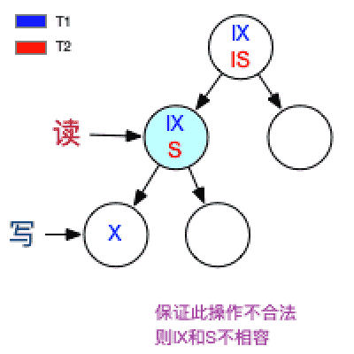

# 数据库概念

## 数据

描述事务的符号记录

## 数据库 `DB` 

存储数据的仓库

## 数据库管理系统 `DBMS` 

管理数据库的系统

### 功能

1. 数据定义功能（DDL）
2. 数据操纵功能（DML）
3. 数据组织、存储、管理（通过索引提高存取效率）
4. 数据库的事务管理和运行管理
5. 数据库的建立和维护
6. 其他功能（网络通信）

## 数据库系统

数据库系统由数据、数据库、数据库管理系统、DBA、应用程序、用户组成

### 特点

1. 数据结构化
2. 数据共享度高、冗余度低、易扩充
3. 数据独立性高（物理独立性和逻辑独立性由二级映像实现）
   - 物理独立性：应用程序与数据的物理存储相互独立
   - 逻辑独立性：应用程序与数据的逻辑结构相互独立
4. 数据由数据库管理系统统一管理
   - 安全性保护、完整性检查、并发控制、数据库恢复

## 数据模型

用来描述数据、组织数据、操作数剧

### 三要素

数据结构、数据操作、完整性约束条件

### 概念模型 `信息模型`

用于数据库设计，从用户角度出发      联系：一对一、一对多、多对多。

### 逻辑模型

#### 层次模型

1. 优点：结构清晰、查询效率高

2. 缺点：和现实差距大、插入和删除复杂、查询必须经过双亲

#### 网状模型

1. 优点：和现实相符

2. 缺点：结构复杂

#### 关系模型

1. 优点：概念单一、结构清晰、数据独立性高、安全

##### 概念

域：一组具有相同数据类型的值的集合

##### 三级模式

1. 模式 `逻辑模式` `DDL` ：一个数据库只有一个模式；全局逻辑结构

2. 外模式 `子模式` `用户模式` `DDL`：一个数据库有多个模式；局部逻辑结构

3. 内模式 `存储模式`：一个数据库只有一个内模式；物理结构和存储结构

##### 二级映像

1. 外模式/模式映像：保证数据逻辑独立性

2. 模式/内模式映像：保证数据物理独立性

### 物理模型

数据在磁盘的存取方式

# 关系数据库

## 关系数据结构

#### 笛卡尔积

$$
D₁×D₂×…×D𝑛 = \{(d₁,d₂,…,d𝑛) | d𝒾∈D𝒾, i = 1,2,…,n\}
$$

#### 关系

```
笛卡尔积的子集。
```

$$
R(D₁,D₂,…,D𝑛)
$$

1. 基本表：实际存在的表，即关系。

2. 视图表：从基本表或者其他视图表中导出的表。

3. 查询表：查询结果的表。

#### 关系模式

$$
R(U, DOM, F, D)
$$

1. R是关系名。
2. U是属性名集合。
3. D是属性U中所来自的域。
4. DOM是属性名到域的映像集合。
5. F是属性间数据的依赖关系集合。

#### 关系数据库

多个关系模式在某一时刻对应的关系的集合，称为关系数据库

1. 型：关系数据库模式，多个关系模式的集合。

2. 值：属于多个关系模式的关系的集合。

## 关系操作

1. 操作的的对象和关系都是集合。
2. 分为两类：DQL、DML。

### 关系代数

```
抽象查询语言，用对关系的运算来表达查询。
```

#### 定义

1. 目【度】：列的个数。

2. 象集：R中属性组X的值x的所有元组在Z上的分量的集合，称为X在R中的象集 𝑍𝔁。

3. 悬浮元组：参与连接的两个关系，通过公共属性链接，在其中一个关系上有，另一个关系上没有的元组。

#### 集合运算

1. 并、差、交

$$
R∪S、R-S、R∩S
$$

2. 笛卡尔积
   $$
   R×S
   $$


   1. 总目数： m+n
   2. 总元组数： k1 * k2。

#### 关系运算

1. 选择

$$
𝛔𝐹(R), F=A𝜽B
$$

2. 投影
   $$
   ∏𝑨(R)
   $$


   1. 只包含投影列的元组去重。

3. 连接
   $$
   R⋈S, F=A𝜽B
   $$

   1. 内连接

      1. 等值连接
         1. 连接条件：连接符必须是=。
      2. 自然连接
         1. 没有连接条件。
         2. 去掉重复列。
         3. 默认连接条件：所有重复的列均需要相等。

   2. 外连接：保留悬浮元组。

      1. 左外连接：保留左边关系的悬浮元组。
         $$
         R⋊S
         $$

      2. 右外连接：保留右边关系的悬浮元组。
         $$
         R⋉S
         $$

4. 除运算
   $$
   R÷S
   $$

   1. R(X,Z),   S(Z,Y)
   2. Z为公共属性。
   3. 值域Dz为S在Z上的投影。
   4. 筛选象集𝑍𝔁包含Dz的所有X元组。

##### 除法关键字

全部、至少、所有

# SQL

关系数据库语言

## 特点

1. 综合统一：语言风格统一。
   1. 数据定义语言 `DDL`：定义表、模式、视图、索引。
   2. 数据操纵语言 `DML`：对表、视图中的数据的增删改。
   3. 数据控制语言 `DCL`：安全性、`revoke`，`grant`。
   4. 数据查询语言 `DQL`
   5. 数据库重构和维护。
   6. 完整性约束、事务。
   7. 嵌入式SQL和SQL定义。
2. 高度非过程化：面向对象、提高独立性。【映像】
3. 面向集合操作。
4. 以固定语法可嵌入多种高级语言。
5. 语言简洁、易学易用。

## 基本概念

1. 外模式：视图、权限。
2. 模式：基本表。
3. 内模式：存储文件、索引。

## DDL

### 模式

#### 定义

```
create schema <模式名> authoruzation <用户名>
```

#### 删除

```
drop schema <模式名> <cascade|restrict>
```

1. cascade：删除相关依赖对象
2. restrict：有依赖就拒绝

### 基本表

#### 定义

```
create table [模式名.]<表名> (
	<列名> <数据类型> [列级完整性约束条件]
	[, <列名> <数据类型> [列级完整性约束条件]]
	...
	[, <表级约束性条件>]
)
```

#### 删除

```
drop table [模式名.]<表名> <cascade|restrict>
```

1. cascade：删除相关依赖对象
2. Restrict：有依赖对象就拒绝
3. 依赖对象：外码、check、视图、触发器、存储过程、函数

#### 修改

```
alter table <表名>
[add [column] <新列名> <数据类型> [完整性约束条件]]
[add <表级完整性约束>]
[drop [column] <列名> [cascade|restrice]]
[drop constraint <完整性约束名> [cascade|restrice]]
[alter column <新列名> <数据类型>]
```

### 索引

1. B+树索引：叶结点属性和元组指针。
2. 散列索引：建立若干桶，桶中存放属性和元组指针。
3. 位图索引：

#### 定义

```
create [unque] [cluster] index <索引名>
on <表名>(<列名> [<次序> [, <列名> [<次序>] ...]])
```

#### 删除

```
drop index <索引名>
```

同时删除数据字典对索引的描述。

#### 修改

```
alter index <旧索引名> rename to <新索引名>
```

### 视图

#### 定义

```
create view <视图名> [(<列名> [, <列名> ...)]]
as <子查询>
[with check option]
```

1. `with check option`：操作时，要满足子查询中的条件表达式。
2. 列名必须全部指定或全部省略。

#### 不可更新的视图（不可和不允许概念不同）

1. 由两个或两个以上表导出的
2. 视图来自常数或表达式 只允许DELETE
3. 聚集函数
4. group by    DISTINCT
5. 有嵌套查询

#### 删除

```
drop view <视图名> [cascade]
```

#### 查询

1. 视图消解：结合子查询和用户查询，转换成等价的对基本表的查询。

#### 更新todo

#### 作用

1. 简化用户的操作。
2. 用户以多种角度看待同一数据。
3. 对重构数据库提供了一定的逻辑独立性。
4. 对机密数据提供安全保护。
5. 可以更清晰的表达查询。

### 数据字典

关系模式定义、视图定义、索引定义、完整性约束定义、用户的操作权限、统计信息。

## DQL

### 定义

```
select [all|distinct] <目标列表达式> [, <目标列表达式>] ...
from <表名或视图名> [, <表名或视图名>...] | (<select 语句>) [AS] <别名>
[where <条件表达式>]
[group by <列名1> [having <条件表达式>]]
[order by <列名2> [asc|desc]]
```

### 条件表达式

1. `between ... and ...` 前闭后闭
2. `like`
   1. `%`：任意长度字符。
   2. `_`：任意一位字符。
   3. `escape`：转义字符。
      1. 用 `escape` 定义转移码。
      2. 转移码之后的字符不具有转义含义。

### 聚合函数

1. `count(列名)`：  跳过空值。
2. 其他聚合函数：跳过空值。

### GROUP BY

1. 只能用于 `select` `having`。
2. 后面可加多列。
3. 一个查询中同时存在 `group by` 和 `order by` 时
   1. 先执行 `group by` ， 再  `order by` 
   2. 可使用嵌套查询，使  `order by`  提前。

### where子句和having的区别

1. where作用域：基本表和视图。
2. having作用域：组。

### 连接查询

1. 等值连接、非等值连接：连接域相等。
2. 自身连接：参与连接的表都是同一张表。
3. 外连接

4. 多表连接

### 嵌套查询

一个查询嵌套在另一个查询块内。

1. 父查询：上 `外` 层查询
2. 子查询：下 `内` 层查询

3. 不相关子查询：子查询的查询条件不依赖父查询。

4. 相关子查询：子查询的查询条件依赖父查询。
   1. 查询过程：可参照嵌套查询。

#### 结果集要求

1. in：多行一列。
2. 比较：一行一列 `分量`。
3. any `some` 和all：多行一列。
   1. any：`> any ()` 大于最小值。` < any()` 小于最大值。
   2. all：`> all ()` 大于最大值。`< all()` 小于最小值。
4. exist：一行多列。
5. exists：多行多列。

### 集合查询

结构相同

1. 并：`union`
2. 交：`intersect`
3. 差：`except`

## DML

### 插入

```
insert
into <表名> [(<属性列1>[,<属性列2>]...)]
values (<常量1>[,常量2])[,(<常量1>[,常量2])]...;
```

#### 插入子查询结果

```
insert
into <表名> [(<属性列1>[,<属性列2>]...)]
子查询;
```

### 修改

```
update <表名>
set <列名> = <表达式> [, <列名> = <表达式>] ...
[where <条件>];
```

### 删除

```
delete from <表名>
[where <条件>];
```

## 空值

1. 判断：`is null` `is not null`

2. 约束条件：码、定义`not null`、定义 `unique` 不能取空值。

3. 运算

   1. 空值与任何值的算数运算：`3 + null = null`
   2. 空值与任何值的比较运算：`3 < null = unknown`，只有选择条件为`true`结果会输出。
   3. unknown与任何值的逻辑运算 ，`and`向下，`or`向上。
      1. true
      2. unknown
      3. false

   | 操作 | true    | false   | unknown |
   | ---- | ------- | ------- | ------- |
   | AND  | unknown | false   | unknown |
   | OR   | true    | unknown | unknown |
   | NOT  |         |         | unknown |

# 数据库完整性

## 实体完整性

primary key

要求：不能为空、唯一。

## 参照完整性

foreign key

```
foreign key (本表属性名) references 被参照表(主码)
on [delete cascade| update cascade | delete no action]
```

1. delete cascade：主表删，本表相应元组删除。
2. update cascade：主表更新，本表相应元组更新。
3. delete no action：不允许主表删除。

## 用户定义完整性

### 属性上的约束条件

#### 不允许空值。

not null

#### 列值唯一。

unique

#### check短语

1. 列级

```
<列名> <数据类型> check (<列名> [in|between|=] 表达式)
```

2. 表级

```
...属新定义
check (<列名1> [in|between|=] 表达式 [and|or] <列名....>)
```

### 完整性约束命名字句

#### 定义

```
constraint <完整性约束条件名> <完整性约束条件>
```

1. 完整性约束条件名：自定义的一个名字，类比索引名。
2. 完整性约束条件：not null、unique、check短语、primary key、foreign key。

#### 修改

1. 删除

```
alter table <表名> drop constraint <完整性约束条件名>
```

2. 添加

```
alter table <表名> add constraint <完整性约束条件名> <完整性约束条件>
```

## 触发器

1. 只有表的拥有者，才能创建触发器。

### 定义

```
cearte trigger <触发器名>
{before|after <触发事件> on <表名>}
referencing new|old row as <变量>
for each <触发器类型>
[when <触发条件>] <触发动作体>
```

1. 触发事件：insert、update、update or insert、update of 列名。
2. referencing：new row as new，old row as old。
3. 触发器类型
   1. row：行级、每行触发一次。
   2. statement：语句级、一条语句引发多行变化，这些变化只触发一次。
4. 触发条件：列名 <比较运算赋> 表达式。
5. 触发动作体：存储过程

```
declare
变量名 类型;
...
begin
	if 条件表达式[变量名 is [not] null] then
		select 类名 into 变量名 ...;
	end if;
end;
```

### 激活

1. 先执行该表的before触发器。
2. 执行sql语句。
3. 执行该表的after触发器。

### 删除

```
drop trigger <触发器名> on <表名> 
```

# 数据库关系规范化理论

## 数据依赖

### 函数依赖

设：属性集`U`，关系模式`R(U)`，`r`为`R(U)`中的任意一个关系。`X`,`Y`是`U`的子集。

```
1. r中任意两个元组，在X上的属性值相同时，在Y上的属性值一定相同。
2. X函数确定Y。Y函数依赖于X。
```

$$
X → Y
$$

#### 性质

1. 非平凡的函数依赖

```
1. X → Y, 
2. Y ⊈ X
```

2. 平凡的函数依赖

```
1. X → Y, 
2. Y ⊆ X
```

3. 完全函数依赖

```
1. X → Y, 
2. X的任何一个真子集都不能决定Y
```

$$
【X→🅕Y】
$$

4. 部分函数依赖

```
1. X → Y, 
2. X中有真子集可以决定Y
```

$$
【X→🅟Y】
$$

5. 传递函数依赖

```
1. X → Y，
2. Y ⊈ X, 
3. Y ↛ X,
4. Y → Z
```

$$
【X→传递Y】
$$

#### Eg

关系模式R(SNO, SNAME, CNO, GRADE)。当SNO相同时，SNAME一定相同。

#### 注意事项

任意两个元组，在X上的属性值不同时，在Y上的属性值可能相同。

### 多值依赖

## 码

```
可以唯一确定一个元组的属性组。
```

设：K是关系R<U, F>上的一个属性组合

1. 候选码

```
K →🅕 U
```

2. 主码：从候选码中选一个作为主码。

3. 超码包含候选码的属性组称为超码。

```
K → U
```

4. 主属性：候选码的任意一个属性。

5. 非主[码]属性：不包含在任何候选码中的属性。

6. 全码：一个关系的整个属性组是码。

7. 外码

```
1. X非R的码。
2. X是另一个关系的码。
```

## 范式

范式主要解决的问题：

1. 插入异常。
2. 删除异常。
3. 修改复杂【冗余】。

设：关系R<U, F>

### 1NF

每一个分量都是原子【不可分】的。

### 2NF

1. R ∈ 1NF。
2. 非主属性完全依赖于任何一个码。

### 3NF

1. R ∈ 1NF。
2. 每个非主属性，都有对码的直接依赖。

#### 证明3NF属于2NF

```
设：(X,Y)是码,Z是非主属性。
如不满足2NF，设：Y→Z。
则推出：(X,Y)→🅟Y，Y→Z。故推出(X,Y)→传递Z，不符合3NF。
```

### BCNF

1. R ∈ 1NF。
2. 对于所有的非平凡函数依赖。
3. 任意一个决定因素必包含码。

#### 证明BCNF属于3NF

```
对于任意的非主属性。
1. 部分依赖：会出现决定因素不含码。
2. 传递依赖：会出现决定因素不含码。
```

#### 证明BCNF消除了主属性对不包含它的码的传递依赖和部分依赖

##### 部分依赖

```
部分依赖的本意就是决定因素是码的真子集。
有部分依赖则表明: 存在决定因素不包含码。
不符合定义。
```

##### 传递依赖

```
传递依赖为：(X,Y)是码, Z非码，并有(X,Y)→Z, Z→（任意属性）
此时，Z是决定因素，但Z不包含码。
不符合定义。
```

### 4NF

### eg

```
S-L-C(SNO, SDEPT, SLOC, CNO, GRADE)                      // 1NF
S-C(SNO, CNO, GRADE), S-L(SNO, SDEPT, SLOC)              // 2NF
S-C(SNO, CNO, GRADE), S-D(SNO, SDEPT), D-L(SDEPT, SLOC)  // 3NF
S-C-T(SNO, CNO, TNO)	//一个老师只能上一门课								// 3NF
S-C(SNO, CNO), T-C(TNO, CNO)														 // BCNF
```

## Armstrong公理系统

### 基本概念

#### 逻辑蕴含

在关系模式R<U,F>中，对于每一个关系r，`X ➝ Y` 都成立，就说`F`逻辑蕴含`X ➝ Y`。

#### 闭包

1. 在关系模式R<U,F>中，F所蕴含的函数依赖的全体叫做`F`的闭包。
2. 由属性组`X`和其能导出的所有属性`Y`的集合`XY`，称为属性集`X`关于函数依赖集`F`的闭包`X🅵⁺`

#### 最小依赖集

1. 右部仅有一个属性。
2. 不存在 `X ➝ A`，使F和`F -  X ➝ A` 等价。
3. 不存在部分依赖。

### 求X在F上闭包

1. 求X中属性能推导出的所有属性的集合B。
2. 判断`X ∪ B` 是否相等。
   1. `X ∪ B` 与`U`相等：算法终止。
   2. `X` 与`X ∪ B` 相等：算法终止。
   3. 不相等：继续下一轮循环。

## 模式分解

### 基本概念

#### 定义

##### 无损连接性

自然连接结果和原来的结果保持一致。

##### 保持函数依赖

分解后的结果要保持原来的函数依赖，否则会出现更新复杂、插入异常。

#### F在属性U𝑖上的投影

$$
\{X ➝ Y | X ➝ Y∊ F⁺ ∧ XY ⊆ U𝑖\}
$$

### 判别保持函数依赖

1. 求`F`在各个子关系的上投影。
2. `F'`为所有投影的并集。
3. 判断F和F'
   1. 相同：保持函数依赖。
   2. 不相同：判断`F'`是否能推出`F-F'`。
      1. 能推出：保持。
      2. 否则：不保持。

### 判别无损连接性

1. 建一个m行j列的表格，j为属性、m为关系。关系如图：

   | 列：关系、行：属性 | A    | B    | C    | D    |
   | ------------------ | ---- | ---- | ---- | ---- |
   | AB                 | a₁   | a₂   | b₁₃  | b₁₄  |
   | BC                 | b₂₁  | a₂   | a₃   | b₂₄  |
   | CD                 | b₃₁  | b₃₂  | a₃   | a₄   |

2. 第一次遍历原函数依赖集`F`。

3. 在表格中找函数依赖左边属性在表格中相同的行。将右边的值改为相同值：

   1. 如果有a：全部改为a。
   2. 否则：改为b的行下标最小的那个。

4. 查看此次遍历结果否对表格有修改，进行判断：

   1. 如果有某一行全是a：判定`无损函数依赖`，结束。
   2. 如果没有对表格修改：判定`有损函数依赖`，结束。
   3. 对表格有修改：进行下一次遍历。

### 最小函数依赖算法

1. 先把依赖的右边分解：`A ➝ BC ⟹ A ➝ B, A ➝ C`。
2. 遍历每一个函数依赖，尝试删除当前函数依赖 `eg：A ➝ B`。
3. 判断由剩下的函数依赖是否可推出`A ➝ B` （或判断 由剩下的函数依赖算出的 `A𝚏⁺` 是否包含 B）。
4. 若可推出，删除该函数依赖，否则，保留该函数依赖。
5. 最后剩下的就是最小函数依赖。

### 候选码算法

1. 求最小函数依赖集`F`
2. 求属性组：`L`,`R`,`LR`,`N`。
   1. `L`：只在所有函数依赖的左边出现。
   2. `R`：只在所有函数依赖的右边出现。
   3. `LR`：在所有函数依赖的左右都出现。
   4. `N`：在所有函数依赖的左右都未出现。
3. 判断属性组`L∪N`的闭包是否为`U`。如果为`U`，则`LN`为唯一候选码。
4. 取`LR`中的属性或属性组，与`L∪N`一一组合，计算闭包，闭包为`U`的均为候选码。**要排除超码**

### 模式分解算法

1. 求极小函数依赖集`F'`。
2. 求`U`中不在`F`的属性`U₀ `。
3. 对F中左边相同的分组，每个组中属性合并（`U₁`, `U₂`, `U₃` ...），去掉被别的组包含的`Uᵢ`
4. **保持函数依赖的3NF**（`U₁`, `U₂`, `U₃` ...）
5. 取`R<U, F>`中任一码，属性集合为`U'`
6. **保持函数依赖和无损连接性的3NF**（`U₁`, `U₂`, `U₃` ...）合并`U'`，去掉被包含的组`Uᵢ`。
7. 遍历分解后的关系，判断每一个是否属于BCNF。
8. 关系不属于，找到 `X ➝ A`,`X`非码的函数依赖，将该关系分解成 `S₁`，`S₂`。`S₁ = XA`，`S₂ = U - A`。再判断每个是否属于BCNF。
9. **无损连接性的BCNF** 最后拆解出来的集合（`U₁`, `U₂`, `U₃` ...）

# 数据库编程

## 存储过程

### 变量&常量定义

1. 变量

   ```
   变量名 数据类型 [[not null] := 初值表达式]
   变量名 数据类型 [[not null] 初值表达式]
   ```

2. 常量：程序中不可改变。

   ```
   常量名 数据类型 constant := 常量表达式
   ```

### 流程控制语句

```
if <条件> then
	<sql语句>;
else 
	<sql语句>;
end if;
```

### 循环控制语句

```
loop
	<sql语句>;   // 循环体
	break;
end loop;
```

```
while <条件> loop
	<sql语句>;   // 循环体
end loop;
```

```
for <变量> in [reverse] 下界 .. 上界 loop
	<sql语句>;   // 循环体
end loop;
```

1. 不加reverse：变量 = 下界，变量++，直到变量 =  上界
2. 加reverse：变量 = 上界，变量--，直到变量 =  下界

### 定义

```
create or replace procedure <存储过程名称> (参数名 数据类,...)
as declare
	定义变量|常量;
	...
begin
	语句
	rollback;
	return;
	commit;
end;
```

### 执行

```
call/perform  procedure <存储过程名称> (参数1,....);
```

### 修改

1. 重命名

   ```
   alter procedure <旧存储过程名称> rename to <新存储过程名称>;
   ```

2. 重编译

   ```
   alter procedure <存储过程名称> compile;
   ```

### 删除

```
dorp procedure <存储过程名称>()
```

# 关系查询处理和优化

## 查询处理步骤

查询分析、查询检查、查询优化、查询执行

### 查询执行

#### 选择

##### 简单全表扫描

1. 已知：内存M块、表有N块。`N = 数据条数 / 每块能放的条数`
2. 从表中读M块，从硬盘 ➞ 内存。
3. 检查内存中的每个元组t，如果t满足条件，输出t。
4. 2、3步骤执行 `N/ M[⨅]` 次

##### 索引扫描

1. 分别扫秒索引，找出各自符合条件的元组指针，取指针交集。
2. 拿指针取表中读取数据块。
3. 检查内存中的每个元组t，如果t满足条件，输出t。

#### 连接

##### 嵌套循环

```c
for (i = 0; i < 大表长度; i++) {
	for (j = 0; j < 小表长度; j++) {
		if (满足连接条件) {
			连接结果放入结果集;
		}
	}
}
```

##### 排序-合并

```c
sort(大表)
sort(小表)
i = j = 0;
while (i < 小表长度)
	if (i.连接属性 > j.连接属性) {
		j++;
	} elseif (i.连接属性 == j.连接属性) {
		连接结果放入结果集;
		j++;
	} else {
		i++
	}
}
```

##### 索引连接【index join】

1. 遍历没有索引的表。
2. 每个元组取有索引的表中，通过索引查找。
3. 连接结果放入结果集。

##### 哈希连接【hash join】

1. 先把小表使用hash函数，放入桶中。
2. 大表用相同的hash函数，去桶中匹配。
3. 连接结果放入结果集。

#### 笛卡尔积读取块数计算

1. 已知：内存M块、A表有N块。B表P块。N > P
2. 笛卡尔积
   1. 读出：从硬盘 ➞ 内存的块数：N + (N / (M - 1)) * P。
   2. 写入：从内存 ➞ 硬盘的块数：A表条数 * B表条数 / 连接后每块能放的条数。
3. 选择
   1. 读出：从硬盘 ➞ 内存的块数：A表条数 * B表条数 / 连接后每块能放的条数。
   2. 写入：筛选后，多的写入，少的留在内存。
4. 投影
   1. [读出：从硬盘 ➞ 内存的块数]
   2. 输出结果。

### 查询优化

#### 优化树优化

1. 把sql语句转化成查询树图。
2. 转成关系代数语法树。
3. 选择尽可能移动到叶端。
4. 把选择和笛卡尔积结合变成一个连接。
5. 投影向上，移到选择和投影同时做为止。

# 数据库恢复

恢复子系统是数据库管理系统一个重要组成部分，常常占整个系统代码的10%以上

## 事务

用户定义的一个数据库的操作序列，这些操作要么都做，要么都不做。

### 语句

1. `begin transaction` 开始

2. `commit` 正常提交

3. `rollback`  运行过程中发生故障 回滚

### ACID

1. `原子性`：事务中包括的所有操作，要么都做，要么都不做

2. `一致性`：是数据库从一个一致性状态到另一个一致性状态，一致性与原子性密切相关，例如银行汇款业务

3. `隔离性`：事务之间不能互相干扰

4. `持续性`：永久性，事务一旦提交就会落盘

#### ACID的破坏因素

1. 多个`事务并行`，不同的事务交叉执行。
2. 事务在运行过程中被强行停止。

## 故障的种类

### 事务内部故障

1. 发生原因：运算溢出、并发事务发生死锁。

2. 处理策略： **事务撤销** `UNDO`。

#### 解决方法

1. 反向扫描日志文件。

2. 对该事务的更新操作执行逆操作，将更新前的值写入数据库。

3. 继续反向扫描日志文件，查找该事务的其他更新操作。

4. 直至找到开始标记。

### 系统故障`软故障`

1. 造成问题：数据不一致、锁紊乱。但不破坏数据库。

2. 类型：CPU故障、操作系统故障、代码错误、系统掉电。

#### 解决方法

1. 正描日志文件，已经提交放入`REDO LIST`，未完成的放入`UNDO LIST`。

   - `REDO LIST`的事务重做：正描日志文件，把更新后的值写入数据库。

   - `UNDO LIST`的事务撤销：反描日志文件，把更新前的值写入数据库。

### 介质故障`硬故障`

造成后果：可能破坏数据库、影响事务。

发生原因：指硬盘损坏、磁头碰撞等、强磁场干扰。

处理策略：重装数据库、重做已完成的事务。

```
1. 装入最新的数据库后备副本。
2. 装入相应的日志文件副本。
```

### 计算机病毒

人为的故障破坏

## 恢复技术

### 数据转储

| 存储方式 | 要求                                                        |
| -------- | ----------------------------------------------------------- |
| 静态转储 | 备份时不允许操作事务。                                      |
| 动态转储 | 1. 备份时允许操作事务。<br>2. 转储期间的事务记在日志文件。  |
| 海量转储 | 每次转储全部数据库                                          |
| 增量转储 | 1. 只转储上一次转储后的更新部分<br/>2. 增量存储记录日志文件 |

|      | 静态                                                     | 动态                                                 |
| ---- | -------------------------------------------------------- | ---------------------------------------------------- |
| 海量 | 每次转储全部数据库<br>转储过程中无运行的事务             | 每次转储全部数据库<br>转储与事务运行并行             |
| 增量 | 只转储上一次转储后更新的过部分<br>转储过程中无运行的事务 | 只转储上一次转储后更新的过部分<br>转储与事务运行并行 |


### 登记日志文件

1. 动态转储必须建立日志文件。
2. 静态转储也可建立日志文件。

#### 内容

1. `日志文件的内容`：记录各个事务对数据库的更新操作、开始标记（begin）、结束标记（commit或rollback）
2. `以记录为单位的日志记录`：事务标识、操作类型、操作对象、更新前数据的旧值、更新后数据的新值
3. `以数据块为单位的日志记录`：事务标识、被更新的数据块
4. `格式`：以记录为单位或以数据块为单位
5. `遵循的规则`
   1. 登记次序按照并发事务执行次序。
   2. 先写日志，后写数据库。

## 具有检查点的恢复技术

1. 重新开始文件【新文件】。
2. 检查点记录【旧文件】：正在执行中的事务的列表。

### 检查点记录内容

1. 建立检查点时刻所有正在执行的事务
2. 这些事务最近一个日志记录里的地址

### 检查点建立过程

1. 当前日志落盘。
2. 日志文件写入**检查点记录**。
3. 数据落盘。
4. **检查点记录**在日志文件中地址写入**重新开始文件**

### 数据恢复步骤

1. 根据**重新开始文件**找到检查点记录。
2. 把正在`执行中的事务`暂时放入`UODO LIST`。
3. 从检查点开始扫描。
   1. 新开始事务：暂放`UODO LIST`。
   2. 事务提交：从`UODO LIST`放入`REDO LIST`。
   3. 扫描结束：`UODO LIST`执行撤销，`REDO LIST`执行重做。

### 数据库镜像

数据库主库同步至镜像。

### 主库

更新操作，同步镜像。

### 镜像`从库`

查询操作，用于主库故障时恢复。

# 并发控制

## 并发

多个事务同时操作一个数据。

### 并发产生的问题

1. `丢失修改`：一个事务的修改覆盖了另一个事务的修改。
2. `不可重复读`：一个事务内，对数据的两次读取得到的结果不一样。
3. `幻读`：在一个事务内，两次获取的记录条数不一样。
4. `脏读`：一个事务中读到了另一个事务要回滚的修改。

## 封锁

1. 排他锁 `写锁` `X`
2. 共享锁 `读锁` `S`
3. 意向共享锁 `IS`：读节点时，对上级节点加读意向锁。
4. 意向排他锁 `IX`：写节点时，对上级节点加写意向锁。
5. `SIX`：读当前节点并且写下级节点。

|         |                              S                               |                              X                               |                              IS                              |                              IX                              |                             SIX                              |
| :-----: | :----------------------------------------------------------: | :----------------------------------------------------------: | :----------------------------------------------------------: | :----------------------------------------------------------: | :----------------------------------------------------------: |
|  **S**  |    |    |  |  |  |
|  **X**  |    |    |  |  |  |
| **IS**  |  |  |  |  |  |
| **IX**  |  |  |  |  |  |
| **SIX** |  |  |  |  |  |

### 封锁协议

| 协议等级 | 加锁内容   | 加锁时机                            | 释放时机                                   | 解决问题                        |
| -------- | ---------- | ----------------------------------- | ------------------------------------------ | ------------------------------- |
| 一级协议 | 写锁       | 写锁：数据修改前                    | 事务结束后                                 | 丢失修改                        |
| 二级协议 | 写锁、读锁 | 读锁：读数据前<br>写锁：数据修改前  | 读锁：读完数据立即释放<br>写锁：事务结束后 | 丢失修改<br>脏读                |
| 三级协议 | 写锁、读锁 | 读锁：读数据前<br/>写锁：数据修改前 | 读锁：事务结束后<br/>写锁：事务结束后      | 丢失修改<br/>脏读<br>不可重复读 |

### 封锁力度

1. 封锁对象的大小称为封锁力度。

2. 并发度和封锁力度成负相关。
3. 多力度封锁：一个系统中可以同时存在多种封锁力度。

#### 多力度树

根据封锁力度划分层级形成的树。

#### 多力度封锁协议

1. 多力度树中每个结点都可独立加锁。
2. 当一个结点被显示加锁，其后裔结点会被隐式封锁。

### 封锁对象

#### 逻辑单元

   属性值。属性值的的集合。元组。关系。索引项。索引。数据库。

#### 物理单元

​    页。物理记录。

### 活锁与死锁

#### 活锁

1. 产生原因：极端情况下，一个事务长时间无法抢到锁。
2. 解决方法：排队上锁（先来先服务）。

#### 死锁（不是并发带来的问题）

1. 产生原因：两个事务互相等待对方释放锁。

2. 预防方法：

   1. `一次封锁法`：事务开始时，将用到的锁全部加上。
   2. `顺序封锁法`：事务中对加锁对象排序，加锁时要加排在该锁前面的所有锁。

3. 诊断方法：

   1. `超时法`：等待时间超过规定时间。
   2. `等待图法`：周期性生成并检测等待图是否有环。

4. 解决方法：

   找撤销代价最小的事务，将其撤销。

## 并发调度

#### **可串行化**

多个并发执行的结果与某一次序串行结果一致，即为可串行化调度。

#### 冲突可串行化

交换两个事务中不冲突的操作得到新调度序列，若该调度是可串行化的，则原调度是冲突可串行化调度。冲突可是可，反之不成立

#### 两段锁协议

加锁动作和解锁动作不交叉。

1. 冲突可串行化是可串行化调度的充分非必要条件。
2. 遵循两段锁协议是可串行化调度的充分非必要条件。

